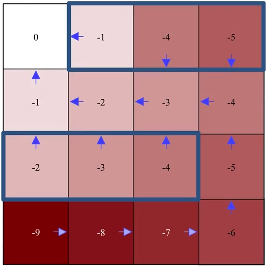

# Chapter 4. Dynamic Programming

The term dynamic programming (DP) refers to a collection of algorithms that can be used to compute optimal policies **given a perfect model of the environment** as a Markov decision process (MDP), it therefore requires no interaction with the environment.

DP algorithms is limited in practice because of their assumption of a perfect model and because of their great computational expense. Yet DP provides an essential foundation for the understanding of the methods presented in the rest of this book. In fact, all of these methods can be viewed as attempts to achieve much the same effect as DP, only with less computation and without assuming a perfect model of the environment.

The key idea of DP, and of reinforcement learning generally, is the use of value functions to organize and structure the search for good policies. As we shall see, DP algorithms are obtained by turning Bellman equations such as these into assignments, that is, into update rules for improving approximations of the desired value functions

## 4.1 Policy Evaluation - computing state-value function for an arbitrary policy

- $\textit{Policy Evaluation}$: to compute the state-value function $v_{\pi}$ for an arbitrary policy $\pi$. (We also refer to it as the $\textit{prediction problem}$.)

    - DP assumes the environment’s dynamics are completely known (perfect model of the environment), in this case, we could use bellman equation to form a simultaneous linear equation system with $|S|$ equations and $|S|$ unknowns.

        With the initial approximation $v_0$ chosen arbitrarily (except that the terminal state, if any, must be given value 0):

        $$
        \begin{align*}
        v_{k+1}(s) &= E_{\pi}[R_{t+1} + \gamma v_{k}(S_{t+1}) | S_t = s] \\
        &= \sum_a \pi(a|s) \sum_{s', r}p(s', r|s, a) [r + \gamma v_{k}(s')] \text{ for all } s \in S
        \end{align*}
        $$
    
    - The above algorithm is called $\textit{iterative policy evaluation}$. Letter $k$ denotes the number of iterations.
    - All the updates done in DP algorithms are called $\textit{expected updates}$ because they are based on an expectation over all possible next states rather than on a sample next state.
    - The updates of all states in one iteration is called a $\textit{sweep}$ through the state space.

- The Iterative Policy Evaluation algorithm for estimating $V \approx v_{\pi}$
    - Algo:
        - Initialization: 
            - Input: $\pi$, the policy to be evaluated
            - Algorithm Parameters: A small threshold $\theta > 0$ determining the accuracy of estimation
            - Initialize $V(s)$ for all $s \in S$, arbitrarily, except that $V(terminal) = 0$
        - Loop: (for each iteration)
            - $\Delta = 0$
            - Loop for each $s \in S$:
                - $v \leftarrow V(s)$
                - $V(s) = \sum_a \pi(a|s) \sum_{s', r} p(s',r|s,a) [r + \gamma V(s')]$
                - $\Delta \leftarrow \max(\Delta, |v - V(s)|)$
            - Until $\Delta < \theta$

    - Intuition: $\Delta$ will be set to 0 at the beginning of each iteration, and is used to record the maximal changes in all state values through state space. So when the maximal change in a sweep smaller than the threshold $\theta$, algorithm stops.

- Gridworld Example:
    - Description: 

        

        
        

        - States: the nonterminal states are $S = {1, 2,...,14}$. 
        - Actions: there are four actions possible in each state, $A = \{up, down, right, left\}$, which deterministically cause the corresponding state transitions, except that actions that would take the agent off the grid in fact leave the state unchanged. 
            - For instance, $p(6, 1|5, right) = 1, p(7, 1|7, right) = 1$, and $p(10,r|5, right) = 0$ for all $r \in R$. 
        - Reward: this is an undiscounted, episodic task. The reward is $-1$ on all transitions until the terminal state is reached. The expected reward function is thus $r(s, a, s\prime)= 1$ for all states $s, s\prime$ and actions $a$.
        - Policy: an equiprobable random policy (all actions are equally likely)
    
    - Policy Evaluation:
        - The first sweep:
            

                    
            

            

                    
            

            

                    
            

        - The second sweep:
            

                    
            

        - The third sweep:
            

                    
            

        - ...
        - The final sweep: $\Delta = 0$ and is finally smaller than $\theta$, $V$ and $V\prime$ are both $V_\pi$
            

                    
            

## 4.2 Policy Improvement

- $\textit{Policy Improvement Theorem}$: if $q_{\pi}(s, \pi\prime(s)) \ge v_{\pi}(s)$ holds for all $s \in S$, then the policy $\pi\prime$ must be as good as, or better than, $\pi$. In other words, $v_{\pi\prime}(s) \ge v_{\pi}(s)$ for all $s \in S$ also holds.

    - the intuition of the first inequality is that (think of a backup diagram starting with v(s)) there exists one (or more) explicit action(s) that could bring more return for the state s than simply calculating the expectation ($v(s) = \sum_a \pi(a|s)q(s,a)$)

- $\textit{Policy Improvement}$: the process of making a new policy that improves on an original policy, **by making it greedy** with respect to the value function of the original policy.

    - Greedification: with $\pi\prime$ denoting the greedified policy:
        $$
        \begin{align*}
        \pi\prime(s) &= \arg\max_a q_{\pi}(s, a) \\
        &= \arg\max_a E_{\pi}[R_{t+1} + \gamma v_{\pi}(S_{t+1}) | S_t=s] \\
        &= \arg\max_a \sum_{s\prime, r} p(s\prime, r|s,a)[r + \gamma v_{\pi}(s\prime)]
        \end{align*} 
        $$

    - Policy Improvement will lead to a strictly better policy unless the original policy is already optimal:
        - suppose the new policy is as good as, but no bette than the old policy (the policy can not be any better in the end), meaning $v_{\pi\prime}=v_{\pi}$, then:

            $$
            \begin{align*}
            v_{\pi\prime} &= \max_a \sum_{s\prime, r} p(s\prime, r|s,a)[r + \gamma v_{\pi}(s\prime)] \\
            &= \max_a \sum_{s\prime, r} p(s\prime, r|s,a)[r + \gamma v_{\pi\prime}(s\prime)]
            \end{align*}
            $$

            The above last equation is eaxtly the bellman optimality equation, this means that when the policy can not get any better, $v_{\pi\prime}$ is $v_{\star}$, therefore, $\pi$ and $\pi\prime$ are both the optimal policy $\pi_{\star}$.
        - if a policy is already the greedy policy with respect to its own value function, then this policy is the optimal policy

- Gridworld Example from section [4.1](#41-policy-evaluation---computing-state-value-function-for-an-arbitrary-policy)

    - after getting the value function $v_{\pi}$ of the initial random policy $\pi$, we perform greedification to get the new policy $\pi\prime$, which is strictly better than $\pi$. 

        

                
        

## 4.3 Policy Iteration (= Policy Evaluation + Policy Improvement)

- $\textit{Policy iteration}$: the process of performing policy evaluation and policy improvement iteratively to find the optimal policy. 

    - Because a finite MDP has only a finite number of policies, this process must converge to an optimal policy and optimal value function in a finite number of iterations ($E$ stands for evaluation and $I$ for improvement):

    $$
    \pi_0 \xrightarrow{\text{E}} v_{\pi_0} \xrightarrow{\text{I}} \pi_1 \xrightarrow{\text{E}} v_{\pi_1} \xrightarrow{\text{I}} ... \xrightarrow{\text{I}} \pi_{\star} \xrightarrow{\text{E}} v_{\star}
    $$

- Algorithm of Policy Iteration:

    1. Initialization $V(s) \in R$ and $\pi(s) \in A(s)$ arbitrarily for all $s \in S$

    2. Policy Evaluation (see the algorithm in section [4.1](#41-policy-evaluation---computing-state-value-function-for-an-arbitrary-policy))

    3. Policy Improvement:
        - *policy-stable* $\leftarrow$ *true*
        - For each $s \in S$:
            - *old-action* $\leftarrow \pi(s)$
            - $\pi(s) \leftarrow \arg \underset{a}{\max} \ \sum_{s\prime,r}\  p(s\prime,r|s,a) \ [r + \gamma v_{\pi}(s\prime)]$ 
            - if *old-action* $\neq \pi(s)$ and $q(s, \pi(s)) \neq q(s, \textit{old-action})$, then *policy-stable* $\leftarrow$ *false*
        - if *policy-stable*, then stop and return $V$ as $V_{\star}$ and $\pi$ as $\pi_{\star}$, else go to step 2.

- New Gridworld Example:
    - Description: 
        - Since the Gridworld example in section [4.1](#41-policy-evaluation---computing-state-value-function-for-an-arbitrary-policy) reaches the optimal policy after only one iteration, we now make the example a bit more complex by elimating one terminal grid and adding blue states where rewards have much lower value of $-10$.

            

                    
            

    
    - Policy iteraton:
        - The first iteration:
            

            

            <h4>Evaluation</h4>
            
            

            

            <h4>Improvement</h4>
            
            

            

        - The second iteration:
            - Notice how exactly the greedification is performed (e.g., the second left grid on the last row). 

                Remember that $\pi\prime(s) = \arg\max_a \sum_{s\prime, r} p(s\prime, r|s,a)[r + \gamma v_{\pi}(s\prime)]$ not $\pi\prime(s) = \arg\max_a v(s\prime)$

            

            

            <h4>Evaluation</h4>
            
            

            

            <h4>Improvement</h4>
            
            

            

        - ...
        - The final Iteration
            - Note that in the final iteration, after policy improvement, the policy remains the same, i.e., the original policy (before improvement) is already the greedy policy with respect to its own value function, the optimal policy is found.

            

            

            <h4>Evaluation</h4>
            
            

            

            <h4>Improvement</h4>
            
            

            

## 4.4 Value Iteration

- Value Iteration:  is the special case of Policy Iteration where policy evaluation stops after just one sweep. 

    - Drawback of policy iteration: requires iterative computation, each of its iterations involves policy evaluation, which may itself be a protracted iterative computation requiring multiple sweeps through the state set, and convergence only occurs in the limit, which takes a lot of time.

    - Value iteration effectively combines, in each of its sweeps, one sweep of policy evaluation and one sweep of policy improvement

- Updating rule:

    $$
    \begin{align*}
    V_{k+1}(s) \ &\dot= \ \max_a q_{k}(s, a) \\
    &= \max_a \sum_{s\prime, r} p(s\prime, r|s,a) [r + \gamma V_{k}(s\prime)]\ \text{for all} s \in S
    \end{align*}
    $$

    - The above equation is obtained simply by turning Bellman Optimality Equation into an updating rule. 

- Algorithm:
    - Algorithm parameter: a small threshold $\theta$ > 0 determining accuracy of estimation. Initialize V(s), for all $s \in S^+$, arbitrarily except that V(terminal) = 0
    - Loop:
        - $\Delta \leftarrow 0$ 
        - For $s \in S$:
            - $v \leftarrow V(s)$
            - $V(s) = \underset{a}{\max} \underset{s\prime, r}{\sum} p(s\prime, r|s,a) [r + \gamma V(s\prime)]$
            - $\Delta \leftarrow \text{max}(\Delta, |v - V(s)|)$ 
        - until $\Delta < \theta$
    
    - Output a deterministic policy, $\pi \approx \pi_{\star}$, such that
        $\pi(s) = \arg \underset{a}{\max}  \underset{s\prime, r}{\sum} p(s\prime, r|s,a) [r + \gamma V(s\prime)]$

## 4.5 Generalized Policy Iteration (GPI) 

- $\star$ Two types of DP:
    - Synchronous DP: update all states systematically in a certain order (takes very long for large state space)

    - Asynchronous DP: update states without order (can be faster, but also problematic when only a small set of states being updated constantly)

- $\textit{Generalized policy iteration (GPI)}$: refers to the general idea of letting policy-evaluation and policyimprovement processes interact, independent of the granularity and other details of the two processes.

    - Almost all reinforcement learning methods are well described as GPI. That is, all have identifiable policies and value functions, with the policy always being improved with respect to the value function and the value function always being driven toward the value function for the policy:

        

        
        

        Both processes stabilize only when a policy has been found that is greedy with respect to its own evaluation function (when $\pi$ itself is the greedy policy of $v_{\pi}$). This implies that the Bellman optimality equation (4.1) holds, and thus that the policy and the value function are optimal.

## 4.6 Summary

Classical DP methods operate in sweeps through the state set, performing an $\textit{expected update}$ operation on each state. The update of states based on estimates of the values of successor states. That is, estimates are updated on the basis of other estimates. We call this general idea $\textit{bootstrapping}$ and requires a perfect model of the environment.

In the next chapter we explore Monte Carlo method - a reinforcement learning method that do not require a model and do not bootstrap.