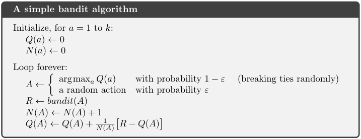
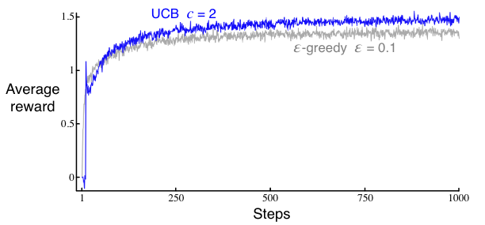

# Chapte 2. Multi-armed Bandit

In this chapter we study the evaluative aspect of reinforcement learning in a simplified setting, one that does not involve learning to act in more than one situation, i.e., there is only one single state.

## 2.1 A k-armed Bandit Problem

- Description: one single state, given k different options, or actions. With each action taken, a numerical reward chosen from a stationary probability distribution will be given. 

- time steps: in k-armed bandit problem, time steps describe the number of times actions being taken.
- value of action: mean reward received by taking this action 

$$
q_{*}(a) \dot= E[R_{t}|A_{t}=a]
$$

- exploitation:
- exploration:

## 2.2 Action-value methods

- methods for estimating the values of actions and for using the estimates to make action selection decisions

- Estimation:
    - denote the estimated value of actioin $a$ at time step $t$ as $Q_{t}(a)$, we would like $Q_{t}(a)$ to be close to $q_{*}(a)$

    - $\textit{sample-average method}$
$$
Q_{t}(a) \dot= \frac{\text{sum of reward when \textit{a} taken prior to t}}{\text{number of times \textit{a} taken prior to t}} = \frac{\sum_{i=1}^{t-1}R_{i} \cdot \mathbb{1}_{A_{i}=a}}{\sum_{i=1}^{t-1} \mathbb{1}_{A_{i}=a}}
$$

- Action selection:
    - Greedy action selection: always exploits current knowledge to maximize immediate reward
    $$
    A_t \dot= \underset{a}{\arg\max} Q_{t}(a)
    $$
    - $\epsilon$-greedy action selection: behave greedily most of the time, but each time with a small probability $\epsilon$, select randomly from among all the actions with equal probability. 

## 2.3 The 10-armed Testbed

- to demonstrate the effectiveness of greedy and $\epsilon$-greedy action selection, we create the following experiment:
    - set $k=10$
    - the reward distribution of each action follows a standard normal distribution ($\mu=0 \text{ and } \sigma=1$) 

        

        
        

    - the performance of each action selection method is measured by averaging the results from 2000 independent $\textit{runs}$, with each $\textit{run}$ containing 1000 time steps 

        

        
        

- Conclusions:
    - The greedy method performed significantly worse in the long run because it often got stuck performing suboptimal actions.
    - The $\epsilon=0.01$ method improved more slowly, but eventually would perform better than the $\epsilon=0.1$ method. 

- Note that the advantage of $\epsilon$-greedy over greedy methods depends on the task. 
    - Reward Variance: if the reward variance is large (noisier reward), it takes more exploration to find the optimal action, in this case  $\epsilon$-greedy method should be better. On the contrary, if reward variance is zero, greedy method will clearly perform best.

    - Stationarity: assume the distribution of the reward changs over time. In this case exploration is needed even in the deterministic case to make sure one of the nongreedy actions has not changed to become better than

## 2.4 Incremental Estimation for Action Values

### 2.4.1 For stationary problems

- We now take another look at sample-average method mentioned in section [2.2](#22-action-value-methods) and study how those averages can be computed in a computationally effcient manner 

- Let $R_i$ denote the reward received at the i-th selection of action $a$, and $Q_n$ denote the estimate of the action value after it has been selected $n-1$ times.

    $$
        \begin{align*}
        Q_{n+1} &= \frac{R_1 + R_2 + ... + R_n}{n} \\
        &= \frac{1}{n}\sum_{i=1}^{n}R_i \\
        &= \frac{1}{n}(R_{n} + (n-1)\frac{1}{n-1}\sum_{i=1}^{n-1}R_i) \\
        &= \frac{1}{n}(R_{n} + (n-1)Q_n) \\
        &= Q_n + \frac{1}{n}(R_{n} - Q_n)
        \end{align*}
    $$

- The incremental estimation follows the general form:

    $NewEstimate \leftarrow OldEstimate + StepSize*[Target - OldEstimate]$

    - In the above case, $StepSize$ is equal to $\frac{1}{n}$, in this book, the $StepSize$ is denoted by $\alpha$ or more generally by $\alpha_t(a)$

- We now can write a pseudocode for solving **stationary** bandit problem using the incremental implementation

    

    
    

### 2.4.2 For nonstationary problems

- If the problem if nonstationary, i.e., the reward distribution changes over time, it would make more sense to give more weights to recent reward than the long-past rewards.

- To achieve the above goal, we could use a constant step-size parameter $\alpha$

$$
\begin{align*}
Q_{n+1} &= Q_n + \alpha \left[ R_n - Q_n \right] \\
        &= \alpha R_n + (1 - \alpha) Q_n \\
        &= \alpha R_n + (1 - \alpha) \left[ \alpha R_{n-1} + (1 - \alpha) Q_{n-1} \right] \\
        &= \alpha R_n + (1 - \alpha) \alpha R_{n-1} + (1 - \alpha)^2 Q_{n-1} \\
        &= \alpha R_n + (1 - \alpha) \alpha R_{n-1} + (1 - \alpha)^2 \alpha R_{n-2} + \\
        &\quad \ldots + (1 - \alpha)^{n-1} \alpha R_1 + (1 - \alpha)^n Q_1 \\
        &=(1 - \alpha)^n Q_1 + \sum_{i=1}^n \alpha (1 - \alpha)^{n-i} R_i
\end{align*}
$$

- Some notes:
    - The final result is a weighted average since $(1 - \alpha)^n + \sum_{i=1}^n \alpha (1 - \alpha)^{n-i} = 1$
    - the weight given to $R_i$ decreases exponentially as the number of intervening rewards increases - $i$ becomes past
    - if $\alpha=1$, $Q_{n+1} = R_n$; $\alpha=0$, $Q_{n+1} = Q_{n}$. $\alpha$ controls the weights given to recent rewards.
    - the choice of $\alpha_n(a)=\frac{1}{n}$ results in the sample-average method
    - *For the study of estimation convergence for different choice of $\alpha_n(a)$, refer to the book chapter 2.5. In general, it is actually more desirable that $\alpha_n(a)$ makes the estimation never converge due to nonstationarity in reality.

## 2.5 More on exploration tricks
Simple tricks to encourage exploration except $\epsilon$-greedy (or as its extension), only for stationary problems

### 2.5.1 Optimistic Initial Values: 

- Optimistic initial values: the method that encourages action-value methods to explore (only in the beginning) by setting the initial action values to a large positive number.

- In 10-armed bandit testbed introduced in section [2.3](#23-the-10-armed-testbed) setting $Q_1(a)=+5$ for all $a$, perform again, 2000 runs with each run up to 1000 time steps

    

    
    

- Difficulties that made optimistic initial values not practical for nonstationary problems:
    - its drive for exploration is inherently temporary, i.e., only in the beginning of a run. 

### 2.5.2 Upper-Confidence-Bound Action Selection

- Implementation: explores actions by taking their uncertainty into account.

    $$
    A_t \dot= \underset{a}{\arg\max} [Q_{t}(a) + c\sqrt{\frac{ln(t)}{N_t(A)}}]
    $$

    - $t$ denotes the current time step
    - $N_t(A)$ denotes the number of action $A$ being selected up to time step $t§
    - $c>0$ controls the degree of exploration 

- Explanation:
    - The square-root term is a measure of the uncertainty or variance in the estimate of $a$’s value. The quantity being max’ed over is thus a sort of upper bound on the possible true value of action $a$, with $c$ determining the confidence level.

    - Each time $a$ is selected the uncertainty is presumably reduced. On the other hand, each time an action other than $a$ is selected, the uncertainty estimate of $a$ increases

    - All actions will eventually be selected, but actions with lower value estimates, or that have already been selected frequently, will be selected with decreasing frequency over time.

- Experimentation:

    

    
    

- Difficulties that made UCB not practical for nonstationary problems:
    - One difficulty is that it tends to exploit more aggressively once it has identified a seemingly optimal action, compared to $\epsilon$-greedy method
    - Another diffculty is when dealing with large state spaces. UCB can be computationally expensive with a large number of actions or when actions need to be reassessed frequently due to changes in the environment. 