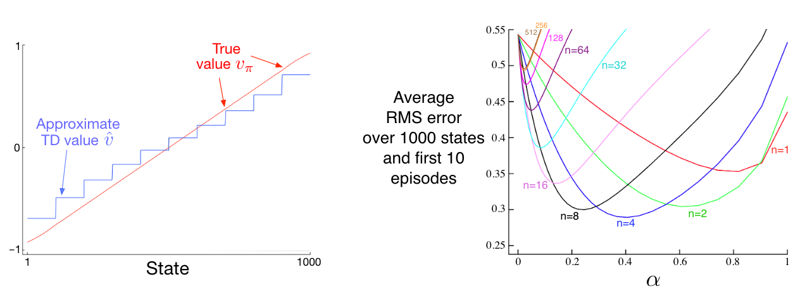
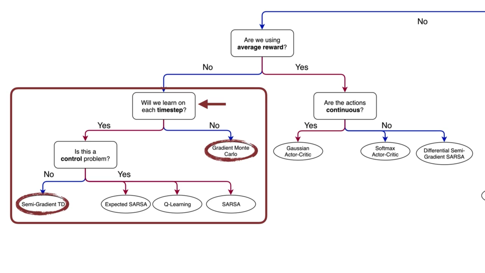

# Chapter 9. On-policy Prediction with Approximation

In this chapter, we now focus on estimating the state-value function from on-policy data. The approximate value function will be represented not as a table but as a parameterized functional form, written as $\hat{v}(s, w) \approx v_\pi(s)$, with weight vector $w \in \mathbb{R}^d$.

For example, $\hat{v}$ might be a linear function in features of the state, with $w$ being the vector of feature weights. More generally, $\hat{v}$ might be the function computed by a multi-layer artificial neural network, with $w$ the vector of connection weights in all the layers. 

Typically, the number of weights (the dimensionality of $w$) is much less than the number of states ($d << |S|$), and changing one weight changes the estimated value of many states. Consequently, when a single state is updated, the change generalizes from that state to affect the values of many other states. Such generalization makes the learning potentially more powerful but also potentially more diffcult to manage and understand.

## 9.1 Value-function Approximation

- Update rules recap:
    - Dynamic programming: 
    $s \rightarrow E_\pi[R_{t+1} + \gamma \hat{v}(S_{t+1}, w_t)|S_t = s]$
    - Monte Carlo:
    $s \rightarrow G_t$
    - Temperal Difference:
    $s \rightarrow R_{t+1} + \gamma \hat{v}(S_{t+1}, w_t)$

- Supervised learning for function approximation
    - We interpret each update as specifying an example of the desired input-output ($s\rightarrow u$) behavior of the value function, with $u$ indicating the $\textit{udpate target}$.
    - In function approximation, we pass the input–output behavior $s\rightarrow u$ of each update as a training example, then interpret the approximate function they produce (after training) as an estimated value function

- The Prediction Objective ($\overline{VE}$)

    - Motivation: by assumption we have far more states than weights, so making one state’s estimate more accurate invariably means making others’ less accurate. We are obligated then to say which states we care most about.

    - Measure: Mean Squared Value Error ($\overline{VE}$)
        $$
        \overline{VE}(w) = \sum_{s \in S} u(s)[v_\pi(s) - \hat{v}(s,w)]^2
        $$
        - The state distribution $u(s) \ge 0, \sum_s u(s)=1$ is called $\textit{on-policy distribution}$, and denotes how much we care about the error in each state $s$. “Often $μ(s)$ is chosen to be the fraction of time spent in $s$.

    - Notes:
        - The best value function for finding a better policy in control is not necessarily the best for minimizing $\overline{VE}$. Nevertheless, it is not yet clear what a more useful alternative goal for value prediction might be. For now, we will focus on $\overline{VE}$.

        - Often times, for complex function approximators such as Neural Networks, we can not find a global optimum of $w_\star$, for which  $\overline{VE}(w_\star) \le \overline{VE}(w)$ for all $w$. Rather, we can only find a local optimum for which  $\overline{VE}(w_\star) \le \overline{VE}(w)$ for all $w$ in some neighborhood of $w_\star$, but oftern this is enough.

## 9.2 Stochastic-gradient and Semi-gradient Methods

- Setup for gradient descent methods: 
    - the weight vector is a column vector with a fixed number of real valued components, $w \dot= (w_1,w_2,...,w_d)^T$. (Note that in this book vectors are generally taken to be column vectors unless explicitly written out horizontally or transposed.)
    - the approximate value function $v(s,w)$ is a differentiable function of $w$ for all $s \in S$. 

- Sotchastic gradient method (SGD)
    - Setup: assume that on each step, we observe a new example $S_t \rightarrow v_\pi(S_t)$ consisting of a (possibly randomly selected) state $S_t$ and its true value under the policy.
    - SGD method:
        - update rule:
            $$
            \begin{align}
            \boldsymbol{w_{t+1}} &\dot= \boldsymbol{w_t} - \frac{1}{2} \alpha \nabla[v_\pi(S_t) - \hat{v}(S_t, \boldsymbol{w_t})]^2 \\
            &= \boldsymbol{w_t} + \alpha [v_\pi(S_t) - \hat{v}(S_t, \boldsymbol{w_t})]\nabla\hat{v}(S_t, \boldsymbol{w_t})
            \end{align}
            $$

        - Notes: 
            - The assumption of available $v_\pi(S_t)$ is clearly impossible in practice. In fact, as long as the target is an unbiased estimate of $v_\pi(S_t)$, i.e., $E[Target | S_t=s] = v_\pi(S_t)$, then $\boldsymbol{w_t}$ is guaranteed to converge to a local optimum under the usual stochastic approximation condition for decreasing $\alpha$ (topics of convergence are not included in DistilRL, please refer to the book chapter 2.7 for details.)
            - By definition, the Monte Carlo target $G_t$ is an unbiased estimator of $v_\pi(S_t)$.
    
    - Gradient Monte Carlo Algorithm for estimating $\hat{v} \approx v_\pi$
        - Input: the policy $\pi$ to be evaluated, 
        - Input: a differentiable function $\hat{v}: S \times \mathbb{R}^d \rightarrow \mathbb{R}$
        - Algorithm parameter: step size $\alpha > 0$
        - Initialize value function weights $\boldsymbol{w} \in \mathbb{R}^d$ arbitrarily (e.g., $\boldsymbol{w=0}$)
        - Loop forever (for each episode):
            - Generate an episode $S_0, A_0, R_1, ... S_{T-1}, A_{T-1}, R_T, S_T$ using $\pi$.
            - $ \text{for } t \text{ in } \{T-1, T-2, ..., 0\}$:
                $$
                \boldsymbol{w} \leftarrow \boldsymbol{w} + \alpha [G_t - \hat{v}(S_t, \boldsymbol{w})]\nabla\hat{v}(S_t, \boldsymbol{w})
                $$

- Semi-gradient method:
    - Setup: the training example $S_t \rightarrow U_t$ with $U_t \in \mathbb{R}$ is not the true value $v_\pi(S_t)$ but a **boostraping target** using $\hat{v}$

    - Semi-gradient methods:
        - update rule
            $$
            \begin{align}
            \boldsymbol{w_{t+1}} &\dot= \boldsymbol{w_t} - \frac{1}{2} \alpha \nabla[U_t - \hat{v}(S_t, \boldsymbol{w_t})]^2 \\
            &= \boldsymbol{w_t} + \alpha [U_t - \hat{v}(S_t, \boldsymbol{w_t})]\nabla\hat{v}(S_t, \boldsymbol{w_t})
            \end{align} 
            $$

        - Notes:
            - There is no guarantees for convergence as for stochastic gradient methods if a bootstrapping estimate of $v(S_t)$ is used as the target $U­_t$. Boostrapping methods use $\hat{v}(S_{t+1}, \boldsymbol{w_t})$ as the target, which depends on the current $\boldsymbol{w_t}$. Yet the derivation from equation $(1)$ to $(2)$ requires independence regarding $\boldsymbol{w_t}$. 
            
                In other words, bootstrapping methods take into account the effect of changing the weight vector $\boldsymbol{w_t}$ on the estimate, but ignore its effect on the target. They include only a part of the gradient and, accordingly, we call them $\textit{semi-gradient methods}$.

            - Although semi-gradient (bootstrapping) methods do not converge as robustly as gradient methods, they do converge reliably in important cases such as the linear case, and they are usually preferred in practice due to the boostrapping advantage against monte carlo methods.
    
    - Semi-gradient TD(0) for estimating $\hat{v} \approx v_\pi$
        - Input: the policy $\pi$ to be evaluated, 
        - Input: a differentiable function $\hat{v}: S^{+} \times \mathbb{R}^d \rightarrow \mathbb{R}$ such that $\hat{v}(terminal, a)=0$
        - Algorithm parameter: step size $\alpha > 0$
        - Initialize value function weights $\boldsymbol{w} \in \mathbb{R}^d$ arbitrarily (e.g., $\boldsymbol{w=0}$)
        - Loop forever (for each episode):
            - Initialize $S$
            - Loop for each step of episode:
                - Choose $A \sim \pi(a|s)$
                - Take action $A$, observe $R, S\prime$
                - $\boldsymbol{w} \leftarrow \boldsymbol{w} + \alpha [R + \gamma \hat{v}(S\prime, \boldsymbol{w}) - \hat{v}(S_t, \boldsymbol{w})]\nabla\hat{v}(S_t, \boldsymbol{w})$
                - $S \leftarrow S\prime$
            - until $S$ is terminal

-  Example: State Aggregatioin:

    - State Aggregation: a method for generalizing function approximation by grouping states together, each group of states share one estimated value.

    - Using state aggregation for gradent MC (video):

        
    
    - Using state aggregation for semi-gradient TD (video):

        
    
    - Comparison between MC and TD: as already described in the above lecture video, the main differences between Temporal Difference (TD) and Monte Carlo (MC) methods in the context of function approximation are as follows:

        1. **Bias in Updates**:
            - **TD**: The TD update is biased because it relies on estimates of the value in the next state. Since value approximations are never perfect, the target may remain biased, even as estimates improve over time.
            - **Monte Carlo**: MC methods use an unbiased estimate of the gradient of the value error, which leads to more accurate value estimates in the long run.

        2. **Convergence**:
            - **TD**: TD does not guarantee convergence to a local minimum of the Mean Squared Value Error (MSVE) because of its inherent bias. In practice, TD can oscillate around a local minimum due to the use of a constant step size.
            - **Monte Carlo**: Over time and with enough samples, MC will converge to a local minimum of MSVE, but it may take longer because it requires more samples and decaying step sizes.

        3. **Speed of Learning**:
            - **TD**: TD generally learns faster than MC because it updates its estimates during the episode, allowing for quicker learning. The algorithm has lower variance in its updates compared to MC.
            - **Monte Carlo**: While MC methods provide more accurate long-term estimates, they typically require more episodes and are slower in terms of early learning, especially with a small number of samples.

        5. **Use of Limited Samples**:
            - **TD**: TD makes better use of limited samples because it learns continuously during episodes.
            - **Monte Carlo**: MC requires running episodes to completion before learning, making it slower when sample size is restricted.

        **Note:** Overall, when speed of learning is critical, especially with limited samples, TD is more preferable due to its faster learning and lower variance in updates 

- Optional Watching: [Doina Precup: Building Knowledge for AI Agents with Reinforcement Learning](https://www.coursera.org/learn/prediction-control-function-approximation/lecture/ipyWM/doina-precup-building-knowledge-for-ai-agents-with-reinforcement-learning)

## 9.3 Linear Models

- Linear Methods: methods that approximate the value function $\hat{v}(s, \boldsymbol{w})$ as a linear function, i.e., the inner product between $\boldsymbol{w}$ and $\boldsymbol{x}(s)$ - a feature vector, as follows:

    $$
    \hat{v}(s, \boldsymbol{w}) \dot= \boldsymbol{w}^{\intercal} \boldsymbol{x}(s) \dot= \sum_{i=1}^d w_i x_i(s)
    $$

    - In this case the approximate value function is said to be $\textit{linear in the weights}$, or simply $\textit{linear}$.
    
    - the feature vector $\boldsymbol{x}(s) \dot= (x_1(s), x_2(s), ... x_d(s))^{\intercal}$ has the same dimension $d$ as the weight vector $\boldsymbol{w}$. Each feature $x_i: S \rightarrow \mathbb{R}$ is a socalled $\textit{basis function}$ which assigns a value ($x_i(s)$) to the state $s$ (the feature of $s$)

- (Semi-)Gradient methods for linear value function

    - Update rule:
        $$
        \begin{align*}
        \boldsymbol{w_{t+1}} &= \boldsymbol{w_t} + \alpha [U_t - \hat{v}(S_t, \boldsymbol{w_t})]\nabla\hat{v}(S_t, \boldsymbol{w_t}) \\
        &= \boldsymbol{w_t} + \alpha [U_t - \hat{v}(S_t, \boldsymbol{w_t})]\boldsymbol{x}(S_t) \\
        \end{align*} 
        $$
    
    - *Convergence
        - MC method: the gradient Monte Carlo algorithm presented in the previous section converges to the global optimum of the $\overline{VE}$ under linear function approximation if $\alpha$ is reduced over time according to the usual conditions.

        - TD(0) method: weight vector eventually converges to a point near the local optimum. 

            - update rule:

                $$
                \begin{align*}
                \boldsymbol{w_{t+1}} &\dot= \boldsymbol{w_t} + \alpha [R_{t+1} + \gamma \hat{v}(S_{t+1}, \boldsymbol{w_t}) - \hat{v}(S_t, \boldsymbol{w_t})]\boldsymbol{x_t} \\
                &= \boldsymbol{w_t} + \alpha [R_{t+1} + \gamma \boldsymbol{w_t}^{\intercal}\boldsymbol{x_{t+1}} - \boldsymbol{w_t}^{\intercal}\boldsymbol{x_{t}}]\boldsymbol{x_t} \\
                &= \boldsymbol{w_t} + \alpha [R_{t+1}\boldsymbol{x_{t}} - \boldsymbol{x_{t}}(\boldsymbol{x_{t}} - \gamma \boldsymbol{x_{t+1}})^{\intercal}\boldsymbol{w_{t}}]\\
                \end{align*} 
                $$

                - Note: $\boldsymbol{x_t}$ is used to represent $\boldsymbol{x}(S_t)$ for simplicity
            
            - in steady state (convergence):
                $$
                E[\boldsymbol{w_{t+1}}|\boldsymbol{w_{t}}] = \boldsymbol{w_{t}} + \alpha(\boldsymbol{b - Aw_{t+1}})
                $$

                with  $\boldsymbol{b} \dot= E[R_{t+1}\boldsymbol{x_{t}}] \in \mathbb{R}^d$ and $\boldsymbol{A} \dot= E[\boldsymbol{x_{t}}(\boldsymbol{x_{t}} - \gamma \boldsymbol{x_{t+1}})^{\intercal}] \in \mathbb{R}^d \times \mathbb{R}^d$ 

                And at converge:
                $$
                \begin{align*}
                & \Rightarrow \quad \mathbf{b} - \mathbf{A}\mathbf{w}_{\text{TD}} = \mathbf{0} \\
                & \Rightarrow \quad \mathbf{b} = \mathbf{A}\mathbf{w}_{\text{TD}} \\
                & \Rightarrow \quad \mathbf{w}_{\text{TD}} \dot= \mathbf{A}^{-1}\mathbf{b}.
                \end{align*}
                $$

            - Notes: 
                - The quantity $\mathbf{w}_{\text{TD}} \dot= \mathbf{A}^{-1}\mathbf{b}$ is called the $\textit{TD fixed point}$. Linear semi-gradient TD(0) converges to this point.

                - At the TD fixed point, it has also been proven (in the continuing case) that the $\overline{VE}$ is within a bounded expansion of the lowest possible error:

                    $$
                    \overline{VE}(\mathbf{w}_{\text{TD}}) \le \frac{1}{1-\gamma} \underset{w}{min}\overline{VE}(\mathbf{w})
                    $$
                    Because $\gamma$ is often near one, this expansion factor can be quite large, so there is substantial potential loss in asymptotic performance with the TD method.

## 9.4 Feature Construction for Linear Methods

Choosing features appropriate to the task is an important way of adding prior domain knowledge to reinforcement learning systems. Intuitively, the features should correspond to the aspects of the state space along which generalization may be appropriate. 

A limitation of the linear form is that it cannot take into account any interactions between features, such as the presence of feature $i$ being good only in the absence of feature $j$, or to put it in another word, we need features that can take the combinations of different states or state dimensions into consideration. 

In this last section we study **how to construct such $x(s)$** for approximating the value function and balancing between generalization and discrimination.

### 9.4.1 Coarse Coding

- You may choose to watch this [lecture video](https://www.coursera.org/learn/prediction-control-function-approximation/lecture/JnNF5/generalization-properties-of-coarse-coding) instead since the following content is well covered in it and if you prefer visual&audio contents over texts.

- Introduction: 

    - Scenario: the natural representation of the state set is a continuous two-dimensional space, one possible kind of representation of features can be $\textit{circles}$ in state space. 

    - Feature construction: If the state is inside a circle, then the corresponding feature has the value 1 and is said to be present; otherwise the feature is 0 and is said to be absent. (This kind of 1–0-valued feature is called a $\textit{binary feature}$.)

        

        Corresponding to each circle / feature is a single weight (a component of $\boldsymbol{w}$) that is affected by learning.

        Performing an update to the weights in one state changes the value estimate for all states within the receptive fields (in this case, circles) of the active features. In the above image, update for state $s$ also changes the value estimate for state $s\prime$
    
    - Definition: Representing a state with features that overlap in the above way (although they need not be circles or binary) is known as **coarse coding**.

- Generalization and Discrimination

    - Demostration: Intuitively, if the circles are small, then the generalization will be over a short distance, as in the below Figure on the left, whereas if they are large, it will be over a large distance, as in the middle. And the shape of the features will also determine the nature of the generalization (on the right side).

        

        As above, features with large receptive fields give broad generalization, and might seem to fall short with discrimination, but conterintuitively, this is not true. Initial generalization from one point to another is indeed controlled by the size and shape of the receptive fields, but finest discrimination is ultimately  controlled more **by the total number of features**, as shown by the next example. 

    - Example

### 9.4.2 Tile Coding

how tile coding works: https://www.coursera.org/learn/prediction-control-function-approximation/lecture/ZR42J/using-tile-coding-in-td

### 9.4.3 Neural Networks ${\star}$

- How to use NN to calculate V(s), give the state representation. An example with one hidden layer:
    

## 9.5 Summary

- Mindmap for the methods introduced in this chapter (for those whose value function can not be represented with a table)

    

- Optimization Strategies for using Neutral Networks

    https://www.coursera.org/learn/prediction-control-function-approximation/lecture/WOMEl/optimization-strategies-for-nns