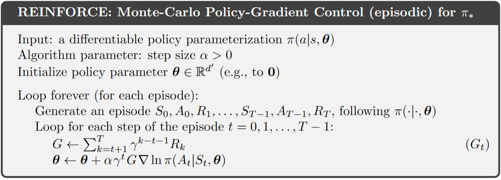
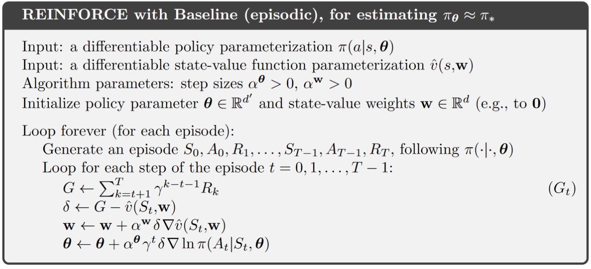
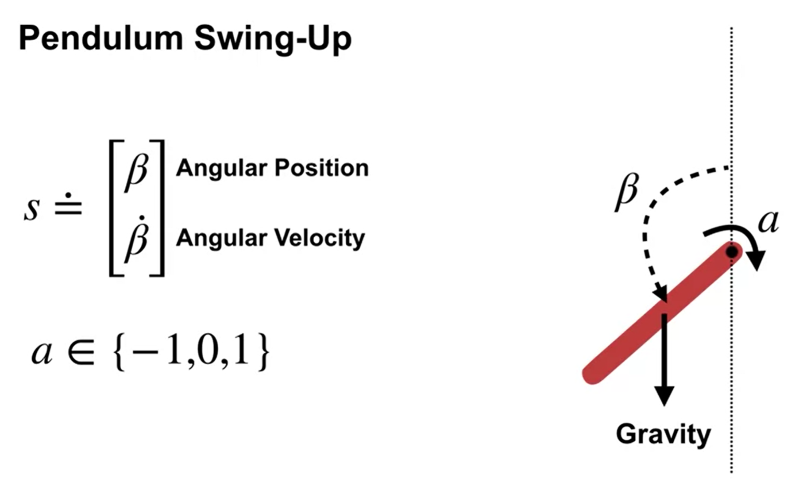
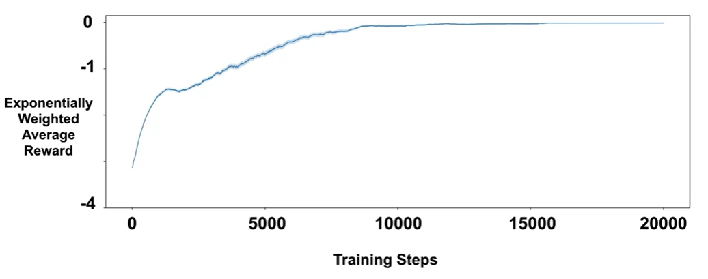

# Chapter 10. Policy Gradient Methods

So far in this book almost all the methods have been action-value methods, i.e., they try to learn the values of actions and then selected actions based on their estimated action values. We now consider methods that instead learn a parameterized policy that can select actions without consulting a value function. Note that a value function may still be used to $\textit{learn}$ the policy parameter (denoted by $\theta \in \mathbb{R}^{d'}$), but is not required for action selection.

This chapter considers methods for learning the policy parameter (the policy is represented as $\pi(a \mid s, \theta) = \Pr\{ A_t = a \mid S_t = s, \theta_t = \theta \}$) based on the gradient of some scalar performance measure $J(\theta)$, which we aim to maximize. Therefore the update of policy parameter follows gradient ascent:

$$\theta_{t+1} = \theta_t + \alpha \nabla \widehat{J}(\theta_t)$$

where $\nabla \widehat{J}(\theta_t)$ is a stochastic estimate whose expectation approximates the gradient of the performance measure with respect to its argument $\theta_t$. All methods that follow this general schema are called $\textit{policy gradient methods}$.

Among $\textit{policy gradient methods}$, methods that learn approximations to both policy and value functions are often called $\textit{actor–critic methods}$, where $\textit{'actor'}$ is a reference to the learned policy, and $\textit{'critic'}$ refers to the learned value function.

## 10.1 Policy Approximation and its Advantages

- **Setup**: In policy gradient methods, the policy can be parameterized in any way, as long as $\pi(a|s, \theta)$ is differentiable with respect to its parameters, In practice, to ensure exploration we generally require that the policy never becomes deterministic (i.e., that $\pi(a|s, \theta) \in (0, 1)$, for all $s, a, \theta$)

- **Approximation example for discrete and small (not too large) action space**:

    - **Parameterization of the policy**: in this setting, we first parameterize numerical $\textit{action preferences}$ $h(s, a, \theta) \in R$ for each state–action pair. The actions with the highest preferences in each state are given the highest probabilities of being selected, according to an e.g., exponential soft-max distribution:

        $$\pi(a|s,\theta) \ \dot= \ \frac{e^{h(s,a,\theta)}}{\sum_b e^{h(s,b,\theta)}}$$

        We call this kind of policy parameterization soft-max in action preferences.

    - **Parameterization of the state-action pair**: The action preferences $h(s, a, \theta) \in R$ themselves can be parameterized arbitrarily. For example, by:
        - a deep artificial network (ANN), where $\theta$ is the vector of all the connection weights of the network (as in the AlphaGo system, readers of interest can refer to the book section 16.6), or
        - a linear system in features as 
            
            $$h(s, a, \theta) = \theta^\top x(s, a)$$

            using feature vectors $x(s, a) \in \mathbb{R}^{d'}$ constructed by any of the methods described in Chapter 9.

- **Advantages of parameterizing policies**

    - **Allowing Determinism**: Unlike the traditional epsilon-greedy approach, which caps exploration, parameterized policies can start stochastic and naturally converge to a greedy policy, i.e., if the optimal policy is deterministic, then the preferences of the optimal actions will be driven infinitely higher than all suboptimal actions (if permitted by the parameterization). This avoids the need for external decisions about when exploration is complete.

    - **Allowing Stochasticity**:  Parameterization of policies enables the selection of actions with arbitrary probabilities. In problems with significant function approximation, a deterministic policy might not always be feasible. A stochastic policy can often perform better, as demonstrated below in the corridor example, stochastic actions help the agent achieve higher returns.

- **Example: Short corridor with switched actions**

    

    - **Setup**: 
        - As shown in the image, there are three nonterminal states, the reward is 1 per step.
        - In the first state, left action causes no movement.
        - In the second state actions are reversed, right actions takes the agent to the left and left to the right.
    
    - **Comparison between action-value method and policy approximation**:

        - An action-value method with $\epsilon$-greedy action selection is forced to choose between just two policies. For example, if $\epsilon = 0.1$, then either left of right action gets the probability of $1 - \frac{\epsilon}{2} = 0.95$, and the other gets only $0.05$. These two $\epsilon$-greedy policies achieve a value (at the start state $S$) of less than $-44$ and $-82$.

        - Policy approximation can do significantly better since it learns a specific probability with which to select right (allowing more stochasticity). As shown in the image, the best probability of selecting the right action with policy approximation is about $0.59$, which achieves a value of about $-11.6$.

## 10.2 The Policy Gradient Theorem

- **Policy Gradient Objective**: 
    
    When we parameterize our policy directly, we can use the ultimate goal of reinforcement learning directly as the learning objective, i.e., to learn a policy that obtains as much reward as possible in the long run. Recall that our three form of reward formulations are:

    - Episodic Setting: $G_t = \sum_{t=0}^{T} R_t$

    - Continuing Setting with Discounted Return: $G_t = \sum_{t=0}^{\infty} \gamma^t R_t$

    - Continuing Setting with Average Reward Formulation: $G_t = \sum_{t=0}^{\infty} R_t - r(\pi)$

    In this chapter, **we focus on the continuing setting with average reward as the objective** (only for continuing tasks, of course). The average reward for a policy $\pi$ is defined as: 

    $$
    \begin{align*}
    r(\pi) &= \sum_{s}\mu(s) v(s) \\
    &= \sum_{s}\mu(s) \sum_{a} \pi(a \vert s, \theta) q(s,a) \\
    \end{align*}
    $$

    Therefore, the goal is to find a policy that maximizes this average reward, so the gradient ascent update we introduced at the beginning of this chapter can be formulated as:

    $$
    \begin{align*}
    \theta_{t+1} &= \theta_t + \alpha \nabla \widehat{J}(\theta_t) \\
    &= \theta_t + \alpha \nabla r(\pi) \\
    &= \theta_t + \alpha \nabla \sum_{s}\mu(s) \sum_{a} \pi(a \vert s, \theta) q(s,a) 
    \end{align*}
    $$ 

    However, Unlike value function approximation (where $\mu(s)$ was fixed), here $\mu(s)$ depends on the policy, which in return changes the distribution $\mu(s)$ when it gets updated. We need a update rule for parameterizing the policy model without depending on $\mu(s)$, and that is when the policy gradient theorem comes to the rescue.

- **Policy Gradient Theorem**: 
    
    The theorem provides an analytic expression for the gradient of performance (average reward) with respect to the policy parameter that does not involve the derivative of the state distribution, and it has proved:

    $$
    \nabla J(\theta) \propto \sum_s \mu(s) \sum_a q_{\pi}(s, a) \nabla \pi(a | s, \theta)
    $$

    The symbol $\propto$ here means "proportional to". In the episodic case, the constant of proportionality is the average length of an episode, and in the continuing case it is 1. The distribution $\mu$ here is the on-policy distribution under $\pi$ as introduced in the last chapter.

    This [optional lecture video](https://www.coursera.org/learn/prediction-control-function-approximation/lecture/Wv6wa/the-policy-gradient-theorem) (between 2:08 - 4:27) provides an intuition of what the term $\sum_a q_{\pi}(s, a) \nabla \pi(a | s, \theta)$ does. For a detailed derivation of the policy gradient theorem, please refer to the book chapter 13.2, page 325.

## 10.3 REINFORCE (with Baseline): Monte Carlo Policy Gradient

### 10.3.1 REINFORCE

- **Derivation of REINFORCE's update rule**:

    The strategy of stochastic gradient ascent requires a way to obtain samples such that the expectation of the sample gradient is proportional to the actual gradient of the performance measure, i.e., we need some way of sampling whose expectation equals or approximates the expression given by the policy gradient theorem. 

    Naturally, we can reformulate the policy gradient theorem as

    $$
        \begin{align*}
        \nabla J(\theta) &\propto \sum_s \mu(s) \sum_a q_{\pi}(s, a) \nabla \pi(a | s, \theta) \\
        &= \mathbb{E}_{\pi} \left[ \sum_a q_{\pi}(S_t, a) \nabla \pi(a | S_t, \theta) \right],
        \end{align*}
    $$
    
    and we can just stop here and instantiate the stochastic gradient-ascent algorithm as

    $$
        \theta_{t+1} \doteq \theta_t + \alpha \sum_a \hat{q}(S_t, a, \mathbf{w}) \nabla \pi(a | S_t, \theta),
    $$

    where $\hat{q}$ is some learned approximation to $q_\pi$. This update algorithm is called an $\textit{all-actions}$ method because its update involves all of the actions. The algorithm is promising and deserves further study, but our current interest is the classical REINFORCE algorithm, which continues the above transformation as follows:

    $$
        \begin{align*}
        \nabla J(\theta) &= \mathbb{E}_{\pi} \left[ \sum_a \pi(a|S_t, \theta) q_{\pi}(S_t, a) \frac{\nabla \pi(a|S_t, \theta)}{\pi(a|S_t, \theta)} \right] \\
        &= \mathbb{E}_{\pi} \left[ q_{\pi}(S_t, A_t) \frac{\nabla \pi(A_t|S_t, \theta)}{\pi(A_t|S_t, \theta)} \right]  \ \text{(replacing \( a \) by a sample \( A_t \sim \pi \))}\\
        &= \mathbb{E}_{\pi} \left[ G_t \frac{\nabla \pi(A_t|S_t, \theta)}{\pi(A_t|S_t, \theta)} \right]  \  \text{(because \( \mathbb{E}_{\pi} [ G_t | S_t, A_t] = q_{\pi}(S_t, A_t) \))}
        \end{align*} \\
    $$

    The stochastic gradient-ascent update of REINFORCE can therefore be instantiated as 

    $$\theta_{t+1} \doteq \theta_t + \alpha \ G_t \frac{\nabla \pi(A_t|S_t, \theta)}{\pi(A_t|S_t, \theta)}$$

- **Intuition on REINFORCE**

    - **The derivation**: note that during derivation, we used a sample $A_t \sim \pi$ to replace the the expectation term $\sum_a \pi(a|S_t, \theta) q_{\pi}(S_t, a)$. This strategy shares similarity as we change from Monte Carlo methods to TD methods. Similarly, this replacement brings more bias yet lower the variance at the same time.

    - **The final update form**: the increment of REINFORCE is proportional to the product of a return $G_t$ and a vector (called the $\textit{eligibility vector}$) - the gradient of the probability of taking the action actually taken divided by the probability of taking that action. The latter may sound horrible when first hearing it, so let's shed some light on what this increment indicates:

        - The return $G_t$ in the incremental term causes the parameter to move most in the directions that favor actions that yield the highest return. (This is where the name REINFORCE comes from, because the algorithm reinforces good actions and discourages bad ones.)

        - The vector $\frac{\nabla \pi(A_t|S_t, \theta)}{\pi(A_t|S_t, \theta)}$, on the other hand, is a typical form of what is called $\textit{relative rate of change}$. In this case, it indicates the direction in parameter space that most increases the probability of repeating the action $A_t$ on future visits to state $S_t$. 
        
            Moreover, the update is inversely proportional to the action probability, giving actions that are less frequently selected an advantage, i.e., encouraging exploration.
    
    - **Why Monte Carlo**: Note that REINFORCE uses the complete return $G_t$ from time $t$, which includes all future rewards up until the end of the episode. In this sense it is a Monte Carlo algorithm and is well defined **only for the episodic case**.

- **Algorithm of REINFORCE:** Monte-Carlo Policy-Gradient Control (episodic) for $\pi_{\star}$

    

    
    

- **Performance of REINFORCE on the short-corridor example**

    

    - Results: as shown, with a good step size, the total reward per episode approaches the optimal value of the start state ($v_\star(s_0)$).

    - Properties of REINFORCE: for sufficiently small $\alpha$, the improvement in expected performance is assured, and convergence to a local optimum under standard stochastic approximation conditions happens for decreasing $\alpha$. However, as a Monte Carlo method REINFORCE may be of high variance and thus produce slow learning.

### 10.3.2 REINFORCE with Baseline

- **Derivation of REINFORCE with Baseline**

    We now generalize the policy gradient theorem to include a comparison of the action value $q_{\pi}(s, a)$ to an arbitrary $baseline \ b(s)$

    $$
    \nabla J(\theta) \propto \sum_{s} \mu(s) \sum_{a} \left( q_{\pi}(s, a) - b(s) \right) \nabla \pi(a \mid s, \theta).
    $$

    The baseline can be any function, even a random variable, **as long as it does not vary with $a$**, and the equation remains valid because the subtracted quantity is zero:

    $$
    \begin{align*}
    \sum_{a} b(s) \nabla \pi(a \mid s, \theta) &= b(s) \nabla \sum_{a} \pi(a \mid s, \theta) \\
    &= b(s) \nabla 1 \\
    &= 0.
    \end{align*}
    $$

    Therefore, we now have a new update rule that includes a general baseline, which is a strict generalization of REINFORCE (since the baseline could be uniformly zero):

    $$
    \theta_{t+1} \doteq \theta_t + \alpha \ (G_t - b(S_t)) \frac{\nabla \pi(A_t|S_t, \theta)}{\pi(A_t|S_t, \theta)}
    $$

- **Justification for adding the baseline**

    - **Lower the variance**: In general, the baseline leaves the expected value of the update unchanged, but it can have a large effect on its variance. Adding a baseline can significantly reduce the variance (and thus speed the learning). 
    
    - **Setting of the baseline:**
    
        For MDPs, the baseline should vary with state. In some states all actions have high values and we need a high baseline to differentiate the higher valued actions from the less highly valued ones; in other states all actions will have low values and a low baseline is appropriate.

        Therefore, **a natural choice of the baseline is an estimate of the state value: $\hat{v}(S_t, \boldsymbol{w})$**. Because REINFORCE is a Monte Carlo method, is it also natural to use a Monte Carlo method to learn the state-value weights $\boldsymbol{w}$. To this end, we give the algorithm of REINFORCE with Baseline as below.

- **Algorithm of REINFORCE with Baseline**: Monte-Carlo Policy-Gradient Control (episodic) for $\pi_\theta \approx \pi_{\star}$

    

    
    

- **Performance of REINFORCE with Baseline on the short-corridor example**
    
    

    Adding a baseline to REINFORCE can make it learn much faster. The step size used here for plain REINFORCE is that at which it performs best.
    
## 10.4 Actor–Critic Methods

At the beginning of this chapter, we briefly defined actor-critic methods, i.e., policy gradient methods that learn approximations to both policy and value functions. At this point, it is important to note that **though REINFORCE with baseline method learns both, it is NOT considered to be an actor-critic method**. The reason is that its state-value function is used only as a baseline, not as a critic. That is, the value function is not used for bootstrapping (updating the value estimate for a state from the estimated values of subsequent states), but only as a baseline for the state whose estimate is being updated. 

Since REINFORCE with baseline is essentially a Monte Carlo method, it is unbiased and will converge asymptotically to a local minimum. As we learned from TD learning methods, **only through bootstrapping do we introduce bias, and an asymptotic dependence on the quality of the function approximation, and thereby reduce variance and accelerate learning**. In order to gain these advantages in the case of policy gradient methods we use actor–critic methods with a bootstrapping critic.

In AC methods, **the state-value function assigns credit to "critizes" the policy’s action selections, and accordingly the former is termed the critic and the latter the actor**, more details on this can be found in the algorithms later in this section.

### 10.4.1 AC methods for episodic tasks:

- **Derivation**

    One-step actor–critic methods replace the full return of REINFORCE with the one-step return (and use a learned state-value function as the baseline) as follows:

    $$
        \begin{align*}
        \theta_{t+1} &\doteq \theta_t + \alpha \ G_t \frac{\nabla \pi(A_t|S_t, \theta)}{\pi(A_t|S_t, \theta)} \quad \quad \quad \quad \quad \quad \quad \text{(REINFORCE)} \\
        &\doteq \theta_t + \alpha \ (G_t - b(S_t)) \frac{\nabla \pi(A_t|S_t, \theta)}{\pi(A_t|S_t, \theta)} \quad \quad \quad \text{(REINFORCE with Baseline)} \\
        &\doteq \theta_t + \alpha \left( G_{t:t+1} - \hat{v}(S_t, \mathbf{w}) \right) \frac{\nabla \pi(A_t | S_t, \theta_t)}{\pi(A_t | S_t, \theta_t)} \quad \quad \quad \quad \quad \quad \quad \quad \text{(Actor-Critic)} \\
        &= \theta_t + \alpha \left( R_{t+1} + \gamma \hat{v}(S_{t+1}, \mathbf{w}) - \hat{v}(S_t, \mathbf{w}) \right) \frac{\nabla \pi(A_t | S_t, \theta_t)}{\pi(A_t | S_t, \theta_t)} \quad \quad \text{(Actor-Critic)} \\
        &= \theta_t + \alpha \delta_t \frac{\nabla \pi(A_t | S_t, \theta_t)}{\pi(A_t | S_t, \theta_t)} \quad \quad \quad \quad \quad \quad \quad \quad \quad \quad \quad \quad \quad \quad \quad \text{(Actor-Critic)}.
        \end{align*}
    $$

    The natural state-value-function learning method to pair with this is semi-gradient TD(0) as given in the following algorithm. Note that **it is now a fully online, incremental algorithm**, with states, actions, and rewards processed as they occur and then never revisited.

- **Algorithm: One-step Actor-Critic (episodic) for estimating $\pi_\theta \approx \pi_{\star}$**

    

    
    

### 10.4.2 AC methods for continuing tasks:

- **Setup**: 

    For continuing problems, we define the performance $J(\theta)$ in terms of the average rate of reward per time step $r(\pi)$. The definition of $r(\pi)$ can be found in Chapter 9 [section 9.2](../Contents/9_on_policy_control_with_approximation.md#92-average-reward-a-new-way-of-formulating-control-problems).

    Note that the policy gradient theorem as given for the episodic case remains true for the continuing case, a proof can be found in the book chapter 13.6 on page 334. Therefore, we are now able to adapt the algorithm for AC methods with average reward setting as demonstrated below.

- **Algorithm of Actor-Critic (continuing), for estimating $\pi_\theta \approx \pi_{\star}$**
    
    

    
    

- **More on Actor-Critic algorithm (continuing)**:

    - Interaction between actor and critic: This [optional lecture video](https://www.coursera.org/learn/prediction-control-function-approximation/lecture/h9nDv/actor-critic-algorithm) (starting from 2:56 - 3:49) gives a vivid explanation of how the actor and the critic interact with each other.

    - Approximation of value function and policy: This [optional lecture video](https://www.coursera.org/learn/prediction-control-function-approximation/lecture/OO2jp/actor-critic-with-softmax-policies) offers an example of how to approximate $\pi(A | S, \theta)$ with softmax policy as described in the beginning of this chapter, and $\hat{v}(S, \mathbf{w})$ and action preference $h(s,a,\theta)$ with linear methods.

- **Example of AC method: Pendulum Swing-up (continuing task)**

    

    - **Setup**: an agent must balance a pendulum upright by applying torque to a pivot point, the pendulum starts from rest position (hanging down) with zero velocity and can move freely under the influence of gravity and the applied actions.
        
        - States: Angular position $\beta$ and angular velocity $\dot{\beta}$ with $-2\pi < \dot{\beta} < 2\pi$ (as high angular velocity could damage the system).

        - Actions: Apply torque in one of three ways: 1) Clockwise torque, 2)Counterclockwise torque and 3) No torque

        - Reward: $r=−∣\beta∣$, i.e., staying upright gives the highest reward zero.

    - **Parameterization and Features**:

        - State-value function: $\hat{v}(s, \mathbf{w}) \dot= \mathbf{w}^{\intercal} x(s)$

        - Softmax policy: $\pi(a|s,\theta) \ \dot= \ \frac{e^{h(s,a,\theta)}}{\sum_b e^{h(s,b,\theta)}}$ with $h(s, a, \theta) = \theta^\top x_h(s, a)$

        - Feature construction: Since state is two-dimensional, we can easily use tile coding with 32 tilings of size 8×8.

    - **Learning**: generally, we want $\alpha^\theta < \alpha^\mathbf{w}$, namely **to let the critic to have a bigger step size than the actor** (learning rate) to allow it to update at a faster rate. That way, the critic can accurately critique the more slowly changing policy.  

    - **Performance**: Training was repeated 100 times, and an exponentially weighted reward plot was used to evaluate performance. As shown by the figure below, the learned policy is quite stable and reliable

        

        - Optional: The Exponentially Weighted Moving Average (EWMA) for reward is commonly used in reinforcement learning to reduce noise and better observe trends in an agent's learning progress, it is calculated as:

            $$
            R_t^{EW} = \lambda R_{t-1}^{EW} + (1 - \lambda) R_t
            $$

            where:
            - $R_t^{EW}$ is the exponentially weighted reward at time step $t$.
            - $R_t$ is the actual reward received at time $t$.
            - $\lambda$ is the smoothing factor (typically between 0 and 1).
            - $R_0^{EW}$ is initialized to the first reward.

## 10.5 Policy Parameterization for Continuous Actions

- **Setup of Gaussian Policies for Continuous Actions**:

    We now turn our attention to continuous action spaces with an infinite number of actions. For such problems, instead of computing learned probabilities for each of the many actions, we instead learn statistics of the probability distribution, and choose actions by sampling from this distribution.

    Assume the distribution is normal, to produce a policy parameterization, the policy can be defined as the normal probability density over a real-valued scalar action, with mean and standard deviation given by parametric function approximators that depend on the state, as follows:

    $$
    \pi(a | s, \theta) \doteq \frac{1}{\sigma(s, \theta) \sqrt{2\pi}} \exp \left( -\frac{(a - \mu(s, \theta))^2}{2\sigma(s, \theta)^2} \right),
    $$

    where $\mu : \mathcal{S} \times \mathbb{R}^{d'} \to \mathbb{R}$ and $\sigma : \mathcal{S} \times \mathbb{R}^{d'} \to \mathbb{R}^+$ are two parameterized function approximators. Therefore, the policy has two parts of parameters to learn $\theta = [\theta_\mu, \theta_\sigma]^\top$.

    The mean can be approximated as a linear function. The standard deviation must always be positive and is better approximated as the exponential of a linear function. Thus

    $$
    \mu(s, \theta) \doteq \theta_{\mu}^{\top} \mathbf{x}_{\mu}(s) 
    \quad \text{and} \quad 
    \sigma(s, \theta) \doteq \exp \left( \theta_{\sigma}^{\top} \mathbf{x}_{\sigma}(s) \right),
    $$

    With these definitions, all the algorithms described in the rest of this chapter can be applied to learn to select real-valued actions.

- **Gaussian Policies applied to the Pendulum Swing-Up Task**:

    - **States and Reward**: Remain the same

    - **Actions**: Instead of three discrete actions, the agent now selects continuous angular acceleration in the range [-3, 3]. 
    
    - **Parameterization**: We now use Gaussian policy and draw actions from a state-dependent Gaussian distribution. $\mu(s)$ and $\sigma(s)$ are modeled as linear and exponential functions as mentioned above respectively. 

    - **Action selection**: 1) Compute $\mu(s)$ and $\sigma(s)$ based on the current state $s$. 2) Sample an action from the Gaussian policy with these parameters. 
    
        During selection, $\sigma(s)$ controls exploration: large $\sigma$ means high variance and leads to high exploration, in contrast, small $\sigma$ leads to low exploration. We typically initialize $\sigma(s)$ to be large and as learning progresses, we expect the variance to shrink and the policy to concentrate around the best action in each state. 

- **Why Continuous Action Policies**:

    - More Flexible Action Selection: The agent can apply fine-grained adjustments rather than picking from a fixed set of actions.

    - Generalization Over Actions: If an action is found to be good, nearby actions also gain probability, reducing the need for extensive exploration.
    
    - Handling Large or Infinite Action Spaces: Even if the true action space is discrete but large, treating it as continuous helps avoid the cost of exploring every action separately.

## 10.6 Summary

This chapter introduces policy gradient methods, a family of reinforcement learning techniques that directly parameterize and optimize policies, as opposed to traditional action-value methods that estimate action values and derive policies from them. A quick summary:

- **Mindmap of where we are now**

    

- **Key Takeaways**

    1. Introduction to Policy Gradient Methods

        - Direct Policy Optimization: Unlike action-value methods, policy gradient methods directly parameterize and optimize the policy $\pi(a|s, \theta)$.
        - Gradient Ascent: Policies are updated by ascending the gradient of a performance measure $J(\theta)$.

    2. Advantages of Policy Parameterization

        - Flexibility: Policies can be stochastic or deterministic, allowing natural convergence to optimal behaviors.
        - Improved Exploration: Stochastic policies enable better exploration compared to $\epsilon$-greedy approaches.

    3. Policy Gradient Theorem

        - Objective: Maximize average reward $r(\pi)$ in continuing tasks.
        - Gradient Expression: 

            $$
            \nabla J(\theta) \propto \sum_s \mu(s) \sum_a q_{\pi}(s, a) \nabla \pi(a | s, \theta)
            $$

        - Avoids differentiating the state distribution $\mu(s)$.

    4. REINFORCE Algorithm

        - Monte Carlo Policy Gradient: Uses full returns from episodes to update policies.
        - Update Rule:

            $$
            \theta_{t+1} = \theta_t + \alpha G_t \frac{\nabla \pi(A_t|S_t, \theta)}{\pi(A_t|S_t, \theta)}
            $$

        - Limitations: High variance and slow learning in some cases.

    5. REINFORCE with Baseline

        - Variance Reduction: Introduces a baseline $b(s)$, typically the state-value estimate $\hat{v}(s)$, to reduce variance.
        - Update Rule with Baseline:

            $$
            \theta_{t+1} = \theta_t + \alpha (G_t - b(S_t)) \frac{\nabla \pi(A_t|S_t, \theta)}{\pi(A_t|S_t, \theta)}
            $$

        - Performance: Faster learning and improved stability compared to plain REINFORCE.

    6. Actor-Critic Methods

        - Combines Policy and Value Learning* The **actor** updates the policy, while the **critic** evaluates actions using bootstrapped value estimates.
        - Update Rules:
            - Policy (Actor):

                $$
                \theta \leftarrow \theta + \alpha^\theta \delta \nabla \ln \pi(A_t|S_t, \theta)
                $$

            - Value Function (Critic):

                $$
                \mathbf{w} \leftarrow \mathbf{w} + \alpha^w \delta \nabla \hat{v}(S_t, \mathbf{w})
                $$

            - TD Error:

                $$
                \delta = R_{t+1} + \gamma \hat{v}(S_{t+1}) - \hat{v}(S_t)
                $$

        - Advantages: Lower variance, faster convergence, and fully online learning.

    7. Continuous Action Spaces and Gaussian Policies

        - Gaussian Policy Parameterization: For continuous actions, policies are modeled as Gaussian distributions with learnable mean $\mu(s)$ and standard deviation $\sigma(s)$.
        - Update Flexibility:

            $$
            \pi(a | s, \theta) = \frac{1}{\sigma(s, \theta) \sqrt{2\pi}} \exp \left( -\frac{(a - \mu(s, \theta))^2}{2\sigma(s, \theta)^2} \right)
            $$
            
        - Benefits: Enables fine-grained control, efficient exploration, and generalization over large or infinite action spaces.