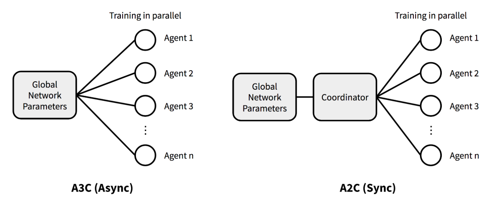

# Chapter 11. Modern Policy Gradient Methods

The algorithms introduced in this chapter is not included in Sutton's book, yet each one of them marks a great milestone in the journey of RL, and is still inspiring further development in the field.  I use the term "modern" to separate these algorithms from these in Chapter 10, yet during learning, you will be surprised to find that all these policy approximation methods share similarities to a significant level. 

In this chapter, for algorithms that can be traced back to their original publications, the notations used are consistent with those in the respective papers. Although different sections may employ varying notational conventions, these notations are grounded in the same fundamental concepts which we have introduced throughout this tutorial, and as such, readers should expect no significant difficulty in understanding them. Also be advised that a fundamental understanding of neural networks is assumed for the study of the content in this chapter.

## 11.1 The Concept of Advantage

### 11.1.1 Definition

Advantage (function) is a concept that compares the Q-value of an action to the Value function of a state, it measures how much better or worse the action $a_t​$ is compared to the average behavior of the agent in that state. It is defined as:

$$
A(s_t, a_t) \ \dot= \ q(s_t, a_t) - v(s_t)
$$

- Intuition: Advantage quantifies how much better or worse the action $a_t$ is than the expected return $E_\pi[G_t \vert s_t]$ of being in state $s_t$.

    - $A(s_t, a_t) > 0$: the action $a_t$ is considered better than the average action in state $s_t$.

    - $A(s_t, a_t) < 0$: the action $a_t$ is worse than the average action in state $s_t$.

    - $A(s_t, a_t) = 0$: the action is neither better nor worse than the expected value.

```{note}
Advantage function $A(s_t, a_t)$ is often written as $A_t$ for simplicity
```

### 11.1.2 Justification of Existence

The gradient estimate in Policy Gradient methods is often noisy, as we have seen in [Chapter 10](../Contents/10_policy_gradient_methods.md) from REINFORCE algorithm, because the estimate is based on the observed returns, which can be stochastic and vary greatly.

Advantage reduces the variance of the gradient estimates and leads to more stable updates by simply replacing the return term in gradient estimate as follows:

$$
\theta_{t+1} \doteq \theta_t + \alpha \ A_t \frac{\nabla \pi(A_t|S_t, \theta)}{\pi(A_t|S_t, \theta)}
$$

```{note}
- For REINFORCE with baseline method, when an approximate state value function $\hat{v}(S_t, \boldsymbol{w})$ is used as the baseline, the quantity $G_t - b(S_t)$ can be seen as an estimate of the advantage $A_t$, because $G_t$ is an estimate of $q(s_t, a_t)$ by definition.

- In practice, one may encounter many cases where REINFORCE with baseline is regarded as actor-critic method. This tutorial abides by the rule in Sutton's book and treat only those, whose estimated critic model is used for boostrapping, as AC methods. 
```

### 11.1.3 Estimation of Advantage

- **By definition**: $A(s_t, a_t)$ can be estimated by simply subtracting state value from action value as by definition:

    $$
    \begin{align*}
    \hat{A}(s_t, a_t) \ &\dot= \ q(s_t, a_t) - v(s_t) \\
    &= G_t - v(s_t) 
    \end{align*}
    $$

    Note that the first estimation is less often seen in practice since it requires learning of two critic models, and therefore often replaced by the second representation. 

- **By TD error**: TD error can be a practical approximate estimation for advantage. Recall that in Chapter 3 [section 3.3](../Contents/3_markov_decision_process.md#33-policies-and-value-functions), we have given that 

    $$q(s,a) \dot= \sum_{s', r}p(s', r|s, a) [r + \gamma v_{\pi}(s')]$$

    This means that $r + \gamma v_{\pi}(s')$ is a single realization when starting from (s,a) and the state $s'$ is actually reached.

    Therefore, we can replace $q(s_t,a_t)$ by $r_{t+1} + \gamma v(s_{t+1})$ and estimated the advantage as:

    $$\hat{A}(s_t, a_t) \ = \ r_{t+1} + \gamma v(s_{t+1}) - v(s_{t})$$

- **Generalized Advantage Estimation (GAE)**: 

    We have mentioned above that advantage can be estimated by $G_t - v(s_t)$ since the return at time step $t$ is an estimate for the respective action-value. We now consider a different perspective for estimating the return. In $n$-step TD method (which is not included in this tutorial), return is defined as 

    $$
    \begin{align*}
    G_{t:t+n} \ &\dot= \ R_{t+1} + \gamma R_{t+2} + \cdots + \gamma^{n-1} R_{t+n} + \gamma^n V(S_{t+n}) \\
    &=  \sum_{k=0}^{n-1} \gamma^k R_{t+k+1} + \gamma^n v(s_{t+n})
    \end{align*}
    $$

    This $n$-step return $G_{t:t+n}$ provides a lower-variance estimator than the Monte Carlo return at the cost of introducing some bias. To bring this idea further, one can calculate an exponentially-weighted average of $n$-step returns with a decay parameter $\lambda$ and introduce the $\lambda$-return:

    $$
    \begin{align*}
    G^{\lambda}_t \ &\dot= \ (1 - \lambda) \sum_{n=1}^{\infty} \lambda^{n-1} G_{t:t+n} \\
    &= (1 - \lambda) \sum_{n=1}^{T-t-1} \lambda^{n-1} G_{t:t+n} + \lambda^{T-t-1} G_t
    \end{align*}
    $$

    The second equation above is derived when we assume all rewards after time step $T$ are 0, such as $G_{t:t+n} = G_{t:T}$ for all $n \geq T-t$. Compared to $n$-step return, where the balance between bias and variance is achieved in a discrete setting (by choosing $n$) $\lambda$-return operates with a continuous spectrum and offers a more smooth trade-off. Empirically, the $\lambda$-return has been shown to produce better performance than simply using an $n$-step return.

    Now, GAE is computed by replacing the MC return with $\lambda$-return as:

    $$
    \begin{align*}
    \hat{A}^{GAE}(s_t, a_t) \ &\dot= \ G^{\lambda}_t - v(s_t)   \tag{1} \\
    &= \sum_{l=0}^{\infty} (\gamma \lambda)^l \delta_{t+l}   \tag{2} \\
    &= \delta_{t} + (\gamma \lambda)\delta_{t+1} + (\gamma \lambda)^2\delta_{t+2} + \ ...   \tag{3}  \\ 
    &= \delta_{t} + (\gamma \lambda)\hat{A}^{GAE}(s_{t+1}, a_{t+1}) \tag{4} 
    \end{align*}
    $$

    To find the exact process of how GAE is represented by $(2)$, we refer interested readers to the [original paper](https://arxiv.org/pdf/1506.02438). Equation $(3)$ implements GAE in truncated form that gives a weighted sum of TD errors, where the future TD errors are discounted and smoothed by the $\lambda$-parameter. In practice, GAE at each time step is often computed using equation $(4)$ in a backward manner.

    ```{note}
    - Intuition on $n$-step return $G_{t:t+n}$: when $n=1$, it results in the 1-step return $R_{t+1} + \gamma v(s_{t+1})$, which is exactly the update target in TD methods (high bias, low variance). As $n$ goes to infinity, it recovers the original Monte Carlo return (unbiased, high variance). Therefore, $n$ acts as a trade-off between bias and variance for the value estimator. 

    - Intuition on $\lambda$ return: similiar to the $n$-step return, $\lambda=0$ reduces to the single-step return (1-step TD target), and $\lambda=1$ recovers the Monte Carlo return.

    - Intuition on GAE: still, when $\lambda=0$, GAE reduces to 1-step TD, and $\lambda=1$ recovers the Monte Carlo estimation.
    ```

## 11.2 Asynchronous Advantage Actor-Critic (A3C)

### 11.2.1 Background

A3C is an actor-critic algorithm that uses multiple workers (parallel actors) to explore the environment (use multiple CPU threads on a single machine) and update the shared model asynchronously. Authors of A3C have applied the asynchronous approach to 4 existing RL algorithms: one-step Q-learning, one-step Sarsa, n-step Q-learning and actor-critic. Among these 4 algorithms, asynchronous advantage actor-critic achieved the state-of-the-art performance on Atari games during the time. 


### 11.2.2 Advantage and Gradient Estimator

- **Estimation of Advantage**: advantage in A3C is estimated by definition, except that instead of using Monte Carlo return, it uses $n$-step return and computes $A(s_t, a_t; \theta, \theta_v)$ as follows (different notations from section [11.1](#111-the-concept-of-advantage)):

    $$
    A(s_t, a_t; \theta, \theta_v) = \sum_{i=0}^{k-1} \gamma^i r_{t+i} + \gamma^k V(s_{t+k}; \theta_v) - V(s_t; \theta_v)
    $$

    where $\theta, \theta_v$ denote the parameter for the actor and critic model, respectively. The step $k$ can vary from state to state and is upper-bounded by $t_{max}$.

- **Optimization Objective**: with advantage being estimated, the gradient for the policy model in A3C is estimated as usual:

    $$
    \begin{align*}
    \hat{g} &= \nabla_{\theta'} \log \pi(a_t | s_t; \theta')A(s_t, a_t; \theta, \theta_v) \\
    &=\nabla_{\theta'} \log \pi(a_t | s_t; \theta') (R_t - V(s_t; \theta_v))
    \end{align*}
    $$

    where $R_t$ is the $n$-step return.

### 11.2.3 A3C Algorithm

- **Pseudocode for A3C**:

    <div style="display: flex; justify-content: center;">
    
    </div>

- **Parameter Sharing between Actor and Critic**

    In the above pseudocode, while the parameters $\theta$ of the policy and $\theta_v$ of the value function are shown as being separate for generality, we always share some of the parameters in practice. 
    
    In A3C paper, the author states that they typically use a convolutional neural network that has one softmax output for the policy $\pi(a_t|s_t; \theta)$ and one linear output for the value function $V(s_t; \theta_v)$, with all non-output layers shared.

- **Entropy Bonus**

    Adding the entropy of the policy $\pi$ to the objective function has been shown to be able to improve exploration by discouraging premature convergence to suboptimal deterministic policies.

    With the entropy bonus / regularization added, the gradient of the full objective function with respect to the policy parameters takes the form:

    $$
    \nabla_{\theta'} \log \pi(a_t | s_t; \theta') (R_t - V(s_t; \theta_v)) + \beta \nabla_{\theta'} H(\pi(s_t; \theta'))
    $$

    where $H$ is the entropy. The hyperparameter $\beta$ controls the strength of the entropy regularization term.


### 11.2.4 Properties of A3C

- **Advantages**

    - Multi-thread computation: For the first time of all RL algorithm, A3C moves computation to a single machine with multiple CPU threads, instead of using separate machines and multiple GPUs, and also achieves better performance than its precursors.

    - Training speed: The reduction in training time is roughly linear in the number of parallel actor-learners

    - Stabilized training: One can explicitly use different exploration policies in each actor-learner to maximize the diversity. The overall changes being made to the parameters by multiple actor-learners applying online updates in parallel are likely to be less correlated in time than a single agent applying online updates. The training process can thereby be stabilized.

- **Disadvantages**:

    - Local Optima Convergence: In A3C each agent talks to the global parameters independently, so it is possible sometimes the thread-specific agents would be playing with policies of different versions and therefore the aggregated update would not be optimal.

    - Complexity in Debugging: The asynchronous nature of A3C can make debugging and analyzing the algorithm more challenging. Since multiple workers update the global network independently, it can be difficult to trace the source of errors or inconsistencies during training.


## 11.3 Advantage Actor-Critic (A2C)

### 11.3.1 Background

A2C is a simplified variant of A3C, and there is no official publication that formally introduces the method. Here, we provide a brief overview of the core concepts underlying A2C and direct interested readers to the relevant sections of this tutorial for more detailed technical descriptions.

In A3C, each worker operates with its own copy of the environment and updates the shared global parameters independently, which introduces asynchronicity. However, reseachers from OpenAI found that there is no evidence showing that this asynchrony provides any performance benefit. In the opposite, waiting for each actor to finish its segment of experience before performing an update, and averaging over all of the actors can simplify debugging and make the use of GPUs more effective.

With the asynchronous setting eliminated, the resulting method is naturally called Advantage Actor-Critic (A2C). Let's now dive deeper into its core ideas. 

### 11.3.2 Core ideas of A2C

- **Gradient Update**

    Except for the asynchrony, gradient update takes exactly the same form as A3C. To resolve the potential inconsistency of gradient update in A3C, a coordinator in A2C waits for all the parallel actors to finish their work before updating the global parameters. Then in the next iteration parallel actors start from the same policy. The synchronized gradient update keeps the training more cohesive and potentially to make convergence faster.

    <div style="display: flex; justify-content: center;">
    
    </div>

- **Algorithm**

    In fact, when parallel actors are used, the one-step actor–critic algorithm introduced in chapter 10, [section 10.4.1](../Contents/10_policy_gradient_methods.md#1041-ac-methods-for-episodic-tasks) is a perfect example of A2C, where the advantage is estimated using one-step TD error. 
    
    To introduce the A2C algorithm from a more practical perspective similar to section [11.2](#1112-justification-of-existence), we use the pseudocode presented in [this paper published on Nature](https://www.nature.com/articles/s41593-018-0147-8) as follows:

    <div style="display: flex; justify-content: center;">
    
    </div>

    Note that those $E$ episodes presented above would be run in parallel by multiple actors in practical implementation.

### 11.3.3 Properties of A2C

- **Advantages**

    - This A2C implementation is more cost-effective than A3C when using single-GPU machines, and is faster than a CPU-only A3C implementation when using larger policies.

    - One advantage of this method is that it can use GPUs more effectively, which perform best with large batch sizes. 

- **Disadvantages**

    - A2C can face instability and convergence issues due to its reliance on gradient descent, which can cause rapid and unpredictable parameter updates. This can lead to oscillations, divergence, or poor performance. Gradient clipping, trust region techniques can ensure a more smoother, reliable learning paths.


```{note}
Some Researchers argue that [A2C is a special case of Proximal Policy Optimization (PPO)](https://arxiv.org/pdf/2205.09123), which we will introduce in next section.
```

## 11.4 Proximal Policy Optimization (PPO)

### 11.4.1 Background

Among all modern RL algorithms, PPO stands out as one of the most influential framework. It is adapted on the basis of Trust Region Policy Optimization (TRPO), while being significantly simpler to implement, and empirically, it seems to perform at least as well as TRPO. We cover PPO's background only by giving a brief description of TRPO.

With definition of advantage, the gradient estimator (also the maximization objective) of all policy gradient methods can be written as:

$$
\hat{g} = \hat{\mathbb{E}}_t \left[ \nabla_{\theta} \log \pi_{\theta}(a_t \mid s_t) \hat{A}_t \right]
$$

TRPO methods takes the following maximization objective:

$$
\begin{align*}
&\text{maximize}_{\theta} \ \hat{\mathbb{E}}_t \left[ \frac{\pi_{\theta}(a_t \mid s_t)}{\pi_{\theta_{\text{old}}}(a_t \mid s_t)} \hat{A}_t \right] \\
&\text{subject to} \quad \hat{\mathbb{E}}_t \left[ \text{KL}\left[\pi_{\theta{\text{old}}}(\cdot \mid s_t), \pi_{\theta}(\cdot \mid s_t)\right] \right] \leq \delta,
\end{align*}
$$

where $\theta_{old}$ denotes the parameter of the policy before the update. 

```{note}
The theory justifying TRPO actually suggests using a penalty instead of a constraint, i.e., solving the unconstrained optimization problem maximize over $\theta$:

$$
\text{maximize}_{\theta} \; \hat{\mathbb{E}}_t \left[ \frac{\pi_{\theta}(a_t \mid s_t)}{\pi_{\theta_{\text{old}}}(a_t \mid s_t)} \hat{A}_t - \beta \, \text{KL}\left[\pi_{\theta_{\text{old}}}(\cdot \mid s_t), \pi_{\theta}(\cdot \mid s_t)\right] \right]
$$

TRPO uses a hard constraint rather than a penalty because it is hard to choose a single value of the coefficient $\beta$ that performs well across different problems—or even within a single problem.
```

### 11.4.2 Objective of Proximal Policy Optimization

We have seen that TRPO maximizes a "surrogate" objective as follows:

$$
L^{CPI}(\theta) = \hat{\mathbb{E}}_t \left[ r_t(\theta) \hat{A}_t \right],
$$

where $r_t(\theta)$ denotes the probability ratio $\frac{\pi_\theta(a_t | s_t)}{\pi_{\theta_{\text{old}}}(a_t | s_t)}$ ($r(\theta_{\text{old}}) = 1$). And $CPI$ refers to conservative policy iteration. Instead of using KL-divergence, PPO modifies this objective and constrain the policy changes that move $r_t(\theta)$ too much away from 1, by introducing the $\textit{Clipped Surrogate Objective}$. To be precise, there are three different components in PPO's optimization objective:

- **Clipped Surrogate Objective**: penalizes changes to the policy that move $r_t(θ)$ away from 1 by clipping $r_t(θ)$ into a given range:

    $$
    L^{CLIP}(\theta) \ \dot= \ \hat{\mathbb{E}}_t \left[ \min \left( r_t(\theta) \hat{A}_t, \, \text{clip}(r_t(\theta), 1 - \epsilon, 1 + \epsilon) \hat{A}_t \right) \right],
    $$

    where epsilon is a hyperparameter for controlling the clipping range.

- **Value Function Loss**: denoted by $L_t^{VF}(\theta)$, the value function loss is a squared-error loss represented as follows:

    $$
    L_t^{VF}(\theta) \dot= (V_\theta(s_t) - V_t^{targ})^2
    $$

- **Entropy Bonus**: PPO also adds an entropy bonus $S[\pi_\theta](s_t)$ to the objective, given as:

    $$
    S[\pi_\theta](s_t) =− \sum_a \pi(a_t \vert s_t)log\pi(a_t \vert s_t)
    $$

    Since PPO uses gradient ascent, adding this entropy term encourages the agent to maintain a level of uncertainty (higher entropy suggests higher uncertainty) about the best action, leading it to explore a broader range of actions during training.
    
    If the policy becomes too deterministic (i.e., it consistently selects the same actions), the entropy will decrease, and the agent will be incentivized to explore more diverse actions, which is of great importance in early stage of training.


- **Final PPO Objective**: Assume we are using a neural network architecture that shares parameters between the policy and value function, we must use a loss function that combines the policy surrogate and a value function error term. With augmentation of entropy bonus to ensure sufficient exploration, the final PPO objective is defined as follows:

    $$
    L_t^{CLIP+VF+S}(\theta) = \hat{\mathbb{E}}_t \left[ L_t^{CLIP}(\theta) - c_1 L_t^{VF}(\theta) + c_2 S[\pi_\theta](s_t) \right],
    $$

    where $c_1$, $c_2$ are **positive** coefficients. Note that $L_t^{VF}(\theta)$ is a negative term, such that the squared-error loss is minimized when the overall objective is maximized.

### 11.4.3 PPO algorithm

- **Pseudocode**

    <div style="display: flex; justify-content: center;">
    
    </div>

    In each iteration, each of $N$ (parallel) actors collect $T$ timesteps of data. Then we construct the surrogate loss on these $N \times T$ timesteps of data, and optimize it with minibatch SGD for $K$ epochs.

- **Algorithm Details**

    - **Estimation of Advantage**: As you may already notice in the pseudocode, PPO uses a truncated version of generalized advantage estimation. 

        One style of policy gradient implementation, popularized in [A3C paper](https://arxiv.org/pdf/1602.01783) runs the policy for $T$ timesteps (where $T$ is much less than the episode length). It requires an advantage estimator that does not look beyond timestep $T$:

        $$
        \hat{A}_t = -V(s_t) + r_t + \gamma r_{t+1} + \cdots + \gamma^{T - t + 1} r_{T - 1} + \gamma^{T - t} V(s_T).
        $$

        Generalizing this choice, PPO uses a truncated version of generalized advantage estimation, which reduces to above when $\lambda = 1$:

        $$
        \begin{align*}
        \hat{A}_t &= \delta_t + (\gamma \lambda) \delta_{t+1} + \cdots + (\gamma \lambda)^{T - t + 1} \delta_{T - 1} \\
        &= \delta_t + \gamma\lambda\hat{A}_{t+1},
        \end{align*}
        $$

    - **Gradient Ascent in Practice**

        In practice, updates for actor and critic model are separate. The gradient (ascent) estimator for policy model is as follows:

        $$
        \hat{g}_{actor} = \frac{1}{NT}\sum_{n=0}^{N} \sum_{t=0}^{T} [\min ( r_t(\theta) \hat{A}_t, \ \text{clip}(r_t(\theta), 1 - \epsilon, 1 + \epsilon) \hat{A}_t) + S[\pi_\theta](s_0)]
        $$

        While #gGradient (descent) estimator for value function is:

        $$
        \hat{g}_{critic} = \frac{1}{NT}\sum_{n=0}^{N} \sum_{t=0}^{T}L_t^{VF}(\theta),
        $$

        for whichever form of loss used for the value function.


### 11.4.4 Properties of PPO

- **Advantages**:

    - Stable Learning: PPO uses a clipped objective to limit how much the policy can change at each update, preventing large, unstable updates that might destabilize training.

    - Implementation Simplicity: Compared to more complex methods like TRPO, PPO is relatively simple to implement while still achieving competitive performance across a range of tasks.

- **Disadvantages**:

    - Hyperparameter Sensitivity: PPO requires careful tuning of its hyperparameters (like the clipping parameter and learning rate) to achieve optimal performance. Which requires experiments and understanding of the specific problem setting.

    - Computational Overhead: PPO can be computationally expensive, particularly when running in a distributed setting or with large-scale environments, as it relies on collecting batches of data before each update and updating of both actor and critic models.

## 11.5 Group Relative Policy Optimization (GRPO)

### 11.5.1 Background

Different from all other algorithms introduced in former sections, GRPO was proposed targeting a specific kind of RL task - the post-training of Large Language Models (LLMs). At this point, its effectiveness applied on other types of tasks is less studied, we introduce GRPO mainly in the context of LLM training.

Before GRPO, the de-facto algorithm for LLM training is PPO with one particular adaptation - adding a KL penalty from a reference model in the reward to prevent the policy deviating too much from the reference during update. The reward is then computed as

$$
r_t = r_\phi(s_t, a_t) - \beta log \frac{\pi_\theta(a_t\vert s_t)}{\pi_{ref}(a_t\vert s_t)}
$$

with $r_\phi$ being the reward model and the reference model $\pi_{ref}$ being a frozen copy (untrainable) of the policy. 

In context of LLM training, critic model is usually a model that has comparable size with the policy model (with some parameter shared). To lower computational burden, GRPO obviates the need for additional value function approximation, and instead **uses the average reward of multiple sampled outputs as the baseline** (explained in advantage estimation). The process is shown in the figure below.

<div style="display: flex; justify-content: center;">

</div>

In short, GRPO does not require the critic model and takes a group average reward as the baseline, advantage is also estimated using this grouping method (introduced later).

```{note}
Notations in context of LLM training:

- $q$: the input question given to an LLM.

- $o_i$: the observation (state) $i$ at a certain time step $t$, usually is the concatenation of $q$ with all generated content till $t$.

- $r_i$: reward given by a reward model $\phi$ based on $o_i$.

- $A_i$: advantage computed at time step $t$.
```

### 11.5.2 Optimization Objective

- **Overall Objective**

    $$
    \begin{align*}
    \mathcal{J}_{GRPO}(\theta) &= \mathbb{E}_{q \sim P(Q), \{o_i\}_{i=1}^G \sim \pi_{\theta_{old}}(O|q)} \left[\frac{1}{G} \sum_{i=1}^G \frac{1}{|o_i|} \sum_{t=1}^{|o_i|} \min \left( \frac{\pi_{\theta}(o_{i,t}|q, o_i,<t)}{\pi_{\theta_{old}}(o_{i,t}|q, o_i,<t)} \hat{A}_{i,t} \, \text{clip} \left( \frac{\pi_{\theta}(o_{i,t}|q, o_i,<t)}{\pi_{\theta_{old}}(o_{i,t}|q, o_i,<t)} \right) (1 - \epsilon, 1 + \epsilon) \hat{A}_{i,t} \right) - \beta D_{KL}[\pi_{\theta_{old}} || \pi_{ref}] \right] \\
    &\text{with} \ \mathbb{D}_{KL} (\pi_{\theta} || \pi_{\text{ref}}) = \frac{\pi_{\text{ref}}(o_i|q)}{\pi_{\theta}(o_i|q)} - \log \frac{\pi_{\text{ref}}(o_i|q)}{\pi_{\theta}(o_i|q)} - 1
    \end{align*}
    $$

    Same as PPO, GRPO also uses a clipped objective, yet differently, no entropy bonus is added in the objective.  

    Also note that, instead of adding KL penalty in the reward, GRPO regularizes by directly adding the KL divergence between the trained policy and the reference policy to the maximization objective, avoiding complicating the calculation of $A_{i,t}$.

    ```{note}
    Note that GRPO estimates the KL divergence with an unbiased estimator different from the KL estimation described at the beginning of this section. 
    ```

- **Estimation of Advantage**

    Since GRPO requires no value function, it estimates advantage $A_{i,t}$ by calculating based on relative rewards of the outputs inside each group only as follows:

    $$
    A_{i,t} = \frac{r_i - \text{mean}(\{r_1, r_2, \dots, r_G\})}{\text{std}(\{r_1, r_2, \dots, r_G\})}
    $$


### 11.5.2 GRPO Algorithm

- **Pseudocode**

    <div style="display: flex; justify-content: center;">
    
    </div>

    The above algorithm [reference to GRPO] uses an iterative approach, except for the usual computations of all components required, there are two main things to be noted:

- **Reward Model Retraining**: In iterative GRPO, the authors generate new training sets for the reward model based on the sampling results from the policy model and continually train the old reward model using a **replay mechanism** that incorporates 10% of historical data. Then, they set the reference model as the policy model, and continually train the policy model with the new reward model.

- **Token Generation as Time Step**: In context of LLM training, this algorithm is performed on the token level.

### 11.5.3 Properties of GRPO

- **Advantages**  

    - Reduced computational burden: GRPO eliminates the need for a critic model, reducing memory usage and computational costs through group-based sampling.

    - Efficient advantage estimation: By comparing multiple outputs for the same input, GRPO provides stable and efficient advantage estimation.

    - Conservative policy updates: A KL penalty in GRPO’s objective function ensures more stable and conservative policy updates.

- **Disadvantages**

    - Complex reward design: GRPO requires careful reward function design to reflect output quality, which can be challenging.

    - Dependency on group size: The group size affects advantage estimation accuracy; too small a group may lack sufficient information, while a very large group increases computational overhead.

## 11.6 Summary

In this chapter, we introduced several reinforcement learning algorithms, focusing on their core concepts, advantages, and disadvantages. The concept of **Advantage** was first discussed, which measures how much better or worse an action is compared to the average behavior in a given state. This helps reduce variance in gradient estimates, leading to more stable updates in policy gradient methods. Advantage can be estimated using TD error, Monte Carlo return, or Generalized Advantage Estimation (GAE), with GAE offering a smooth bias-variance trade-off.

We then delved into Asynchronous **Advantage Actor-Critic (A3C)**, which uses multiple workers to explore the environment and update the shared model asynchronously. A3C estimates advantage using n-step returns and includes an entropy bonus to improve exploration. While A3C benefits from multi-thread computation and faster training, it may converge to local optima and presents challenges in debugging due to its asynchronous nature.

Next, we explored **Advantage Actor-Critic (A2C)**, a synchronous variant of A3C where updates are coordinated among parallel actors. This method is more cost-effective on single-GPU machines and offers better GPU utilization but can face instability and convergence issues due to reliance on gradient descent.

**Proximal Policy Optimization (PPO)** simplifies TRPO while maintaining performance, using a clipped objective to limit policy changes. PPO combines clipped surrogate objective, value function loss, and entropy bonus. It provides stable learning and simpler implementation but requires careful hyperparameter tuning and can be computationally intensive.

Finally, **Group Relative Policy Optimization (GRPO)** targets post-training of Large Language Models (LLMs), eliminating the need for a critic model by using group-based sampling. GRPO uses the average reward as a baseline and incorporates KL penalty for conservative updates. While GRPO reduces computational burden and offers efficient advantage estimation, it relies heavily on complex reward design and group size considerations.

## Resources

### References

**[1] GAE paper**: [High-Dimensional Continuous Control Using Generalized Advantage Estimation](https://arxiv.org/pdf/1506.02438)

**[2] A3C paper**: [Asynchronous Methods for Deep Reinforcement Learning](https://arxiv.org/pdf/1602.01783)

**[3] Paper that proposed the Entropy Bonus**: [Function optimization using connectionist reinforcement learning algorithms](https://www.researchgate.net/publication/2703232_Function_Optimization_Using_Connectionist_Reinforcement_Learning_Algorithms)

**[4] A2C blog from OpenAI**: https://openai.com/index/openai-baselines-acktr-a2c/

**[5] PPO paper**: [Proximal Policy Optimization Algorithms](https://arxiv.org/pdf/1707.06347)

**[6] GRPO paper**: [DeepSeekMath: Pushing the Limits of Mathematical Reasoning in Open Language Models](https://arxiv.org/pdf/2402.03300)

**[7] Lil'Llog** which gives the graphical comparison between A3C and A2C: https://lilianweng.github.io/posts/2018-04-08-policy-gradient/#a2c

**[8] Shulman's blog** that proposed the unbiased KL divergence estimator used in GRPO: http://joschu.net/blog/kl-approx.html

### Extra Resoures

If you are interestd in RL algorithms developed specifically for LLM post-training, here are some suggested readings:

1. [RRHF: Rank Responses to Align Language Models with Human Feedback](https://neurips.cc/virtual/2023/poster/72308)

2. [RAFT: Reward rAnked FineTuning for Generative Foundation Model Alignment](https://arxiv.org/pdf/2304.06767)

3. [Back to Basics: Revisiting REINFORCE Style Optimization for Learning from Human Feedback in LLMs](https://arxiv.org/pdf/2402.14740)

4. [ReMax: A Simple, Effective, and Efficient Reinforcement Learning Method for Aligning Large Language Models](https://arxiv.org/pdf/2310.10505)

5. [REINFORCE++: A Simple and Efficient Approach for Aligning Large Language Models](https://arxiv.org/pdf/2501.03262)