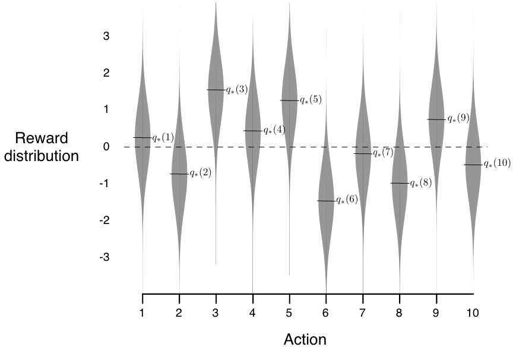

# Chapter 2. Multi-armed Bandit

In this chapter we study the evaluative aspect of reinforcement learning in a simplified setting, one that does not involve learning to act in more than one situation, i.e., there is only one single state.

## 2.1 A k-armed Bandit Problem

- **Setting**: In one single state, you are given $k$ different options, or actions. With each action taken, a random numerical reward chosen from a stationary probability distribution will be given. **The objective is to maximize the expected total reward over some time period.**

    - Time steps: time steps describe the number of times actions are taken.

    - Value of an action: mean reward received by taking this action 

        $$
            q_{*}(a) \dot= E[R_{t}|A_{t}=a]
        $$

        We assume that you do not know the action values with certainty (otherwise the problem is already solved). You may have an estimate for the value of action $a$ at time step $t$ as $Q_t(a)$, and ideally $Q_t(a)$ would be close to $q_{*}(a)$.

    - For beginners who find this setting abstract, feel free to watch this [optional lecture video](https://www.coursera.org/learn/fundamentals-of-reinforcement-learning/lecture/PtVBs/sequential-decision-making-with-evaluative-feedback), in which the lecturer motivates this problem with a small example of a doctor choosing medicines.

- **To explore or to exploit**: In any RL problem, we are always forced to trade-off between the two options: exploration or exploitation. explained in this setting as follows:

    - **Exploitation**: to exploit your current knowledge of the values of the actions, i.e., to always choose that one action whose estimated value is the greatest. This action is also called the $\textit{greedy action.}$  

    - **Exploration**: to select one of the nongreedy actions. This is beneficial since it enables you to improve your estimate of the nongreedy action’s value.

    Exploitation is the right thing to do to maximize the expected reward on the one step, but exploration may produce the greater total reward in the long run. The trade-off is faced nearly everywhere in RL problems. We will see some tricks about encouraging exploration later in [section 2.5](#25-more-on-exploration-tricks)

## 2.2 Action-value methods

- **Definition**: methods for estimating the values of actions and for using the estimates to make action selection decisions are called action-value methods.

- **Estimation for $Q_{t}(a)$:**

    One natural way to estimate $Q_{t}(a)$ is by averaging the rewards actually received using the socalled $\textit{sample-average method}$

    $$
        \begin{align*}
        Q_{t}(a) \ &\dot= \ \frac{\text{sum of reward when $a$ taken prior to t}}{\text{number of times $a$ taken prior to t}} \\
        &= \frac{\sum_{i=1}^{t-1}R_{i} \cdot \mathbb{1}_{A_{i}=a}}{\sum_{i=1}^{t-1} \mathbb{1}_{A_{i}=a}}
        \end{align*}
    $$

- **Action selection methods:** there are two natural ways when selecting actions based on estimates, one maximizes exploitation, and the other takes exploration into account based on that:

    - **Greedy action selection:** always exploits current knowledge to maximize immediate reward
    
    $$
    A_t \dot= \underset{a}{\arg\max} Q_{t}(a)
    $$

    - **$\epsilon$-greedy action selection:** behave greedily most of the time, but each time with a small probability $\epsilon$ (with $0<\epsilon<1$ and close to $0$), we select randomly among all the actions (including the greedy action) with equal probability. 

## 2.3 The 10-armed Testbed

- **Setup**: To demonstrate the effectiveness of greedy and $\epsilon$-greedy action selection, we create the following experiment:
    - We set $k=10$, i.e., create a 10-armed bandit problem.
    - Design the reward distribution of each action to follow a standard normal distribution ($\mu=0 \text{ and } \sigma=1$) 

        <div style="display: flex; justify-content: center;">
        
        </div>

- **Performance**: The performance of each action selection method is measured by averaging the results from 2000 independent $\textit{runs}$, with each $\textit{run}$ containing 1000 time steps (recall that time steps describe the number of times actions are taken.)

    <div style="display: flex; justify-content: center;">
    
    </div>

    With greater $\epsilon$ value indicating more exploration and all selection methods used sample averages as their action-value estimates, conclusions from the above figure are: 

    - The greedy method performed significantly worse in the long run because it often got stuck performing suboptimal actions.

    - The $\epsilon=0.01$ method (less exploration) improved more slowly, but eventually would perform better than the $\epsilon=0.1$ (more exploration) method. This emphasizes the trade-off between exploration and exploitation, i.e., exploration ($\epsilon=0.01$) can improve performance yet worsen results when too much ($\epsilon=0.1$).


```{note}
- **Note on the advantage of exploration:** It depends on the task. 

    - **Reward Variance:** if the reward variance is large (noisier reward), it takes more exploration to find the optimal action, in this case  $\epsilon$-greedy method should be better. On the contrary, if reward variance is zero, greedy method will clearly perform best.

    - **Stationarity**: assume the distribution of the reward changs over time (as in a Markov Decision Process in different states, which will be introduced in the next chapter). In this case exploration is needed even in the deterministic case to make sure one of the nongreedy actions has not changed to become better than the greedy one.


```

## 2.4 Incremental Estimation for Action Values

We now take another look at sample-average method mentioned in [section 2.2](#22-action-value-methods) and study how those averages can be computed in a computationally effcient manner. Specifically, we study this problem in stationary and nonstationary scenario, respectively.

### 2.4.1 Stationary problems

- **Derivation**: Let $R_i$ denote the reward received at the $i$-th selection of action $a$, and $Q_n$ denote the estimate of the action value after it has been selected $n-1$ times. For $n$-th action selection:

    $$
        \begin{align*}
        Q_{n+1} &= \frac{R_1 + R_2 + ... + R_n}{n} \\
        &= \frac{1}{n}\sum_{i=1}^{n}R_i \\
        &= \frac{1}{n}(R_{n} + (n-1)\frac{1}{n-1}\sum_{i=1}^{n-1}R_i) \\
        &= \frac{1}{n}(R_{n} + (n-1)Q_n) \\
        &= Q_n + \frac{1}{n}(R_{n} - Q_n) \quad \text{(An incremental estimation)}
        \end{align*}
    $$

    - The above incremental estimation follows the general form:

        $$
        NewEstimate \leftarrow OldEstimate + StepSize*[Target - OldEstimate]
        $$

        with $StepSize$ is equal to $\frac{1}{n}$, which changes from time step to time step. In this book, the $StepSize$ is denoted by $\alpha$ or more generally by $\alpha_t(a)$

    - This equation of incremental estimation is a very representative form of many fundamental update rules in reinforcement learning and will be introduced in depth in [Chapter 6](../Contents/6_temporal_difference_learning.md) in particular. 

    - With this incremental implementation, we now can write a pseudocode for solving **stationary** bandit problem as below.

- **Algorithm**: A simple bandit algorithm 

    <div style="display: flex; justify-content: center;">
    
    </div>


### 2.4.2 Nonstationary problems

- **Derivation**: If the problem if nonstationary, i.e., the reward distribution changes over time, it would make more sense to give more weights to recent reward than the long-past rewards. To achieve this goal, we could use a constant step-size parameter $\alpha$

    $$
    \begin{align*}
    Q_{n+1} &= Q_n + \alpha \left[ R_n - Q_n \right] \\
            &= \alpha R_n + (1 - \alpha) Q_n \\
            &= \alpha R_n + (1 - \alpha) \left[ \alpha R_{n-1} + (1 - \alpha) Q_{n-1} \right] \\
            &= \alpha R_n + (1 - \alpha) \alpha R_{n-1} + (1 - \alpha)^2 Q_{n-1} \\
            &= \alpha R_n + (1 - \alpha) \alpha R_{n-1} + (1 - \alpha)^2 \alpha R_{n-2} + \\
            &\quad \ldots + (1 - \alpha)^{n-1} \alpha R_1 + (1 - \alpha)^n Q_1 \\
            &=(1 - \alpha)^n Q_1 + \sum_{i=1}^n \alpha (1 - \alpha)^{n-i} R_i
    \end{align*}
    $$

- **Explanation**:

    - Intuition for the final form

        - The final result is still a weighted average since $(1 - \alpha)^n + \sum_{i=1}^n \alpha (1 - \alpha)^{n-i} = 1$

        - The weight given to $R_i$ decreases exponentially as the number of intervening rewards increases, i.e., as $i$ becomes past
    
    - Intuition for $\alpha$

        - If $\alpha=1$, $Q_{n+1} = R_n$, and if $\alpha=0$, $Q_{n+1} = Q_{n}$. $\alpha$ controls the weights given to recent rewards.

        - The choice of $\alpha_n(a)=\frac{1}{n}$ results in the sample-average method

    - Optional: For the study of estimation convergence for different choice of $\alpha_n(a)$, refer to the original book chapter 2.5. In general, it is actually more desirable that $\alpha_n(a)$ makes the estimation never converge due to nonstationarity in reality.

## 2.5 More on exploration tricks
There are two more simple tricks for encouraging exploration beyond $\epsilon$-greedy (or as its extension). Note that they only work well for stationary problems for reasons that will be explained in each section

### 2.5.1 Optimistic Initial Values: 

- **Definition**: the method that encourages exploration (only in the beginning) by setting the initial action values to a large positive number.

- **Performance**: As an example, in 10-armed bandit testbed introduced in [section 2.3](#23-the-10-armed-testbed), we now set $Q_1(a)=+5$ for all $a$ (which is wildly optimistic since action values are given by standard normal distribution). Perform the experiment again use the same setting as before, i.e., averaging 2000 runs with each run up to 1000 time steps

    <div style="display: flex; justify-content: center;">
    
    </div>

    - Initially, the optimistic method performs worse because it explores more, but eventually it performs better because its exploration decreases with time.

    - At the beginning, the optimistic method has a sharp rise in optimal action ratio because of its frequent exploration.

- **Properties**: 

    - It is not well suited to nonstationary problems because its drive for exploration is inherently temporary, i.e., only in the beginning of a run. 

    - Nevertheless, these simple methods (including sample-average methods), and one of them, or some simple combination of them, is often adequate in practice.

### 2.5.2 Upper-Confidence-Bound Action Selection

- **Definition**: explores actions by taking their uncertainty into account as below:

    $$
        A_t \dot= \underset{a}{\arg\max} [Q_{t}(a) + c\sqrt{\frac{ln(t)}{N_t(A)}}]
    $$

    - $t$ denotes the current time step
    - $N_t(A)$ denotes the number of action $A$ being selected up to time step $t$
    - $c>0$ controls the degree of exploration 

- **Intuition**:

    - Naming convention: The square-root term is a measure of the $\textit{uncertainty}$ or variance in the estimate of $a$’s value. The quantity being maximized over is thus a sort of **upper bound on the possible true value** of action $a$, with $c$ determining the confidence level.

    - Working mechanism:
        
        - Each time $a$ is selected the uncertainty is presumably reduced: $N_t(a)$ increments, and, as it appears in the denominator, the uncertainty term decreases.
        
        - On the other hand, each time an action other than $a$ is selected, the uncertainty estimate of $a$ increases, causing its action value estimate to be bigger and the action will be explored more in later selection.

        - All actions will eventually be selected, but actions with lower value estimates, or that have already been selected frequently, will be selected with decreasing frequency over time. In short, more uncertainty leads to more exploration, causing the uncertainty to decrease in return.

- **Performance**:

    <div style="display: flex; justify-content: center;">
    
    </div>

    - UCB generally performs better than $\epsilon$-greedy action selection, except in the first $k$ steps, when it selects randomly among the as-yet-untried actions.

    - Similar to the optimitic initial value method, UCB also leads to a sudden increase in the average reward in the beginning of the experiment. This is because that UCB initializes each action with an optimistic upper confidence bound ($c\sqrt{\frac{ln(t)}{N_t(A)}}$ is quite large when $N_t(a)$ is small), leading all actions to have high values and to be explored in the beginning.

- **Properties**: UCB is more diffcult than $\epsilon$-greedy to extend beyond bandits to the more general reinforcement learning settings considered in the rest of this book due to its:

    - Difficulty in dealing with nonostationary problems: For UCB method, $N_t(a)$ accumulates over time. This means older observations dominate the estimated reward $Q_t(a)$. If the reward distribution shifts over time, UCB does not adapt quickly, i.e., it keeps exploiting an outdated "optimal" action rather than re-exploring.

    - Difficulty in dealing with large state spaces: UCB can be computationally expensive with a large number of actions or when actions need to be reassessed frequently due to changes in the environment. 


## 2.6 Summary

This chapter introduces multi-armed bandits, a simplified reinforcement learning problem where an agent chooses between $k$ actions, each with an unknown reward distribution. The goal is to maximize total reward over time while balancing exploitation and exploration.  

- Key Takeaways 

    1. Trade-off: Exploration vs. Exploitation
        - Greedy methods **maximize immediate reward** but can get stuck.  
        - **ε-greedy** explores randomly with probability **ε** (averaged among all actions) to find better actions.  

    2. Better Exploration Methods
        - **Optimistic Initial Values**: Start high to encourage early exploration.  
        - **Upper Confidence Bound (UCB)**: Explores actions with **high uncertainty** more often.  

    3. Efficient Learning
        - **Sample-average updates** work for stable rewards. 
        - **Constant step-size ($\alpha$) updates** adapt to changing rewards.  

- **Extra lecture video (optional)**: [Jonathan Langford: Contextual Bandits for Real World Reinforcement Learning](https://www.coursera.org/learn/fundamentals-of-reinforcement-learning/lecture/GkDVA/jonathan-langford-contextual-bandits-for-real-world-reinforcement-learning)