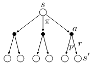
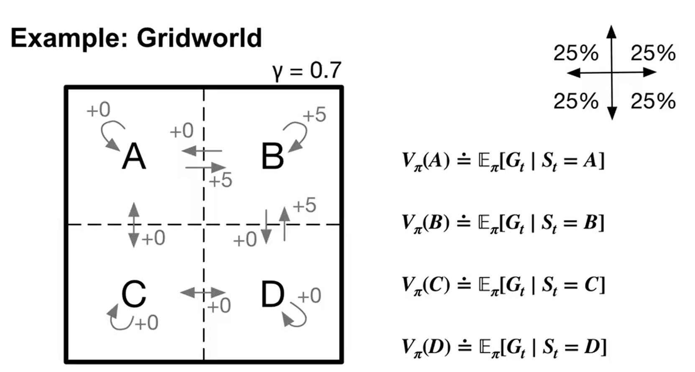
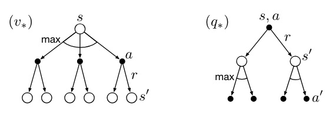

# Chapter 3. Finite Markov Decision Processes

MDPs are a formalization of sequential decision making, where actions influence both immediate rewards, and subsequent states, and thereby the future rewards. So they must consider the trade-off between the immediate reward and the delayed reward. 

Recall that in bandit problems we estimated the value $q_{\star}(a)$ of each action $a$, in MDPs, we would need to estimate the value $q_{\star}(s, a)$ of each action $a$ in each state $s$, or we estimate the value $v_{\star}(s)$ of each state given optimal action selection. The meaning of these notations will be explained later in this chapter. 

## 3.1. Agent-Environment Interface

- **Illustration of an MDP**: MDPs are meant to be a straightforward framing of the problem of learning from interactions between a learner and the environment to achieve a goal, illustrated as follows:

    <div style="display: flex; justify-content: center;">
    
    </div>

    - Explanations:

        - $\textit{Agent}$: the learner and decision maker

        - $\textit{Environment}$: the entity the agent interacts with, comprising everything outside the agent.

        - Interaction process: at time step $t$, the agent receives a representation of the environment's state $S_t \in S$, selects, on that basis, an action $A_t \in A(s)$, as a consequence, it then receives a numerical reward $R_{t+1} \in R \subset \mathbb{R}$, and finds itself in a new environment state $S_{t+1} \in S$.

        - $\textit{Trajectory}$: The sequence led by the interaction process: $s_0, a_0, r_1, s_1, a_1, r_2, ... , s_t, a_t, r_{t+1}$ (sometimes when we talk about MDPs, we refer to this kind of sequences directly).

- **Dynamics of MDP**: in a $\textit{finite MDP}$ - the sets of $S, A, R$ all have finite elements, so $S_t, R_t$ have well-defined discrete probability distributions that are dependent only on the preceding state and action ($\textit{Markov property}$) - the dynamics of a finite MDP can be represented in this form as follows:

    $$
        p(s', r | s, a) \dot= Pr(S_{t+1}=s', R_{t+1}=r | A_t=a, S_t=s) \\
        \text{with} \sum_{s' \in S} \sum_{ r\in R} p(s', r | s, a) = 1, \text{for all} \ s \in S, a \in A(s)
    $$

- **Useful derivations**: with the dynamics of a MDP known, one can compute anything one might want to know about the environment:

    - State-transition probability:

        $$
            p(s' | s, a) \doteq Pr(S_{t+1}=s' | A_t=a, S_t=s) = \sum_{r \in R}p(s', r | s, a)
        $$

    - Expected reward for state-action pairs:

        $$
            r(s,a) \doteq E[R_{t+1}|S_t=s, A_t=a] = \sum_{r \in R} r \sum_{s' \in S}p(s', r|s, a) 
        $$

    - Expected reward for state-action-next-state triples:

        $$
            r(s, a, s') \doteq \mathbb{E}[R_t \mid S_{t-1} = s, A_{t-1} = a, S_t = s'] = \sum_{r \in \mathcal{R}} r \frac{p(s', r \mid s, a)}{p(s' \mid s, a)}.
        $$


## 3.2. About Rewards and Returns

### 3.2.1 Goals and Rewards

- **Definition of reward**: In reinforcement learning, the purpose or goal of the agent is formalized in terms of a special scalar signal, called the $\textit{reward} \ (R_t \in R)$, passing from the environment to the agent.

    Note that the reward signal is your way of communicating to the agent of what you want it to achieve, NOT how you want it achieved, i.e., reward signal doesn't take the process into account.

- **Reward hypothesis**: The idea of maximizing the cumulative reward to allow the agent to show desirable behaviour is based on the $\textit{reward hypothesis}$: that all of what we mean by goals and purposes can be well thought of as the maximization of the expected value of the cumulative sum of the reward.

### 3.2.2 Returns and Episodes

- **Goal**: In general, we seek to maximize the $\textit{expected return} \ G_t$ of a sequence of rewards: 

    - for episodic tasks:

        $$
        G_t \dot= R_{t+1} + R_{t+2} + ... + R_{T} 
        $$

    - for continuing tasks:

        $$
        \begin{align*}
        G_t \ &\dot= \ R_{t+1} + \gamma R_{t+2} + \gamma^2 R_{t+3} + ... \\
        &= \sum_{k=0}^{\infty} \gamma^k R_{t+k+1} \\
        &= R_{t+1} + \gamma \times G_{t+1}
        \end{align*}
        $$

- **Details on the two types of tasks**:

    - $\textit{Episodic tasks}$: episodes end in a special state called the $\textit{terminal state}$, followed by a reset to a standard starting state or to a sample from a standard distribution of starting states. Note that
    
        - the next episode begins independently of how the previous one ended

        - episodes can all be considered to end in the same $\textit{terminal state}$

        - notation $S^+$ is used to denote the set of all non-terminal states plus the terminal state.

    - $\textit{Continuing tasks}$: in contrast, continuing tasks are those tasks in which the agent–environment interaction does not break naturally into identifiable episodes, but goes on continually without limit. Note that in continuous cases,

        - $\gamma \in (0,1)$ is called the $\textit{discount rate}$, and is used to represent the agent's preference between immediate and future reward. The more $\gamma$ approaches 1, the more "farsighted" the agent becomes.

        - though $G_t$ is a sum of an infinite number of terms, it is still finite if the reward is nonzero and constant and $\gamma \in (0,1)$.

        - special case for continuing tasks: if reward signal is +1 all the time, then:

            $$
            G_t = \sum_{k=0}^{\infty} \gamma^k = \frac{1}{1 - \gamma}
            $$

        - notation $S$ is used to denote the set of all non-terminal states.

- **Example of the two type of tasks**: Pole-Balancing (could be episode or continuing)

    <div style="display: flex; justify-content: center;">
    
    </div>

    - **Objective**: to apply forces to a cart moving along a track so as to keep a pole hinged to the cart from falling over. The pole is reset to vertical after each failure.

    - **Episodic perspective**:

        - Description: This task could be treated as episodic, where the natural episodes are the repeated attempts to balance the pole. 
        
        - Reward: The reward in this case could be $+1$ for every time step during which failure did not occur
        
        - Return: Return at each time would be the number of steps until failure.

    - **Continuing perspective**:

        - Description: We could also treat this as a continuing task, using discounting. 
        
        - Reward: In this case the reward would be $-1$ on each failure and zero at all other times. 
        
        - Return: The return at each time step would then be related to $-\gamma^K$, where K is the number of time steps before failure. The return is maximized by keeping the pole balanced for as long as possible.

### 3.2.3 Unified Notation for Episodic and Continuing Tasks

In practice, it turns out that when we discuss episodic tasks we almost never have to distinguish between different episodes. The two types of tasks can be unified by considering episode termination as the entering of a special $\textit{absorbing state}$ that transitions only to itself and that generates only rewards of zero.

<div style="display: flex; justify-content: center;">

</div>

So the expected return of both episodic and continuing tasks can now be written as $G_t=\sum_{k=0}^{\infty} \gamma^k R_{t+k+1}$


## 3.3. Policies and Value Functions

Almost all reinforcement learning algorithms involve estimating value functions - functions of states (or of state - action pairs) that estimate how good it is for the agent to be in a given state. We start this section by first defining policy:

- **Definition**: formally, a $\textit{policy}$ is a mapping from states to probabilities of selecting each possible action:

    $$
        \pi(a|s) = Pr(A_t=a|S_t=s)
    $$

and then we introduce Bellman equations and Bellman optimality equations for recursively computing value functions (both state-value and action-value functions).

### 3.3.1 Bellman Equations ([Optional Lecture video](https://www.coursera.org/learn/fundamentals-of-reinforcement-learning/lecture/X5VDU/bellman-equation-derivation))

- **Value Function (of state $s$) under policy $\pi$**: is the expected return when starting in state $s$ and following $\pi$ thereafter:

    $$
        \begin{align*}
        v_{\pi}(s) \ &\dot= \ \mathbb{E}_{\pi}[G_t|S_t=s] \\
        &= \mathbb{E}_{\pi}\left[\sum_{k=0}^{\infty}\gamma^k R_{t+k+1} | S_t=s\right] \\
        &= \colorbox{lightyellow}{$\sum_a \pi(a|s)q(s,a)$} \\
        &= \sum_a \pi(a|s) \sum_{s', r}p(s', r|s, a) [r + \gamma \mathbb{E}_{\pi}[G_{t+1}|S_{t+1}=s']] \\
        &= \colorbox{lightyellow}{$\sum_a \pi(a|s) \sum_{s', r}p(s', r|s, a) [r + \gamma v_{\pi}(s')]$} \quad (\text{Bellman equation for} \ v_\pi)
        \end{align*}
    $$

    - States are the independent variables for the value function, i.e., **for each input state, state-value function assigns a respective state value.**

    - **States-value functions are always defined by the policy**, when changing the policy, the resulted state-value function will usually be different.

    - The final equation above is called $\textit{Bellman Equation}$ for $v_{\pi}$, which expresses a relationship between the value of a state and the values of its successor states. The bellman equation can be understood with help of the following backup diagram for $v_{\pi}$:

        <div style="display: flex; justify-content: center;">
        
        </div>

        The backup operations (from bottom $s'$ to top $s$) transfer value information back to a state from its successor states.

- **Action-value function under policy $\pi$**: the expected return starting from $s$, taking the action $a$, and thereafter following policy $\pi$:

    $$
        \begin{align*}
        q_{\pi}(s,a) \ &\dot= \ \mathbb{E}_{\pi}[G_t|S_t=s, A_t=a] \\
        &= \mathbb{E}_{\pi}\left[\sum_{k=0}^{\infty}\gamma^k R_{t+k+1} | S_t=s, A_t=a\right] \\
        &= \colorbox{lightyellow}{$\sum_{s', r} p(s', r|s, a) (r + \gamma v(s'))$} \\
        &= \sum_{s', r} p(s', r|s, a) (r + \gamma \sum_{a'} \pi(a'|s')\mathbb{E}_{\pi}[G_{t+1}|S_{t+1}=s', A_{t+1}=a']) \\
        &= \colorbox{lightyellow}{$\sum_{s', r} p(s', r|s, a) [r+ \gamma \sum_{a'} \pi(a'|s') q(s', a')]$} \quad (\text{Bellman equation for} \ q_\pi)
        \end{align*}
    $$

    - Likewise, $q_{\pi}(s,a)$ is a function of state $s$ and action $a$, and is defined unique to the policy $\pi$.

    - The bellman equation for $q_{\pi}(s,a)$ can be understood with help of the following backup diagram:
        <div style="display: flex; justify-content: center;">
        
        </div>


- **Example of Gridworld (lecture video)**

    Watch this lecture video linked to the following image, which gives a vivid example of how Bellman equation is computed in a gridworld environment. If the image is not clickable, try [this link](https://www.coursera.org/learn/fundamentals-of-reinforcement-learning/lecture/in2Rn/why-bellman-equations)

	<a href="https://www.coursera.org/learn/fundamentals-of-reinforcement-learning/lecture/in2Rn/why-bellman-equations">
	
	</a>


### 3.3.2 Bellman Optimality Equation ([Optional Lecture video](https://www.coursera.org/learn/fundamentals-of-reinforcement-learning/lecture/9DFPk/optimal-value-functions))

- **Optimal Policy:** This [lecture video](https://www.coursera.org/learn/fundamentals-of-reinforcement-learning/lecture/AjTR1/optimal-policies) introduces optimal policy in depth if you find the textual definition too abstract.

    - Better or Equal Policy: A policy $\pi$ is defined to be **better or equal** to another policy $\pi'$ if:

    $$ v_{\pi}(s) \ge v_{\pi'}(s) \quad \text{for all } s \in S $$

    - Optimal Policy ($\pi_{\star}$): An **optimal policy** $\pi_{\star}$ is a policy that is better or equal to any other policy. Formally:
        - $\pi_{\star}$ must exist.
        - There can be more than one optimal policy.

- **Optimal value functions:**

    - Optimal State-Value Function: The **optimal state-value function** is defined as:

    $$ v_{\star}(s) \doteq \max_{\pi} v_{\pi}(s) \text{ for all } s \in S$$

    - Optimal Action-Value Function: The **optimal action-value function** is defined as:

    $$ q_{\star}(s, a) \doteq \max_{\pi} q_{\pi}(s, a) \text{ for all } s \in S, a \in A(s) $$


- **Bellman Optimality Equation:**

	- for $v_{\star}(s)$ (also written as $v_{\pi_\star}(s)$):

	$$
    \begin{align*}
	  v_{\star}(s) &= \colorbox{lightyellow}{$ \underset{a \in A(s)}{\max} q_{\star}(s,a)$} \\
      &= \underset{a}{\max} E_{\pi_{\star}}[R_{t+1} + \gamma G_{t+1} | S_t=s, A_t=a] \\
      &= \underset{a}{\max} E_{\pi_{\star}}[R_{t+1} + \gamma v_{\star}(s') | S_t=s, A_t=a] \\
	  &= \colorbox{lightyellow}{$ \underset{a}{\max} \sum_{s', r}p(s',r|s,a) (r+\gamma v_{\star}(s'))$}
    \end{align*}
    $$

	- for $q_{\star}(s,a)$ (also written as $q_{\pi_\star}(s,a)$):

	$$
    \begin{align*}
	  q_{\star}(s,a) &= E_{\pi_{\star}}[R_{t+1} + \gamma v_{\star}(s') | S_t=s, A_t=a] \\
      &= \colorbox{lightyellow}{$ \underset{s', r}{\sum} p(s', r|s,a) [r+\gamma v_{\star}(s')] $}\\
	  &= \colorbox{lightyellow}{$ \underset{s', r}{\sum} p(s', r|s,a) [r+ \gamma \ \max_a q_{\star}(s',a')]$}
    \end{align*}
    $$

    - Similarly, the bellman optimality equation can be easily memorized with help of these two backup diagrams:
        
        <div style="display: flex; justify-content: center;">
        
        </div>

        - Keep in mind that **$v_{\star}(s) =  \underset{a \in A(s)}{\max} q_{\star}(s,a)$ is the key of deriving both bellmann optimality equations.**

- **What are we doing**: you could easily feel confused at this point of what are we doing here. Well in short, the one thing we need in the end of RL process is the (near-)optimal policy, which supports our (or should I say, the agent's) decision making. 

    The optimal policy can be derived by having the optimal value function, and the optimal value function can be solved with bellmann optimality equation. To give you more details, 

    - the Bellman optimality equation is actually a system of equations, one for each state, so if there are $n$ states, then there are $n$ equations in $n$ unknowns. **If the dynamics $p$ of the environment are known**, then in principle one can solve this system of equations for $v_{\star}$

    - **any policy that is greedy with respect to the optimal state-value function $v_{\star}$ is an optimal policy**, because $v_{\star}$ already takes into account the reward consequences of all possible future behavior.

    In reality, optimal action-value function $q_{\star}$ is often more desirable, with it, decisions can be made without knowing the dynamics of the environment. ($v_{\star}$, on the other hand, can only be used for decision making when environment dynamics are known - possible successor states and their values are known)


## 3.4 Summary

- **Key Takeaways:**

    1. MDP Basics:
        - MDPs model sequential decision-making where actions influence immediate and future rewards.
        - The Markov property states that the next state depends only on the current state and action.

    2. Agent-Environment Interaction:
        - The agent makes decisions; the environment provides state and reward feedback.
        - A trajectory is a sequence of states, actions, and rewards:  $(s_0, a_0, r_1, s_1, a_1, r_2, \ldots)$.

    3. MDP Dynamics:
        - Transition probability: $p(s', r | s, a) = \Pr(S_{t+1} = s', R_{t+1} = r | S_t = s, A_t = a)$.
        - Expected reward:  $r(s, a) = \mathbb{E}[R_{t+1} | S_t = s, A_t = a]$.

    4. Rewards and Returns:
        - The reward signal defines what the agent should achieve, not how to achieve it.
        - The return $G_t$ is the cumulative sum of rewards:
            - Episodic tasks: $G_t = R_{t+1} + R_{t+2} + \ldots + R_T$.
            - Continuing tasks:  $G_t = \sum_{k=0}^{\infty} \gamma^k R_{t+k+1}$,  where $\gamma$ is the discount factor $(0 < \gamma < 1)$.

    5. Policies and Value Functions:
        - A policy $\pi$ maps states to action probabilities: $\pi(a|s) = \Pr(A_t = a | S_t = s)$.
        - State-value function $v_\pi(s)$:  $v_\pi(s) = \mathbb{E}_\pi[G_t | S_t = s]$.
        - Action-value function $q_\pi(s, a)$:  $q_\pi(s, a) = \mathbb{E}_\pi[G_t | S_t = s, A_t = a]$.

    6. Bellman (optimality) Equations: refer to [section 3.3](#33-policies-and-value-functions) for their derivations

```{note}
Explicitly solving the Bellman optimality equation provides one route to finding an optimal policy, and thus to solving the reinforcement learning problem. However, this solution is rarely directly useful - it relies on at least three assumptions that are rarely true in practice:

1) we accurately know the dynamics $p$ of the environment; 
2) we have enough computational resources to complete the computation of the solution; and 
3) the Markov property.

Even in a simple tabular setting where 1. and 3. are met, the number of states could easily scale beyond any current suptercomputer's ability. Therefore, there are other reinforcement learning methods that can be understood as **approximately solving the Bellman optimality equation**, and will be introduced in the following chapters.
```


 

