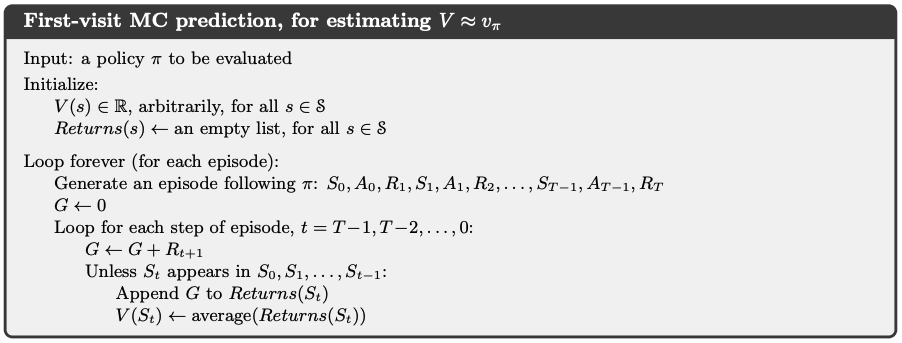
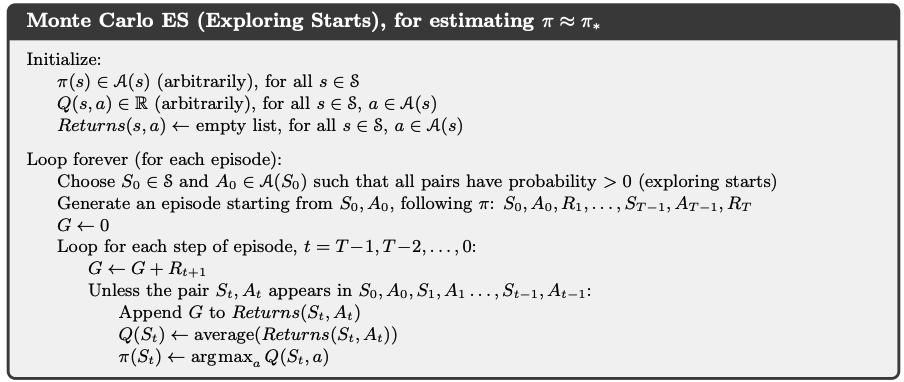
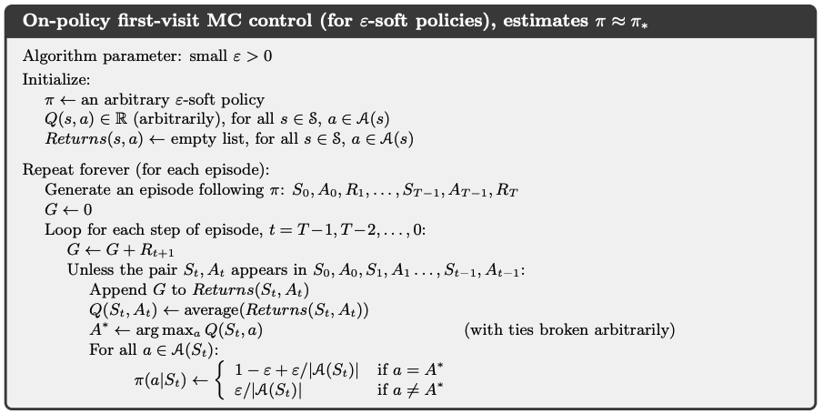
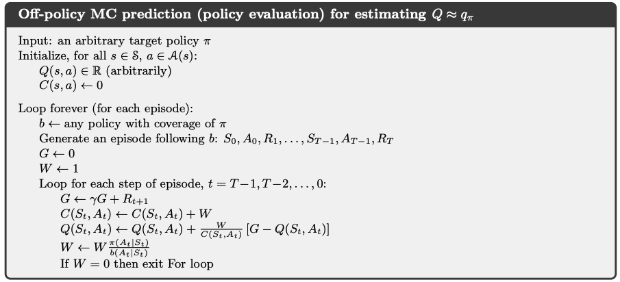
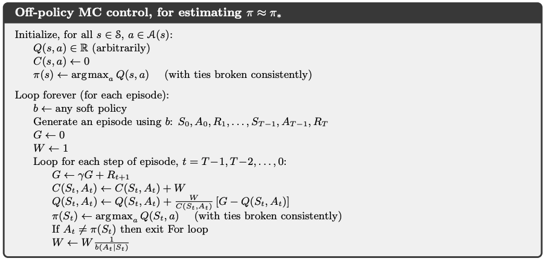

# Chapter 5. Monte Carlo Methods

Monte Carlo methods a way of solving the reinforcement learning problem based on **experience only**, i.e., averaging sample returns. To ensure that well-defined returns are available, here we define Monte Carlo methods only for **episodic tasks**.

Only on the completion of an episode are value estimates and policies changed. Monte Carlo methods can thus be incremental in an **episode-by-episode** sense, but not in a step-by-step (online) sense.

We adapt the idea of general policy iteration (GPI) and learn value functions from sample returns with the MDP. The value functions and corresponding policies still interact to attain optimality in essentially the same way (GPI).

One final note about the notation: **throughout this chapter, we assume an episode always starts at time step $0$ and ends at time step $T$, i.e., $S_T$ is the terminal state.**

## 5.1 Monte Carlo Prediction (Evaluation)

Basics of MC methods:

- **Define a $\textit{visit}$ to state $s$**: an occurrence of state s in an episode. Of course, $s$ may be visited multiple times in the same episode

- **Evaluation methods**: 
    - **first-visit MC method** estimates $v_{\pi}(s)$ as the average of the returns following first visits to $s$.
    - **every-visit MC method** averages the returns following all visits to $s$.

### 5.1.1 MC Prediction for state-value function

- **First-visit MC prediction, for estimating $V \approx v_{\pi}$**

    - Algorithm: 

        <div style="display: flex; justify-content: center;">
        
        </div>

    - Intuition: the realizations of return $G_t$ for each state is calculated backwards from $S_{T-1}$ to $S_0$, by the law of large number, the average of $G_t$ for each state will be the value of that state: $v(S_t) = E_{\pi}[G_t|S_t]$

    - Visualization of return calculation ($T=5$, integers on arrows are the rewards):
        <div style="display: flex; justify-content: center;">
        
        </div>

```{note}
- An important fact about MC methods is that the estimates for each state are **independent.** The estimate for one state does not build upon the estimate of any other state, as is the case in DP. In other words, Monte Carlo methods do not bootstrap as we defined it in the previous chapter.

- For MC methods, the computational expense of estimating the value of a single state is independent of the number of states. This can make Monte Carlo methods particularly attractive when one requires the value of only one or a subset of states.
```

### 5.1.2 MC Prediction for action-value function

- **Motivation**: state values $v_{\pi}$ are only usable when we have the model of the environment. Since MC methods assume there is **no model available**, one of our primary goals in this case is to actually estimate $q_\star$.

```{todo}
Turn this algo below into a book-style image
```

- **First-visit MC prediction, for estimating $Q \approx q_{\pi}$**

    - Algorithm: 

        - Input: a policy $\pi$ to be evaluated

        - Initialize:
            - $Q(s, a) \in \mathbb{R}$ arbitrarily, for all $s \in S, a \in A(s)$.
            - $Return(s, a) \leftarrow$ an empty list for all $s \in S, a \in A(s)$.

        - Loop forever (for each episode):
            - Generate an episode following $\pi: S_0, A_0, R_1, S_1, A_1, ..., S_{T-1}, A_{T-1}, R_T, S_T$
            - $G_T \leftarrow 0$
            - $ \text{for } t \text{ in } \{T-1, T-2, ..., 0\}$:
                - $G_{t} \leftarrow \gamma G_{t+1} + R_{t+1}$ 
                - Append $G_{t}$ to $Returns(S_t, A_t)$
                - $q(S_t, A_t) \leftarrow average(Returns(S_t, A_t))$

    - Intuition: same as in [section 5.1.1](#511-mc-prediction-for-state-value-function), remember that $q(s,a) = E_\pi[G_t | S_t, A_t]$

```{note}
The Monte-Carlo return $G_t$ provides an **unbiased sample** of the expected return at a given state, but due to stochasticity from the dynamics of the environment and policy, each reward $R_t$ can be a random variable, the sum of which can result in a **high variance estimator** of the expected return. 

Many modern RL methods (or at least the estimation of return) have been proposed aiming to alleviate this problem, several of them will be introduced in [Chapter 11](../Contents/11_modern_policy_gradient_methods.md). 
```

## 5.2 Monte Carlo Control

General problems and two basic assumptions we rely on in [section 5.1](#51-monte-carlo-prediction-evaluation):

- **Problem of $\textit{maintaining exploration}$**: in estimating $q_{\pi}$, many state-action pairs may never be visited. E.g., if the policy is deterministic, many actions at a state may not be taken.
    - **Assumption (1)** of $\textit{exploring starts}$: episodes start in a state-action pair, and every pair has a nonzero probability of being selected as the start. (So every state-action pair will be visited an infinite number of times in the limit of an infinite number of episodes.)

- **Problem of estimating $\hat{q}_{\pi}(S_t, A_t)$**: by default, we used the law of large numbers and rely on the following assumption:
    - **Assumption (2)** of infinite number of episodes: policy evaluation can be done with infinite number of episodes (complete policy evaluation).

Apparently, these two assumptions are hardly truth in practice, so we are now going to introduce methods that remove them gradually.

### 5.2.1 Monte Carlo Control removing Assumption (2)

- How to **remove Assumption (2)**:

    - To avoid infinite number of episodes nominally required for policy evaluation, we could **give up trying to complete policy evaluation** before returning to policy improvement. Value iteration can be seen as an extreme example of this idea.

    - For Monte Carlo policy iteration it is natural to alternate between evaluation and improvement on an **episode-by-episode** basis. After each episode, the observed returns are used for policy evaluation, and then the policy is improved at all the states visited in the episode.

- Monte Carlo ES (Exploring Starts), for estimating $\pi \approx \pi_{\star}$

    <div style="display: flex; justify-content: center;">
    
    </div>

    ```{note}
    The essential technique of the above algorithm is that after each update of $Q(S_t,A_t)$, the improvement (greedification) will be made directly, which removes the second assumption.
    ```

### 5.2.2 Monte Carlo Control removing both assumptions

- **On & Off-policy methods**:

    - On-policy methods: attempt to evaluate or improve the policy that is used to make decisions. (e.g., MC with ES, dynamic programming etc.)

    - Off-policy methods: evaluate or improve a policy different from that used to generate the data.

- **$\epsilon$-soft policies**:

    - **$\epsilon$-greedy policy**: as introduced in Chapter 2 [section 2.2](../Contents/2_multi_armed_bandits.md#22-action-value-methods) all non-greedy actions are given the minimal probability of selection $\frac{\epsilon}{|A(s)|}$ (**uniform distribution**), the greedy action has the probability of $1 - \epsilon + \frac{\epsilon}{|A(s)|}$. 
        - $\epsilon$-greedy policy is a type of $\epsilon$-soft policies. Among $\epsilon$-soft policies, $\epsilon$-greedy policies are in some sense those that are closest to greedy.

    - **$\epsilon$-soft policy**: all actions have probability of $\pi(a|s)>\frac{\epsilon}{|A(s)|}$ for all states. This means that the agent explores all possible actions with non-zero probability $\frac{\epsilon}{|A(s)|}$, but **not necessarily uniformly**.

- **On-Policy first-visit Monte Carlo Control (with $\epsilon$-soft policy), for estimating $\pi \approx \pi_{\star}$**

    - Algorithm:

        <div style="display: flex; justify-content: center;">
        
        </div>

    - Intuition: If we remove the assumption of exploring starts, we cannot simply improve the policy by making it greedy with respect to the current value function, because that would prevent further exploration of non-greedy actions. So on the basis of Monte Carlo ES (Exploring Starts) in [section 5.2.1](#521-monte-carlo-control-removing-assumption-2), this algorithm removes the assumptions of exploring start by:

        - defining the initial policy to be $\epsilon$-soft and, 
        - updating the old policy to be $\epsilon$-greedy policy during policy improvement. 
    
```{note}
- The algorithm above also removes the second assumption (infinite episode) because the $\epsilon$-greedification happens immediately after the calculation of the $Q(S_t, A_t)$.

- Policy improvement theorem assures that any $\epsilon$-greedy policy with respect to $q_\pi$ is an improvement over any $\epsilon$-soft policy. 

- Note that we now only achieve the best policy among the $\epsilon$-soft policies, i.e, a near-optimal policy which still explores, not really the optimal policy.
```

## 5.3 Off-policy Monte Carlo Methods

All learning control methods face a dilemma: They seek to learn action values conditional on subsequent optimal behavior, but they need to behave non-optimally in order to explore all actions (to find the optimal actions). How can they learn about the optimal policy while behaving according to an exploratory policy? A more straightforward approach is to use two policies

Let's recap On / Off-policy learning:

- **On-policy learning**: learns the value or policy function for the current $\textit{target policy}$ $\pi$ that the agent is following. This means that the agent learns by interacting with the environment using the same policy that it is improving. **On-policy methods are generally simpler and are considered first.**

- **Off-policy learning**: the learning is from data generated by $\textit{behavior policy}$ $b$ and is "off" the $\textit{target policy}$ $\pi$. Off-policy methods require additional concepts and notation, and because the data is due to a different policy, **off-policy methods are often of greater variance and are slower to converge.** \
**On the other hand, off-policy methods are more powerful and general.** They include on-policy methods as the special case in which the target and behavior policies are the same.
    - In order to use episodes from $b$ to estimate values for $\pi$, we proceed based on the **assumption of coverage**: wherever $\pi(a|s) \ge 0$, $b(a|s) \ge 0$ must also hold. This means, behavior policy $b$ must be stochastic in states where it is not identical to the target policy $\pi$.

### 5.3.1 Off-policy Monte Carlo Prediction via Importance Sampling

- **$\textit{Importance Sampling}$ Implementation**: Here is a [lecture video](https://www.coursera.org/learn/sample-based-learning-methods/lecture/XPxPd/importance-sampling) to explain importance sampling should you find the textual derivation hard to understand.

	- given existing samples from $X \sim b$, we want to estimate $E_{\pi}[X]$ (of a different distribution)

	- derivation:

        $$
        \begin{align*}
        E_{\pi}[X] &= \sum_{x \in X} x \pi(x) \\
        &= \sum_{x \in X} x \pi(x) \frac{b(x)}{b(x)} \\
        &= \sum_{x \in X} x b(x) \frac{\pi(x)}{b(x)} \\
        &= \sum_{x \in X} x b(x) \rho(x)  \quad (\rho(x) \text{ denotes } \frac{\pi(x)}{b(x)}) \\
        &= E_{b}[X \rho(X)] \\
        &\approx \frac{1}{n} \sum_{i=1}^n x_i \rho(x_i)
        \end{align*}
        $$

    - the ratio $\rho(x)=\frac{\pi(x)}{b(x)}$ is called the **importance sampling ratio**.

- **Importance Sampling for evaluating the target policy $\pi$ in theory**:

	1. Calculating the importance sampling ratio $\frac{\pi}{b}$ **for one given state-action trajectory**

        - Given a trajectory $S_{t+1}, A_{t+1}, S_{t+2}..., A_{T-1}, S_T$, starting from $S_t, A_t$, the probability of this trajectory is

            $$
            \begin{align*}
            Pr (&S_{t+1}, A_{t+1} ,..., S_{T-1}, A_{T-1}, S_T | S_t, A_t) \\
            &= p(S_{t+1}|A_t, S_t)\pi(A_{t+1}|S_{t+1}) ... p(S_{T-1}|A_{T-2}, S_{T-2})\pi(A_{T-1}|S_{T-1})p(S_T|A_{T-1},S_{T-1}) \\
            &= \Pi_{k=t+1}^{k={T-1}} p(S_k|A_{k-1}, S_{k-1})\pi(A_k|S_k) \times p(S_T|A_{T-1},S_{T-1})
            \end{align*}
            $$  

	        Therefore the **importance sampling ratio**:

            $$
            \begin{align*}
            \rho_{t+1: T-1} &= \frac{\Pi_{k=t+1}^{k={T-1}} p(S_k|A_{k-1}, S_{k-1})\pi(A_k|S_k) \times p(S_T|A_{T-1},S_{T-1})}{\Pi_{k=t+1}^{k={T-1}} p(S_k|A_{k-1}, S_{k-1})b(A_k|S_k) \times p(S_T|A_{T-1},S_{T-1})} \\
            &= \frac{\Pi_{k={t+1}}^{k={T-1}} \pi(A_k|S_k)}{\Pi_{k={t+1}}^{k={T-1}} b(A_k|S_k)}
            \end{align*}
            $$

		```{note}
        - The subscript of $\rho_{t: T-1}$ corresponds to the sequence of actions in the trajectory, i.e., {$A_{t+1}, ..., A_{T-1}$}, then the trajectory stops at the terminal state $S_T$

        - $\rho_{t+1: T-1}$ only depends on the two policies, **not the dynamics of the environment**, which means importance sampling can be used in model-free RL problems.
        ```


    2. Estimating $q_{\pi}(s,a)$ given $q_b(s,a) = E_b[G_t|S_t = s, A_t = a]$ as:

        $$q_{\pi}(s,a)= E_b[\rho_{t+1:T-1} \times G_t|S_t = s, A_t=a]$$

        - Intuition: note that the value function for $q$: $E[G_t|S_t = s, A_t=a]$ is calculating an expectation based on all given trajectories, so every $G_t$ is a single realisation, which can be seen as the variable $x$ in the derivation of importance sampling equation. \
        The importance sampling ratio $\rho_{t+1:T-1}$ is calculated on a trajectory basis to correspond to this trajectory-based character of $G_t$ (and is used for multiplication with $G_t$ directly).

- **Importance sampling for evaluating the target policy $\pi$ in practice**

	- **Settings**: 

        - About time steps: the time steps will be numbered in a way that increases across episode boundaries for convenience. That is, if the first episode of the batch ends in a terminal state at $t=100$, then the next episode begins at $t = 101$.

        - About notations:

            - $J(s,a)$: **the set of time steps** in which state action pair $(s,a)$ is visited (This is for an every-visit method; for a first-visit method, $J(s,a)$ would only include time steps that were first visits to $(s,a)$ within their episodes).

            - $T(t)$: **the time step** of the first terminal state from time step $t$.

            - $\{G_t\}_{t \in J(s,a)}$: the set of returns that pertain to state action pair $(s,a)$ from all episodes.

            - $\{\rho_{t+1:T(t)-1}\}_{t \in J(s,a)}$: the importance sampling ratio for the trajectory $\{S_{t+1}, A_{t+1}, ..., S_{T(t)-1}, A_{T(t)-1}, S_{T(t)} \}$.

    - **Approaches**:

        - Ordinary importance sampling for evaluating target policy:

            $$
            Q(s,a) \dot= \frac{\sum_{t \in J(s)} \ \rho_{t+1:T(t)-1} \times G_t}{|J(s,a)|}
            $$
        
        - Weighted importance sampling for evaluating target policy:
        
            $$
            Q(s,a) \dot= \frac{\sum_{t \in J(s)} \ \rho_{t+1:T(t)-1} \times G_t}{\sum_{t \in J(s)} \ \rho_{t+1:T(t)-1}}
            $$

```{note}
- **For first-visit methods**:

    Consider the estimates of their first-visit methods after observing a single return $G_t$ from $(s,a)$, in the weighted-average estimate, the estimate is equal to the observed return $G_t$ independent of the ratio, its estimate in this case is $q_b(s,a)$ rather than $q_\pi(s,a)$. In contrast, the estimate from ordinary method is always $q_\pi(s,a)$, but it could be highly volatile depending on the value of $\rho_{t+1:T(t)-1}$. 

    In summary, ordinary importance sampling is unbiased whereas weighted importance sampling is biased (though the bias converges asymptotically to zero). On the other hand, the variance of ordinary importance sampling is in general unbounded because the variance of the ratios can be unbounded, whereas in the weighted estimator the largest weight on any single return is one. In fact, assuming bounded returns, the variance of the weighted importance-sampling estimator converges to zero even if the variance of the ratios themselves is infinite.

    **In practice, the weighted estimator usually has dramatically lower variance and is strongly preferred.** Nevertheless, we will not totally abandon ordinary importance sampling as it is easier to extend to the approximate methods using function approximation that we explore later.

- **For every-visit methods**:

    The every-visit methods for ordinary and weighed importance sampling are both biased, though, again, the bias falls asymptotically to zero as the number of samples increases. **In practice, every-visit methods are often preferred because they remove the need to keep track of which states have been visited and because they are much easier to extend to approximations.**
```

- **Incremental Implementation for updating $Q(s,a)$**:

    - **For on-policy methods**:

        $Q(s,a)$ is calculated by simply averaging the collected return realizations, so the incremental implementation can be done the same way as in Chapter 2 in [section 2.4.1](../Contents/2_multi_armed_bandits.md#241-stationary-problems), namely:

        $$
        NewEstimate \leftarrow OldEstimate + StepSize*[Target - OldEstimate]
        $$

    - **For off-policy methods**:

        - Ordinary importance sampling: the returns are also simply averaged by $J(s,a)$, so the incremental rule is the same as on-policy methods, as shown above.

        - Weighted importance sampling: here we have to form a weighted average of the returns using a slightly different incremental algorithm.

            - Assume the set $\{G_t\}_{t \in J(s,a)}$ alredy contains $n-1$ items, numbered as $G_1, G_2, ..., G_{n-1}$, and the respective weight for $G_i$ is $W_i = \rho_{i+1:T(i)-1}$ and $W_i \in \{\rho_{t+1:T(t)-1}\}_{t \in J(s,a)}$

            - So the $n$-th weighted average estimate for $Q(s,a)$ is:

                $$
                \begin{align*}
                Q_n(s,a) &\dot= \frac{\sum_{k=1}^{k=n-1}W_k G_k}{\sum_{k=1}^{k=n-1}W_k} \\
                &\dot= Q_{n-1}(s,a) + \alpha \times [G_n - Q_{n-1}(s,a)]
                \end{align*}
                $$

                with $\alpha = \frac{W_n}{C_n}$ and $C_n \dot= C_{n-1} + W_n = \sum_{i=1}^{i=n} W_i$, where $C_0 \dot= 0$           

- **Off-policy MC prediction (policy evaluation) for estimating $Q \approx q_\pi$** 

    <div style="display: flex; justify-content: center;">
    
    </div>

    ```{note}
    $W_{t+1} = \rho_{t+1:T(i)-1}$
    ```


### 5.3.2 Off-policy Monte Carlo Control

- **Rule of thumb**: In Control, the target policy is typically the deterministic greedy policy with respect to the current estimate of the action-value function. This policy becomes as deterministic optimal policy while the behavior policy remains stochastic and more exploratory, for example, an $\epsilon$-greedy policy.  

- **Off-policy MC prediction (policy evaluation) for estimating $\pi \approx \pi_\star$**

    <div style="display: flex; justify-content: center;">
    
    </div>

    ```{note}
    - The policy $\pi$ converges to optimal at all encountered states even though actions are selected according to a different soft policy $b$,which may change between or even within episodes.

    - A potential problem is that this method learns only from the tails of episodes, when all of the remaining actions in the episode are greedy. If non-greedy actions are common, then learning will be slow, particularly for states appearing in the early portions of long episodes. Potentially, this could greatly slow learning.
    ```
    
## 5.4 Summary

Currently, Monte Carlo methods for both prediction and control remain unsettled and are a subject of ongoing research.

- **Mindmap of where we are now**

    

- **Key Takeaways**
    - Advantages of MC over DP methods:

        1) Monte Carlo methods require no model of the environment’s dynamics. 

        2) Monte Carlo methods can be used with simulation or sample models. For surprisingly many applications it is easy to simulate sample episodes even though it is difficult to construct the kind of explicit model of transition probabilities. 

        3) It is easy and efficient to use Monte Carlo methods to focus on a small subset of the states. A region of special interest can be accurately evaluated without going to the expense of accurately evaluating the rest of the state set.

        4) MC methods may be less harmed by violations of the Markov property. Because they do not update their value estimates on the basis of the value estimates of successor states, i.e., they do not bootstrap.

    - Maintaining sufficient exploration:

        - For on-policy methods: use assumption (1) of exploring start or initialize $\pi$ to be a $\epsilon$-soft policy
        
        - For off-policy methods: we learn the value function of a target policy from data generated by a different behavior policy, which satisfies the assumption of coverage. At the same time, we need importance sampling to transform the expected returns from the behavior policy to the target policy. 

- **Extra lecture video (optional)**: [Emma Brunskill: Batch Reinforcement Learning](https://www.coursera.org/learn/sample-based-learning-methods/lecture/mZvQp/emma-brunskill-batch-reinforcement-learning)