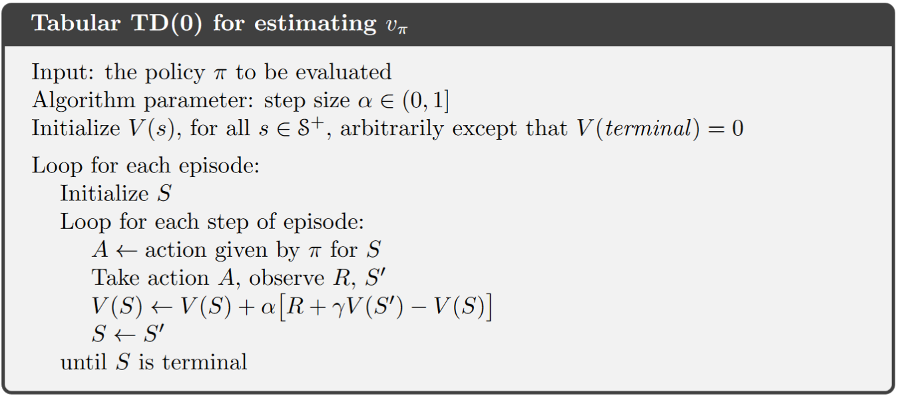
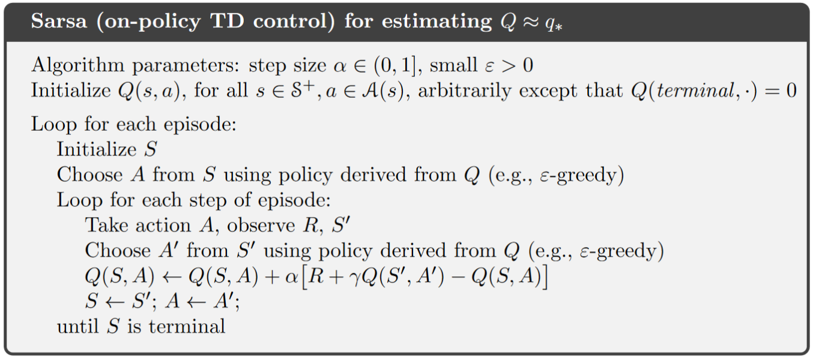
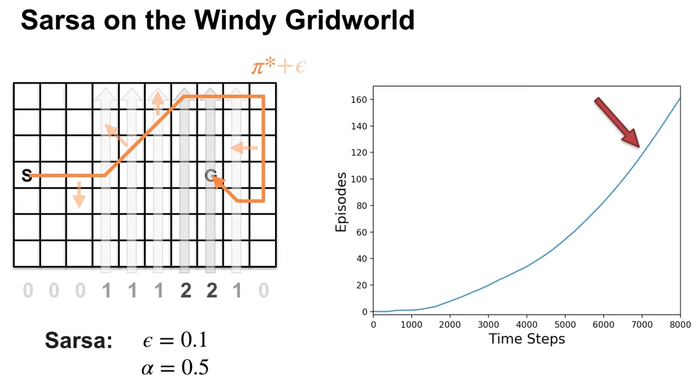
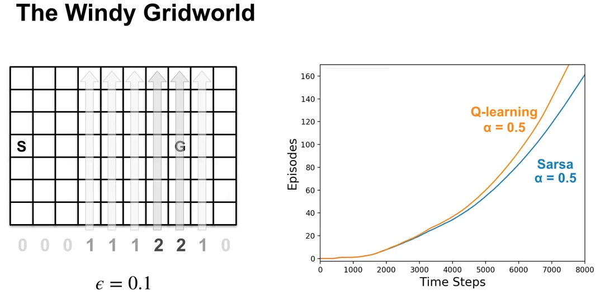

# Chapter 6. Temporal-Difference Learning

Temporal-Difference (TD) Learning is a combination of Monte Carlo ideas and Dynamic Programming (DP). Like MC methods, TD methods **can learn directly from raw experience** without a model of the environment’s dynamics. Like DP, TD methods update estimates based in part on other learned estimates, without waiting for a final outcome (**they bootstrap**).

As usual, we start by focusing on the policy evaluation or prediction problem, the problem of estimating the value function $v_\pi$ for a given policy $\pi$. For the control problem (finding an optimal policy), DP, TD, and MC methods all use some variation of generalized policy iteration (GPI). The differences in the methods are primarily differences in their approaches to the prediction problem.

## 6.1 TD prediction

- **To introduce TD methods, first recall that** 

	$$
		\begin{align}
		v_{\pi}(s) &\dot= E[G_t | S_t = s] \\
		&= E[R_{t+1} + \gamma G_{t+1}| S_t = s] \\
		&= E[R_{t+1} + \gamma v_{\pi}(S_{t+1})| S_t = s]
		\end{align}
	$$

	- **Monte Carlo methods** use an estimate of equation (1) as a target:

		$V(S_t) \leftarrow V(S_t) + \alpha (G_t - V(S_t))$ with $G_t$ as the single realization from each episode .

	- **Dynamic Programming methods** use an estimate of equation (3) as a target:

		$V(s) = \sum_a \pi(a|s) \sum_{s', r} p(s',r|s,a) [r + \gamma V(s')]$


	- **Temporal Difference methods** also uses an estimate of equation (3), yet requires no model of the environment's dynamics. It combines the above two in the following way:

		$V(S_t) \leftarrow V(S_t) + \alpha (R_{t+1} + \gamma V(S_{t+1}) - V(S_t))$ with $R_{t+1} + \gamma V(S_{t+1})$ as the single realization of $R_{t+1} + \gamma v_{\pi}(S_{t+1})$ each time. 
		- The target for the TD update is $R_{t+1} + \gamma V(S_{t+1})$, this TD method is called **TD(0) or one-step TD**, which is a special case of the TD($\lambda$) or n-step TD (not included in this tutorial)

		- TD combines the sampling of MC and the bootstrapping of DP: 
			1. TD and MC both involve looking ahead to a sample successor state (or state–action pair), i.e., they both use $\textit{sample update}$ instead of $\textit{expected update}$ as in DP.

			2. Whereas MC methods must wait until the end of the episode to determine the increment to $V(S_t)$ (only then is $G_t$ known), TD and DP methods need to wait only until the next time step, i.e., they bootstrap.

		- The term $\delta_t = R_{t+1} + \gamma V(S_{t+1}) - V(S_t)$ is called $\textit{TD error}$. $\delta_t$ is the error in $V(S_t)$, yet available at time $t+1$.

- **Tabular TD(0) for estimating $v_\pi$**:

	- Algorithm:

		<div style="display: flex; justify-content: center;">
    	
    	</div>

	
		```{note}
		Notice the difference between MC algorithms, there is now no need to generate the whole episode. Instead, $V(s)$ will be updated right after an action is taken and a new state is observed, i.e., TD methods work in a "step-wise" fashion.
		```

- **Example of Driving Home** (Click to watch the lecture video)

	<a href="https://www.coursera.org/learn/sample-based-learning-methods/lecture/9Dxlq/the-advantages-of-temporal-difference-learning">
	
	</a>

- **Advantages of TD prediction**:

	- Over dynamic programming: TD methods do not need a model of the environment. Over Monte Carlo: TD methods are naturally implemented in an online, fully incremental fashion, i.e., they do not require waiting until the end of an episode.

	- For any fixed policy $\pi$, TD(0) has been proved to converge to $v_\pi$. For details, refer to the book chapter 6.2, we skip the proof in this tutorial.

	- In practice, TD methods have usually been found to  converge faster than constant-$\alpha$ MC methods on stochastic tasks. A demonstrative example is given in the following video:

		<a href="https://www.coursera.org/learn/sample-based-learning-methods/lecture/CEzFc/comparing-td-and-monte-carlo">
		
		</a>			

## 6.2 TD Control

### 6.2.1 Sarsa: On-policy TD Control

- **Background for Sarsa**:
	- Since TD methods deal with tasks where there is no model of environment available, it is natural to estimate $Q_\pi(s,a)$ instead of $V_\pi(s)$. Similar to [section 6.1](#61-td-prediction), the **update rule for Sarsa** is: 

		$$Q(S_t, A_t) \leftarrow Q(S_t, A_t) + \alpha [R_{t+1} + \gamma Q(S_{t+1}, A_{t+1}) - Q(S_t, A_t)]$$
		
		with $Q(S_t, A_t)=0$ if $S_t$ is the terminal state.

	- **Naming of Sarsa**: the above update rule uses every element of the quintuple of events, ($S_t,A_t,R_{t+1},S_{t+1},A_{t+1}$), that make up a transition from one state–action pair to the next. This quintuple gives rise to the name Sarsa (**S**tate, **A**ction, **R**eward, **S**tate, **A**ction)

	- Similar to any other on-policy methods, we continually estimate $q_\pi$ for the behavior policy $\pi$, and at the same time change $\pi$ toward greediness with respect to $q_\pi$ (pattern of generalized policy iteration (GPI)). 

- **Sarsa (on-policy TD control) for estimating $Q \approx q_{\star}$**

	<div style="display: flex; justify-content: center;">
	
	</div>


	```{note}
	- **There is no need to initialize a policy $\pi$ in the beginning**, the action can be derived directly from a given policy with $Q(s,a), \text{ for all } s \in S, a \in A(s)$ available.

	- While deriving the next action, make sure to use a soft-policy to ensure exploration.

	- Notice that after transition to the state $S'$, you still need to take another action $A'$ to be able to update $Q(S,A)$.

	- Sarsa converges with probability 1 to an optimal policy and action-value function as long as all state–action pairs are visited an infinite number of times and the policy converges in the limit to the greedy policy (which can be arranged, for example, with $\epsilon$-greedy policies by setting $\epsilon = 1/t$).
	```
	
- **Example: Sarsa in the Windy Gridworld**

	<a href="https://www.coursera.org/learn/sample-based-learning-methods/lecture/RZeRQ/sarsa-in-the-windy-grid-world">
	
	</a>

	- Notice that the first few episodes take a couple thousand steps to complete. The curve gradually gets steeper indicating that episodes are completed more quickly.

	- Notice the episode completion rate stops increasing. This means the agent's policy hovers around the optimal policy and won't be exactly optimal, because of exploration.


### 6.2.2 Q-learning: Off-policy TD Control

- **Background for Q-learning**:

	- The update rule for Q-learning is: 

		$$Q(S_t, A_t) \leftarrow Q(S_t, A_t) + \alpha [R_{t+1} + \gamma \max_a Q(S_{t+1}, a) - Q(S_t, A_t)]$$

	- This way of directly approximating $q_\star$ dramatically simplifies the analysis of the algorithm and enabled early convergence proofs. All that is required for correct convergence is that all pairs continue to be updated (exploration).

- **$Q$-learning (off-policy TD control) for estimating $\pi \approx \pi_{\star}$**

	<div style="display: flex; justify-content: center;">
	
	</div>


	```{note}
	- **Different from Sarsa, at target state $S'$, Q-learning chooses the greedy action that maximizes $Q(S', a)$ directly**, but not according to a policy derived from $Q$ (although, the derived policy from $Q$ can also be the greedy policy, if so, the update rules of Sarsa and Q-learning are identical).

	- **Q-learning is off-policy, but why?** Consider the derived policy from current $Q$ as the $\textit{behavior policy}$, which can be e.g., $\epsilon$-greedy. but the $\textit{target policy}$ for Q-learning is actually the greedy policy according to the $max$ term in the update rule from above (actions are chosen according to $\epsilon$-greedy, updates are made according to the greedy policy). Readers of interest about why exactly Q-learning is off-policy can further refer to this [lecture video.](https://www.coursera.org/learn/sample-based-learning-methods/lecture/1OikH/how-is-q-learning-off-policy) 
	```
		
- **Example: Q-learning in the Windy Gridworld**

	<a href="https://www.coursera.org/learn/sample-based-learning-methods/lecture/BZbSy/q-learning-in-the-windy-grid-world">
	
	</a>

	- In the beginning, the two algorithms learn at a similar pace. Towards the end, Q-Learning seems to learn a better final policy. 

	- When we decrease the step-size $\alpha$, Sarsa learns the same final policy as Q-Learning, but more slowly. This experiment highlights the impact of parameter choices in reinforcement learning. $\alpha$, $\epsilon$, initial values, and the length of the experiment can all influence the final result.

- **Example of Cliff Walking - Another comparison between Sarsa and Q-learning**

	

	- **Description**:

		- States and goal: the agent start at state $S$ on the lower left and tries to reach the goal G on the lower right.

		- Actions: up, down, right, and left.

		- Reward: $-1$ on all transitions except those into the region marked "The Cliff", which incurs a reward of $-100$.

	- **Performance comparison**:

		- Q-learning (red): learns values for the optimal policy, that which travels right along the edge of the cliff. But this results in its occasionally falling off the cliff because of the $\epsilon$-greedy action selection.

		- Sarsa (blue): learns the longer but safer path through the upper part of the grid.

		- Although Q-learning actually learns the values of the optimal policy, **its online performance is worse than that of Sarsa, which learns the roundabout policy**. Of course, if $\epsilon$ were gradually reduced, then **both methods would asymptotically converge to the optimal policy.**

### 6.2.3 Expected Sarsa

- **Background for expected Sarsa**:

	- update rule: 

	$$
		\begin{align*}
		Q(S_t, A_t) \leftarrow Q(S_t, A_t) + \alpha [R_{t+1} + \gamma E_{\pi}[Q(S_{t+1}, A_{t+1})|S_{t+1})] - Q(S_t, A_t)] \\
		\leftarrow Q(S_t, A_t) + \alpha [R_{t+1} + \gamma \sum_{a}\pi(a|S_{t+1}) Q(S_{t+1}, a) - Q(S_t, A_t)]
		\end{align*}
	$$

	- Given the next state, $S_{t+1}$, this update moves deterministically in the same direction as Sarsa moves in expectation, and accordingly it is called Expected Sarsa.
	- Expected Sarsa is more complex computationally than Sarsa but, in return, it eliminates the variance due to the random selection of $A_{t+1}$. Given the same amount of experience we might expect it to perform slightly better than Sarsa.

- **Expected Sarsa for estimating $\pi \approx \pi_{\star}$**

	```{todo}
	Turn expected Sarsa algo into book-similar image
	```

	- Algorithm parameter: step size $\alpha \in (0,1], \epsilon > 0$
	- Initialize $Q(s,a)$, for all $s \in S^+, a \in A(s)$
	- Loop for each episode:
		- Initialize $S$
		- Loop for each step of episode:
			- Choose $A$ from $S$ using policy derived from $Q$ (e.g., $\epsilon$-greedy)
			- Take action $A$, observe $R, S'$
			- $Q(S, A) \leftarrow Q(S, A) + \alpha [R + \gamma \sum_{a}\pi(a|S') Q(S', a) - Q(S, A)]$
			- $S \leftarrow S'$
		- until $S$ is terminal

	```{note}
	- The algorithm is just like Q-learning except that instead of using the maximum over next state-action pairs it uses the expected value, taking into account how likely each action is under the current policy.

	- The fun part about Expected Sarsa is that **it can be both on- and off-policy**. The above algorithm is an on-policy setting, but in general expected sarsa might use a policy different from the target policy $\pi$ to generate behavior, in which case it becomes an off-policy algorithm. 
		- For example, suppose $\pi$ is the greedy policy while behavior is more exploratory; then Expected Sarsa is then exactly Q-learning. 
			
		- In the above sense Expected Sarsa subsumes and generalizes Q-learning while reliably improving over Sarsa. **Except for the small additional computational cost, Expected Sarsa may completely dominate both of the other more-well-known TD control algorithms.**
	```
		
- **Comparison on Cliff Walking example**:

	The figure below shows the interim and asymptotic performance of the three TD control methods on the cliff-walking task as a function of $\alpha$.

	- All three algorithms use $\epsilon$-greedy policy with $\epsilon$=0.1

	- Asymptotic performance is an average over 100,000 episodes, then averaged over 10 runs.

	- Interim performance is an average over the first 100 episodes, then averaged over 50,000 runs.

		
    
	Expected Sarsa retains the significant advantage of Sarsa over Q-learning on this problem. In cliff walking the state transitions are all deterministic and all randomness comes from the policy. In such cases, Expected Sarsa can safely set $\alpha$ = 1 without suffering any degradation of asymptotic performance, whereas Sarsa can only perform well in the long run at a small value of $\alpha$, at which short-term performance is poor.

## 6.3 Summary

The methods presented in this chapter are today the most widely used reinforcement learning methods. This is probably due to their great simplicity: they can be applied online, with a minimal amount of computation, to experience generated from interaction with an environment; they can be expressed nearly completely by single equations that can be implemented with small computer programs.

The special cases of TD methods introduced in the present chapter should rightly be called $\textit{one-step, tabular, model-free}$ TD methods. In the next chapter we extend them to the form that include a model of the environment. But for now, a quick summary: 

- **Mindmap of where we are now**

	

- **Key Takeaways**

	- **TD Prediction (TD(0))**

		- Updates value estimates after each step:  

			$$V(S_t) ← V(S_t) + α (R_{t+1} + γ V(S_{t+1}) - V(S_t))$$
		- TD error ($δ_t$) measures the difference between predicted and updated values.
		- Advantages: No model needed, incremental updates, faster convergence than MC.

	- **TD Control Methods**

		- Sarsa (on-policy): Updates based on the current policy. Safer, but may not find the most optimal paths.  

		$$Q(S_t, A_t) ← Q(S_t, A_t) + α [R_{t+1} + γ Q(S_{t+1}, A_{t+1}) - Q(S_t, A_t)]$$

		- Q-learning (off-policy): Updates using the maximum possible future reward. Learns optimal policies but can be riskier during exploration.  

		$$Q(S_t, A_t) ← Q(S_t, A_t) + α [R_{t+1} + γ max_a Q(S_{t+1}, a) - Q(S_t, A_t)]$$

		- Expected Sarsa: Uses expected future rewards, reducing variance and improving stability. 
		 
		$$Q(S_t, A_t) ← Q(S_t, A_t) + α [R_{t+1} + γ Σ_a π(a|S_{t+1}) Q(S_{t+1}, a) - Q(S_t, A_t)]$$

	- **Comparisons**

		- Sarsa learns conservative policies, good for risky environments.

		- Q-learning finds optimal policies but can perform poorly online due to risky exploration.
		
		- Expected Sarsa balances both, offering stable performance with minimal extra computation.

	- **Convergence**: All methods converge to optimal policies if exploration is sufficient, and learning rates are properly set.

- **Extra lecture video (optional)**: [Rich Sutton: The Importance of TD Learning](https://www.coursera.org/learn/sample-based-learning-methods/lecture/MgFyz/rich-sutton-the-importance-of-td-learning)