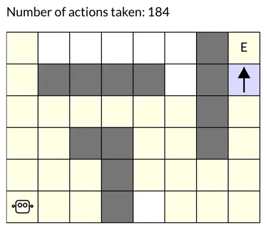

# Chapter 7. Planning and Learning with Tabular Methods

In this chapter we develop a unified view of reinforcement learning methods that require a model of the environment ($\textit{model-based}$ RL methods), such as dynamic programming, and methods that can be used without a model ($\textit{model-free}$ RL methods), such as Monte Carlo and temporal-difference methods. 

**Model-based methods rely on $\textit{planning}$** as their primary component, while **model-free methods primarily rely on $\textit{learning}$**. Although there are real differences between these two kinds of methods, there are also great similarities:

- The heart of both kinds of methods is the computation of value functions. 

- All the methods are based on looking ahead to future events, computing a backed-up value, and then using it as an update target for an approximate value function.

In addition to the unified view of planning and learning methods, a second theme in this chapter is the benefits of planning in small, incremental steps. This enables planning to be interrupted or redirected at any time with little wasted computation, which appears to be a key requirement for efficiently intermixing planning with acting and with learning of the model.

## 7.1 Models and Planning

- **$\textit{Model}$ (of the environment)**: anything that an agent can use to predict how the environment will respond to its actions, 

	- $\textit{Distribution models}$: produce a description of all possibilities and their probabilities. E.g., the model used in DP (i.e., the dynamics of the environment: $p(r, s' | s, a)$)

	- $\textit{Sample models}$: produce just one of the possibilities, sampled according to the probabilities.

	- Both kinds of models are used to $\textit{simulate}$ the environment and produce $\textit{simulated experience}$. Given a starting state and a policy, a sample model could produce an entire episode, and a distribution model could generate all possible episodes and their probabilities. 


- **$\textit{Planning}$**: any computational process that takes a $\textit{model}$ as input and produces or improves a policy for interacting with the modeled environment, illustrated as:

	$$
		model \xrightarrow{\text{planning}} policy
	$$

	there are two distinct approaches to planning:

	- $\textit{state-space planning}$: a search through the state space for an optimal policy or an optimal path to a goal. Actions cause transitions from state to state, and value functions are computed over states.

	- $\star\textit{plan-space planning}$: search through the space of plans. Operators transform one plan into another, and value functions, if any, are defined over the space of plans. Plan-space methods are difficult to apply efficiently to the stochastic sequential decision problems that are the focus in reinforcement learning, and we do not consider them further


- **Unifying model-based and model-free RL methods**: the heart of both learning and planning (state-space planning) methods is the **1) estimation of value functions by 2) backing-up update operations**. The difference is that whereas planning uses simulated experience generated by a model, learning methods use real experience generated by the environment.

	- The common structure between planning and learning can be diagrammed as follows:

	$$
		\text{model} \rightarrow \text{simulated experience} \xrightarrow{\text{backups}} \text{values} \rightarrow \text{policy}
	$$

	- Example of planning: $\textit{random-sample one-step tabular}$ **Q-planning**
		
		<div style="display: flex; justify-content: center;">
		        
		</div>
			
## 7.2 Dyna: Integrated Planning, Acting, and Learning

- **An online planning agent**: interacts with the environment in real time and updates the model based on the newly gained information.

	- The possible relationships between experience, model, values, and policy are summarized in the following diagram:
		<div style="display: flex; justify-content: center;">
		        
		</div>

	- Depending on how the real experience is used, the reinforcement learning process can be divided into direct and indirect RL:

		- $\textit{direct reinforcement learning}$: uses real experience to directly improve the value function and policy.

		- $\textit{indirect reinforcement learning}$ (or $\textit{model-learning}$): uses real experience to improve the model.

		- Note: Indirect methods often make fuller use of a limited amount of experience and thus achieve a better policy with fewer environmental interactions. On the other hand, direct methods are much simpler and are not affected by biases in the design of the model. (Instead of exaggerating the contrast between these two, this book focuses more on discovering the similarities.)
	
- **Dyna agent**: a type of online planning agent that performs all the above processes — planning, acting, model-learning, and direct RL — all occurring continually.

	- Architecture:
		<div style="display: flex; justify-content: center;">
		        
		</div>

	- Explanation:
		- The arrow on the left of the figure represents direct reinforcement learning operating on real experience to improve the value function and the policy. 
		- On the right are model-based processes. The model is learned from real experience and gives rise to simulated experience.
		- Typically, the same reinforcement learning method is used both for learning from real experience and for planning from simulated experience.

	- Computing time allocation: 
		- usually the acting, model-learning, and direct RL processes require little computation, and we assume they consume just a fraction of the time. 
		- a larger fraction of time in each step can be devoted to the planning process, which is inherently computation-intensive.

- **A type of dyna agent: Tabular Dyna-Q for estimating $q_\pi$**:

	- Algorithm

		<div style="display: flex; justify-content: center;">
		        
		</div>

		```{note}
		- $Model(s, a)$ denotes the contents of the predicted next state and the reward received for state-action pair $(s, a)$.

		- Direct reinforcement learning, model-learning are implemented by steps `(d)` and `(e)`, respectively. 

		- The whole step `(f)` performs the planning.

			- $\textit{Search Control}$: the first two steps in step `(f)` that select the starting states and actions for the simulated experiences generated by the model.

			- Note that the starting state in planning is random selected, it does NOT have to be the real starting state

			- **Note that planning only happens for the states with which the agent have made real experience.**

		- If `(e)` and `(f)` are omitted, the remaining algorithm would be one-step tabular Q-learning.
		```

	- Lecture video for an illustrative Example (starting from `3:13`): In a gridworld with obstacles, an agent starts from the lower left grid and travels to the end state on the upper right. Initial policy $\pi$ assigns equal probability to all four action: left, right, up and down.

		<a href="https://www.coursera.org/learn/sample-based-learning-methods/lecture/k7Out/the-dyna-algorithm">
		
		</a>

- **Example: Dyna Maze**

	- An illustrative example of how exactly a planning agent may learn much faster than a pure learning agent:

		<a href="https://www.coursera.org/learn/sample-based-learning-methods/lecture/TGSQi/dyna-q-learning-in-a-simple-maze">
		
		</a>

	- The agent needs many planning steps because search control samples state action pairs randomly. The planning update will not have any effect if the sample state action pair produces a 0 TD error. This happened a lot in this environment because all the rewards are 0, and so are the initial values. 

	- In larger environments random search control becomes even more problematic. But in this example, the more planning we did the better the agent performed

## 7.3 When the model is wrong

- **An inaccurate model**: model is either incomplete (does not contain some transition information) or the environment has changed (leads the transition information stored in the model become inaccurate).

	- When the model is wrong: we face the trade-off between exploration vs. exploitation (in the planning context):

		- exploration means trying actions that improve the model

		- exploitation means behaving in the optimal way given the current model

- **Example: Blocking Maze - when the environment become "worse"**

	- **Description**: initially, there is a short path from start to goal, to the right of the barrier, as shown in the upper left of the figure. After 1000 time steps, the short path is “blocked,” and a longer path is opened up along the left-hand side of the barrier

		

	- **Interpretation**

		- The first part of the graph shows that both Dyna agents found the short path within 1000 steps. 

		- When the environment changed, the graphs become flat, indicating a period during which the agents obtained no reward because they were wandering around behind the barrier. 

		- After a while, however, they were able to find the new opening and the new optimal behavior.

- **Example: Shortcut Maze - when the environment become "better"**

	- **Description**: initially, the optimal path is to go around the left side of the barrier (upper left). After 3000 steps, however, a shorter path is opened up along the right side, without disturbing the longer path

		

		```{note}
		It is harder to detect modeling error in the case where the environment changes to become "better" (better solutions emerge), this is where more thoughts on exploration (during planning) are need to keep the model up-to-date.
		```


- **Dyna-Q+ agent - encourages exploration during planning**

	```{todo}
	Turn the dyna-Q+ algo to book-similar image
	```

	- Initialize $Q(s,a)$ and $Model(s,a)$ for all $s \in S$ and $a \in A$ 
	- Loop forever:
		- `(a)` $S \leftarrow$ current (non-terminal) state
		- `(b)` $A \leftarrow \epsilon$-greedy($S, Q$)
		- `(c)` Take action $A$, observe reward $R$, and the next state $S'$
		- `(d)` $Q(S, A) \leftarrow Q(S, A) + \alpha [R + \gamma max_a Q(S', a) - Q(S, A)]$
		- `(e)` $Model(S, A)$ $\leftarrow R, S'$  and $S$ $\leftarrow S'$ (assuming deterministic environment)
		- `(f)` If $S$ is the terminal state, then $S \leftarrow StartingState$ and restart, Else loop repeat $n$ times:
			- $S \leftarrow$ random **previously observed** state
			- $A \leftarrow$ random action **available (doen not have to be taken before)** in $S$
			- $R, S' \leftarrow Model(S, A)$
			- $R = R + \kappa \sqrt \tau_{S,A,R,S'}$
			- $Q(S, A) \leftarrow Q(S, A) + \alpha [R + \gamma max_a Q(S', a) - Q(S, A)]$
	
	```{note}
	- Modification 1: the reward is now $R + \kappa \sqrt \tau$, where $\kappa$ is a constant and $\tau$ indicates the amount of time steps that the transition $(S,A) \rightarrow (R, S')$ has not been tried during real experience. 

		- The more time that has elapsed, the greater (we might presume) the chance that the dynamics of this pair has changed and that the model of it is incorrect.

		- Note that $\tau$ will not be updated in the planning process, but only in real interactions.

		- This type of way to encourage exploration is similar to Upper-Confidence-Bound Action Selection descibed in [Chapter 2](../Contents/2_multi_armed_bandits.md) which both measure the uncertainty in a way. 

	- Modification 2: actions that had never been tried before from a state were allowed to be considered in the planning step `(f)`. The initial model for such actions was that they would lead back to the same state with a reward of zero.
	```

## 7.4 Summary

- **Mindmap of where we are now**

	 

- **Key Takeaways**

	1. Model-Based vs. Model-Free Methods

		- Model-based methods (e.g., Dynamic Programming) use planning with a model.
		- Model-free methods (e.g., Monte Carlo, TD) learn directly from experience.
		- Both compute value functions using backup operations but differ in the source of experience (simulated vs. real).

	2. Models and Planning
		- A model predicts the environment's response to actions.
			- Distribution models provide all outcomes and probabilities.
			- Sample models provide a single sampled outcome.
		- Planning improves policies using models.
			- State-space planning searches state transitions for optimal policies.

	3. Dyna: Integrated Planning, Acting, and Learning
		- Dyna architecture combines direct reinforcement learning, model learning, and planning.
			- Direct RL updates value functions from real experiences.
			- Model learning updates the model from real experiences.
			- Planning uses the model for simulated experiences to refine learning.
		- Tabular Dyna-Q alternates between real and simulated experiences to accelerate learning.

	4. Handling Inaccurate Models
		- Model inaccuracies occur when the environment changes or the model lacks information.
		- Planning faces a trade-off between exploration (improving the model) and exploitation (using the current model).

	5. Dyna-Q+ for Encouraging Exploration
		- Dyna-Q+ adds exploration bonuses to rewards based on how long actions remain unvisited.
		- Untried actions are included in planning to promote broader exploration.
		- Helps agents adapt to dynamic environments by detecting changes faster.

	6. Practical Insights
		- Incremental planning allows flexible adaptation to changes.
		- Model-based methods learn faster with fewer interactions, while model-free methods are simpler and avoid model bias.
		- Effective planning requires prioritizing useful simulated experiences through search control.

- **Extra lecture video (optional)**: [Drew Bagnell: self-driving, robotics, and Model Based RL](https://www.coursera.org/learn/sample-based-learning-methods/lecture/pvjdV/drew-bagnell-self-driving-robotics-and-model-based-rl)