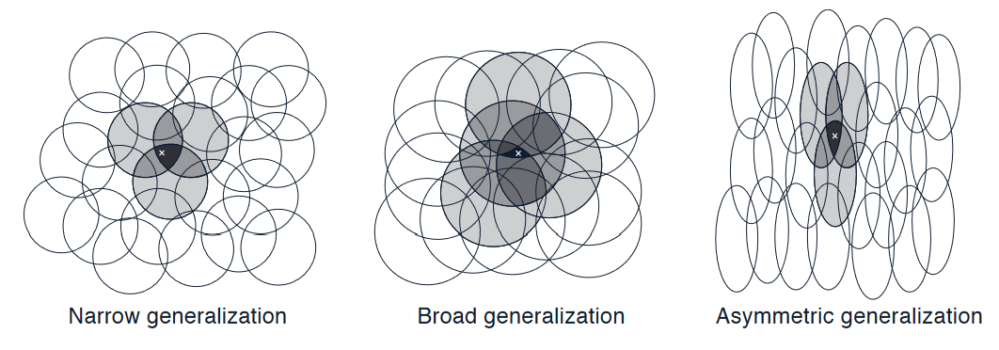

# Chapter 8. On-policy Prediction with Approximation

In this chapter, we now focus on estimating the state-value function from on-policy data. The approximate value function will be represented not as a table but **as a parameterized functional form, written as $\hat{v}(s, w) \approx v_\pi(s)$, with weight vector $w \in \mathbb{R}^d$**.

For example, $\hat{v}$ might be a linear function in features of the state, with $w$ being the vector of feature weights. More generally, $\hat{v}$ might be the function computed by a multi-layer artificial neural network, with $w$ the vector of connection weights in all the layers. 

**Typically, the number of weights (the dimensionality of $w$) is much less than the number of states ($d << |S|$)**, and changing one weight changes the estimated value of many states. Consequently, when a single state is updated, the change generalizes from that state to affect the values of many other states. Such generalization makes the learning potentially more powerful but also potentially more difficult to manage and understand.

## 8.1 Value-function Approximation

- **Update rules recap**:

    - Dynamic programming: 
    $s \rightarrow E_\pi[R_{t+1} + \gamma \hat{v}(S_{t+1}, w_t)|S_t = s]$

    - Monte Carlo:
    $s \rightarrow G_t$

    - Temporal Difference:
    $s \rightarrow R_{t+1} + \gamma \hat{v}(S_{t+1}, w_t)$

- **Supervised learning for function approximation**

    - We interpret each update as specifying an example of the desired input-output ($s\rightarrow u$) behavior of the value function, with $u$ indicating the $\textit{udpate target}$.

    - In function approximation, we pass the input–output behavior $s\rightarrow u$ of each update as a training example, then interpret the approximate function they produce (after training) as an estimated value function

- **The Prediction Objective ($\overline{VE}$)**

    - **Motivation**: by assumption we have far more states than weights, so making one state’s estimate more accurate invariably means making others’ less accurate. We are obligated then to say which states we care most about.

    - **Measure**: Mean Squared Value Error ($\overline{VE}$)

        $$
        \overline{VE}(w) = \sum_{s \in S} u(s)[v_\pi(s) - \hat{v}(s,w)]^2
        $$

        - The state distribution $u(s) \ge 0, \sum_s u(s)=1$ is called $\textit{on-policy distribution}$, and denotes how much we care about the error in each state $s$. “Often $μ(s)$ is chosen to be the fraction of time spent in $s$.

    ```{note}
    - The best value function for finding a better policy in control is not necessarily the best for minimizing $\overline{VE}$. Nevertheless, it is not yet clear what a more useful alternative goal for value prediction might be. For now, we will focus on $\overline{VE}$.

    - Often times, for complex function approximators such as Neural Networks, we can not find a global optimum of $w_\star$, for which  $\overline{VE}(w_\star) \le \overline{VE}(w)$ for all $w$. Rather, we can only find a local optimum for which  $\overline{VE}(w_\star) \le \overline{VE}(w)$ for all $w$ in some neighborhood of $w_\star$, but often this is enough.
    ```

## 8.2 Stochastic-gradient and Semi-gradient Methods

- **Setup for gradient descent methods**: 

    - the weight vector is a column vector with a fixed number of real valued components, $w \dot= (w_1,w_2,...,w_d)^T$. (Note that in this book vectors are generally taken to be column vectors unless explicitly written out horizontally or transposed.)

    - the approximate value function $v(s,w)$ is a differentiable function of $w$ for all $s \in S$. 

- **Stochastic gradient method (SGD)**

    - **Setup**: assume that on each step, we observe a new example $S_t \rightarrow v_\pi(S_t)$ consisting of a (possibly randomly selected) state $S_t$ and its true value under the policy.

    - **SGD method**:
        - update rule:

            $$
            \begin{align}
            \boldsymbol{w_{t+1}} &\dot= \boldsymbol{w_t} - \frac{1}{2} \alpha \nabla[v_\pi(S_t) - \hat{v}(S_t, \boldsymbol{w_t})]^2 \\
            &= \boldsymbol{w_t} + \alpha [v_\pi(S_t) - \hat{v}(S_t, \boldsymbol{w_t})]\nabla\hat{v}(S_t, \boldsymbol{w_t})
            \end{align}
            $$

        ```{note}
        - The assumption of available $v_\pi(S_t)$ is clearly impossible in practice. In fact, as long as the target is an unbiased estimate of $v_\pi(S_t)$, i.e., $E[Target | S_t=s] = v_\pi(S_t)$, then $\boldsymbol{w_t}$ is guaranteed to converge to a local optimum under the usual stochastic approximation condition for decreasing $\alpha$ (topics of convergence are not included in DistilRL, please refer to the book chapter 2.7 for details.)

        - By definition, the Monte Carlo target $G_t$ is an unbiased estimator of $v_\pi(S_t)$.
        ```
            
    - **Gradient Monte Carlo Algorithm for estimating $\hat{v} \approx v_\pi$**

		<div style="display: flex; justify-content: center;">
		        
		</div>

- **Semi-gradient method**:

    - **Setup**: the training example $S_t \rightarrow U_t$ with $U_t \in \mathbb{R}$ is not the true value $v_\pi(S_t)$ but a **boostrapping target** using $\hat{v}$

    - **Semi-gradient methods**:

        - update rule

            $$
            \begin{align}
            \boldsymbol{w_{t+1}} &\dot= \boldsymbol{w_t} - \frac{1}{2} \alpha \nabla[U_t - \hat{v}(S_t, \boldsymbol{w_t})]^2 \\
            &= \boldsymbol{w_t} + \alpha [U_t - \hat{v}(S_t, \boldsymbol{w_t})]\nabla\hat{v}(S_t, \boldsymbol{w_t})
            \end{align} 
            $$
        
        ```{note}
        - There is no guarantees for convergence as for stochastic gradient methods if a bootstrapping estimate of $v(S_t)$ is used as the target $U­_t$. Boostrapping methods use $\hat{v}(S_{t+1}, \boldsymbol{w_t})$ as the target, which depends on the current $\boldsymbol{w_t}$. Yet the derivation from equation $(1)$ to $(2)$ requires independence regarding $\boldsymbol{w_t}$. 
        
            In other words, bootstrapping methods take into account the effect of changing the weight vector $\boldsymbol{w_t}$ on the estimate, but ignore its effect on the target. They include only a part of the gradient and, accordingly, we call them $\textit{semi-gradient methods}$.

        - Although semi-gradient (bootstrapping) methods do not converge as robustly as gradient methods, they do converge reliably in important cases such as the linear case, and they are usually preferred in practice due to the boostrapping advantage against monte carlo methods.
        ```
    
    - **Semi-gradient TD(0) for estimating $\hat{v} \approx v_\pi$**
		<div style="display: flex; justify-content: center;">
		        
		</div>

-  **Example: State Aggregation**:

    - $\textit{State Aggregation}$: a method for generalizing function approximation by grouping states together, each group of states share one estimated value.

    - Using state aggregation for gradient MC (Lecture video):

        <a href="https://www.coursera.org/learn/prediction-control-function-approximation/lecture/aJ9j6/state-aggregation-with-monte-carlo">
        
        </a>
    
    - Using state aggregation for semi-gradient TD (Lecture video):

        <a href="https://www.coursera.org/learn/prediction-control-function-approximation/lecture/jS4tj/comparing-td-and-monte-carlo-with-state-aggregation">
        
        </a>

- **Extra lecture video (optional)**: [Doina Precup: Building Knowledge for AI Agents with Reinforcement Learning](https://www.coursera.org/learn/prediction-control-function-approximation/lecture/ipyWM/doina-precup-building-knowledge-for-ai-agents-with-reinforcement-learning)

## 8.3 Linear Models

- **Linear Methods**: methods that approximate the value function $\hat{v}(s, \boldsymbol{w})$ as a linear function, i.e., the inner product between $\boldsymbol{w}$ and $\boldsymbol{x}(s)$ - a feature vector, as follows:

    $$
    \hat{v}(s, \boldsymbol{w}) \dot= \boldsymbol{w}^{\intercal} \boldsymbol{x}(s) \dot= \sum_{i=1}^d w_i x_i(s)
    $$

    - In this case the approximate value function is said to be $\textit{linear in the weights}$, or simply $\textit{linear}$.
    
    - the feature vector $\boldsymbol{x}(s) \dot= (x_1(s), x_2(s), ... x_d(s))^{\intercal}$ has the same dimension $d$ as the weight vector $\boldsymbol{w}$. Each feature $x_i: S \rightarrow \mathbb{R}$ is a so-called $\textit{basis function}$ which assigns a value ($x_i(s)$) to the state $s$ (the feature of $s$)

- **(Semi-)Gradient methods for linear value function**

    - Update rule:

        $$
        \begin{align*}
        \boldsymbol{w_{t+1}} &= \boldsymbol{w_t} + \alpha [U_t - \hat{v}(S_t, \boldsymbol{w_t})]\nabla\hat{v}(S_t, \boldsymbol{w_t}) \\
        &= \boldsymbol{w_t} + \alpha [U_t - \hat{v}(S_t, \boldsymbol{w_t})]\boldsymbol{x}(S_t) \\
        \end{align*} 
        $$
    
    - $\star$ Convergence
        - MC method: the gradient Monte Carlo algorithm presented in the previous section converges to the global optimum of the $\overline{VE}$ under linear function approximation if $\alpha$ is reduced over time according to the usual conditions.

        - TD(0) method: weight vector eventually converges to a point near the local optimum. 

            - update rule:

                $$
                \begin{align*}
                \boldsymbol{w_{t+1}} &\dot= \boldsymbol{w_t} + \alpha [R_{t+1} + \gamma \hat{v}(S_{t+1}, \boldsymbol{w_t}) - \hat{v}(S_t, \boldsymbol{w_t})]\boldsymbol{x_t} \\
                &= \boldsymbol{w_t} + \alpha [R_{t+1} + \gamma \boldsymbol{w_t}^{\intercal}\boldsymbol{x_{t+1}} - \boldsymbol{w_t}^{\intercal}\boldsymbol{x_{t}}]\boldsymbol{x_t} \\
                &= \boldsymbol{w_t} + \alpha [R_{t+1}\boldsymbol{x_{t}} - \boldsymbol{x_{t}}(\boldsymbol{x_{t}} - \gamma \boldsymbol{x_{t+1}})^{\intercal}\boldsymbol{w_{t}}]\\
                \end{align*} 
                $$

                - Note: $\boldsymbol{x_t}$ is used to represent $\boldsymbol{x}(S_t)$ for simplicity
            
            - in steady state (convergence):

                $$
                E[\boldsymbol{w_{t+1}}|\boldsymbol{w_{t}}] = \boldsymbol{w_{t}} + \alpha(\boldsymbol{b - Aw_{t+1}})
                $$

                with  $\boldsymbol{b} \dot= E[R_{t+1}\boldsymbol{x_{t}}] \in \mathbb{R}^d$ and $\boldsymbol{A} \dot= E[\boldsymbol{x_{t}}(\boldsymbol{x_{t}} - \gamma \boldsymbol{x_{t+1}})^{\intercal}] \in \mathbb{R}^d \times \mathbb{R}^d$ 

                And at converge:

                $$
                \begin{align*}
                & \Rightarrow \quad \mathbf{b} - \mathbf{A}\mathbf{w}_{\text{TD}} = \mathbf{0} \\
                & \Rightarrow \quad \mathbf{b} = \mathbf{A}\mathbf{w}_{\text{TD}} \\
                & \Rightarrow \quad \mathbf{w}_{\text{TD}} \dot= \mathbf{A}^{-1}\mathbf{b}.
                \end{align*}
                $$

            ```{note}
            - The quantity $\mathbf{w}_{\text{TD}} \dot= \mathbf{A}^{-1}\mathbf{b}$ is called the $\textit{TD fixed point}$. Linear semi-gradient TD(0) converges to this point.

            - At the TD fixed point, it has also been proven (in the continuing case) that the $\overline{VE}$ is within a bounded expansion of the lowest possible error:

                $$
                \overline{VE}(\mathbf{w}_{\text{TD}}) \le \frac{1}{1-\gamma} \underset{w}{min}\overline{VE}(\mathbf{w})
                $$
                Because $\gamma$ is often near one, this expansion factor can be quite large, so there is substantial potential loss in asymptotic performance with the TD method.
            ```              

## 8.4 Feature Construction for Linear Methods

Choosing features appropriate to the task is an important way of adding prior domain knowledge to reinforcement learning systems. Intuitively, the features should correspond to the aspects of the state space along which generalization may be appropriate. 

A limitation of the linear form is that it cannot take into account any interactions between features, such as the presence of feature $i$ being good only in the absence of feature $j$, or to put it in other words, we need features that can take the combinations of different states or state dimensions into consideration. 

In this last section we study **how to construct such $x(s)$** for approximating the value function and balancing between generalization and discrimination.

### 8.4.1 Coarse Coding


- **Introduction**: 

    - **Scenario**: assume the natural representation of the state set is a continuous two-dimensional space, one possible kind of representation of features can be $\textit{circles}$ in state space. 

    - **Feature construction**: If the state is inside a circle, then the corresponding feature has the value 1 and is said to be present; otherwise the feature is 0 and is said to be absent. (This kind of 1–0-valued feature is called a $\textit{binary feature}$.)

        

        Corresponding to each circle / feature is a single weight (a component of $\boldsymbol{w}$) that is affected by learning.

        Performing an update to the weights in one state changes the value estimate for all states within the $\textit{receptive fields}$ (in this case, circles) of the active features. In the above image, update for state $s$ also changes the value estimate for state $s\prime$
    
    - **Definition**: Representing a state with features that overlap in the above way (although they need not be circles or binary) is known as **coarse coding**.

- **Generalization and Discrimination**

    - You may choose to watch this [lecture video](https://www.coursera.org/learn/prediction-control-function-approximation/lecture/JnNF5/generalization-properties-of-coarse-coding) instead, since the following content is well covered in it and if you prefer visual&audio contents over texts.

    - **Demonstration**: 
    
        Intuitively, if the circles are small, then the generalization will be over a short distance, as in the below Figure on the left, whereas if they are large, it will be over a large distance, as in the middle. And the shape of the features will also determine the nature of the generalization (on the right side).

        

        As above, features with large $\textit{receptive fields}$ give broad generalization, and might seem to fall short with discrimination, but counterintuitively, this is not true. Initial generalization from one point to another is indeed controlled by the size and shape of the $\textit{receptive fields}$, but finest discrimination is ultimately  controlled more **by the total number of features**, as shown by the next example. 

    - **Example: Coarseness of Coarse Coding**

        - Setup: Linear function approximation based on coarse coding and Semi-Gradient method was used to learn a one-dimensional square-wave function, the values of this function were used as the targets, $U_t$.

        - Results: as below, the width of the features had a strong effect early in learning. However, the final function learned was affected only slightly by the width of the features

            


### 8.4.2 Tile Coding

- **Introduction**

    - **Description**: Tile coding is **a form of coarse coding** for multi-dimensional continuous spaces. In tile coding the $\textit{receptive fields}$ of the features are grouped into partitions of the state space. Each such partition is called a $\textit{tiling}$, and each element of the partition is called a $\textit{tile}$.

    - **Demonstration**:

        

        - The simplest tiling of a two-dimensional state space is a uniform grid such as that shown on the left side of figure above. Note that with just one tiling, we would not have coarse coding but just a case of state aggregation.

        - To get true coarse coding with tile coding, multiple tilings are used, each offset by a fraction of a tile width (shown on the right side of the figure). Every state (indicated by the white spot) falls in exactly one tile in each of the four tilings. These four tiles correspond to four features that become active when the state occurs. In this example there are $4 \times 4 \times 4 = 64$ components, all of which will be 0 except for the four corresponding to the tiles that the state $s$ falls within.
    
    - **Advantages**:

        - Allowing for the learning rate $\alpha$ to be set in an easy, intuitive way: The overall number of features that are active at one time is the same for any state, so the total number of features present is always the same as the number of tilings. This allows the step-size parameter, $\alpha$ ,to be set in an easy, intuitive way, for example, choosing $\alpha = \frac{1}{n}$, where $n$ is the number of tilings, results in exact one-trial learning.

        - Computational advantages: during computation of $\sum_{i=1}^d w_i x_i(s)$ one simply computes the indices of the $n \ll d$ active features (n is equal to the number of tilings) and then adds up the n corresponding components of the weight vector.

- **How it works**: It is recommended to watch the lecture video below since it offers a more comprehensive explanation of how tile code works with TD.

    <a href="https://www.coursera.org/learn/prediction-control-function-approximation/lecture/ZR42J/using-tile-coding-in-td">
    
    </a>

## 8.5 Summary
In this chapter, we focused on extending reinforcement learning (RL) from the tabular case to function approximation, a crucial step for handling large state spaces in real-world problems. A quick summary:

- **Mindmap of where we are now**

    


- **Key Takeaways**

    1. Transition to Function Approximation:
        - Moving away from tabular methods allows RL to be applied in more complex problems where it's impractical to enumerate every state.
        - The conceptual shift involves parameterized function approximation, where we no longer store state values in a table.
        - We aim to minimize the **Mean Squared Value Error**, which measures the difference between the true state values and our approximations, weighted by visitation frequency $u(s)$.

    2. Gradient Methods:
        - **Gradient Monte Carlo**: Updates are made at the end of each episode using the sampled returns.
        - **Semi-Gradient TD**: Uses bootstrapping with value estimates at the next time step, enabling updates during episodes and faster learning.
            - We also introduced **Linear TD** with function approximation, which provably converges to a well-understood solution.

    3. Generalization and Discrimination:
        - **Generalization** allows updates for one state to improve value estimates for other similar states, speeding up learning.
        - **Discrimination** ensures that distinct states are assigned different values, preventing overgeneralization.

    4. Feature Construction and Representation:

        - **Coarse coding** groups neighboring states into arbitrary-shaped features, such as overlapping circles where each circle is active (1) if the state is inside it and inactive (0) otherwise.

        - **Tile Coding**:
            - A specialized form of coarse coding that uses **overlapping grids (tilings)**.
            - Each tiling is non-overlapping, with one active feature per grid, but multiple offset tilings allow for finer state discrimination.
            - The design of tilings balances generalization, discrimination, and efficiency.

- **Extra Lecture Video (optional)**: [David Silver on Deep Learning + RL = AI?](https://www.coursera.org/learn/prediction-control-function-approximation/lecture/xZuSl/david-silver-on-deep-learning-rl-ai)